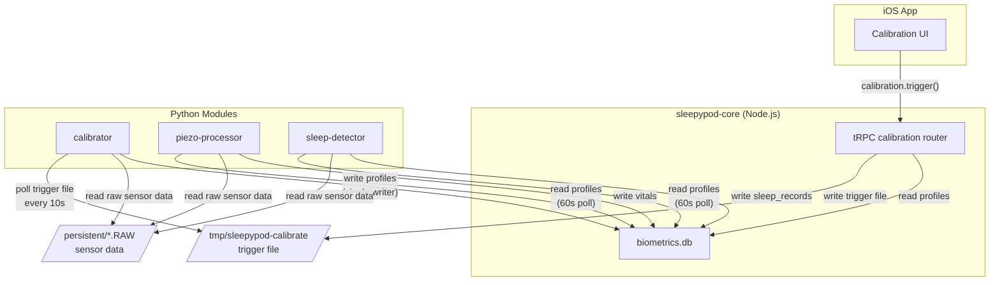
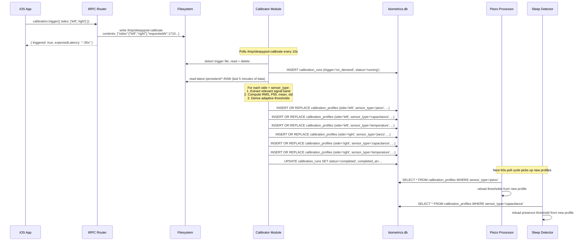
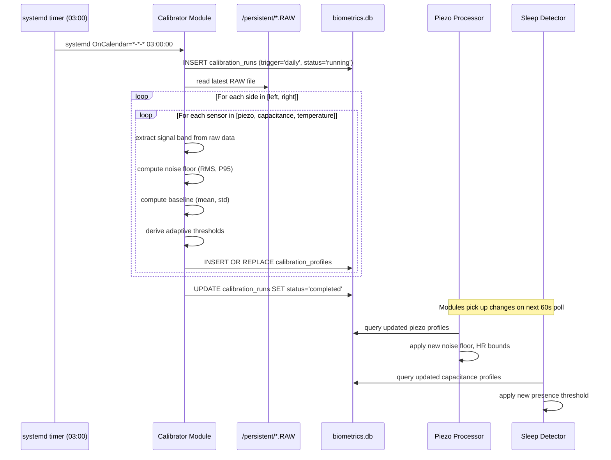

# Calibration System Architecture

Technical architecture for the sleepypod-core sensor calibration system. Covers data flow, database schema, module integration, and threshold configuration.

## System Overview



### Data Ownership

| Component | Reads | Writes |
|---|---|---|
| tRPC calibration router | `calibration_profiles`, `calibration_runs`, `vitals_quality` | trigger file only |
| Calibrator module | `/persistent/*.RAW`, trigger file | `calibration_profiles`, `calibration_runs` |
| Piezo processor | `calibration_profiles`, `/persistent/*.RAW` | `vitals`, `vitals_quality` |
| Sleep detector | `calibration_profiles`, `/persistent/*.RAW` | `sleep_records`, `movement` |

## Database Schema

All three tables live in `biometrics.db` alongside the existing `vitals`, `sleep_records`, `movement`, `bed_temp`, and `freezer_temp` tables.

### `calibration_profiles`

Stores the current calibration state for each sensor on each side. One row per (side, sensor_type) pair. The calibrator overwrites on each run via `INSERT OR REPLACE`.

| Column | Type | Constraints | Description |
|---|---|---|---|
| `id` | INTEGER | PK, autoincrement | Row ID |
| `side` | TEXT | NOT NULL, enum('left','right') | Bed side |
| `sensor_type` | TEXT | NOT NULL, enum('piezo','capacitance','temperature') | Which sensor this profile calibrates |
| `noise_floor_rms` | REAL | | RMS amplitude of empty-bed signal. Used to compute adaptive thresholds. |
| `noise_floor_p95` | REAL | | 95th percentile of empty-bed signal amplitude. Used for spike rejection. |
| `baseline_mean` | REAL | | Mean signal level during quiet empty bed. Piezo: DC offset. Capacitance: empty-bed reading. Temperature: ambient reference. |
| `baseline_std` | REAL | | Standard deviation of baseline. Quantifies sensor stability. |
| `temp_offset_c` | REAL | | Temperature sensor only: offset in centidegrees C to correct factory thermistor tolerance. NULL for non-temperature sensors. |
| `presence_threshold` | REAL | | Capacitance sensor only: computed adaptive presence threshold (6x noise floor RMS). NULL for non-capacitance sensors. |
| `hr_noise_floor_bpm` | REAL | | Piezo sensor only: estimated heart-rate-equivalent noise floor in bpm. Used to set minimum detectable HR. NULL for non-piezo sensors. |
| `calibrated_at` | INTEGER | NOT NULL, timestamp | Unix timestamp of when this profile was computed |
| `run_id` | INTEGER | FK -> calibration_runs.id | Which calibration run produced this profile |
| `metadata` | TEXT | JSON | Extensible field for algorithm-specific parameters (e.g., bandpass filter coefficients, window sizes used during calibration) |

**Unique index**: `(side, sensor_type)` -- enforces one active profile per sensor per side.

### `calibration_runs`

Audit log of every calibration execution. Never deleted; used for debugging and drift tracking.

| Column | Type | Constraints | Description |
|---|---|---|---|
| `id` | INTEGER | PK, autoincrement | Run ID (referenced by calibration_profiles.run_id) |
| `trigger` | TEXT | NOT NULL, enum('daily','on_demand','startup') | What initiated this run |
| `started_at` | INTEGER | NOT NULL, timestamp | When the calibrator began processing |
| `completed_at` | INTEGER | timestamp | When the run finished. NULL if still running or failed. |
| `status` | TEXT | NOT NULL, enum('running','completed','failed') | Outcome |
| `sensors_calibrated` | TEXT | JSON | Array of sensor_type values that were successfully calibrated, e.g. `["piezo","capacitance"]` |
| `error_message` | TEXT | | Error details if status = 'failed' |
| `raw_file_used` | TEXT | | Path to the RAW file that was analyzed |
| `samples_analyzed` | INTEGER | | Number of raw samples processed during this run |
| `duration_ms` | INTEGER | | Wall-clock duration of the calibration computation |

### `vitals_quality`

Companion table to `vitals`. Stores per-reading quality metadata without adding columns to the heavily-written, indexed `vitals` table.

| Column | Type | Constraints | Description |
|---|---|---|---|
| `id` | INTEGER | PK, autoincrement | Row ID |
| `vitals_id` | INTEGER | NOT NULL, FK -> vitals.id | The vitals row this quality assessment belongs to |
| `side` | TEXT | NOT NULL, enum('left','right') | Bed side (denormalized from vitals for query efficiency) |
| `timestamp` | INTEGER | NOT NULL, timestamp | Same timestamp as the vitals row (denormalized for range queries) |
| `quality_score` | REAL | NOT NULL | Composite quality score, 0.0 (reject) to 1.0 (high confidence). See Quality Scoring Formula below. |
| `snr_db` | REAL | | Signal-to-noise ratio in dB, computed from calibrated noise floor |
| `motion_artifact` | INTEGER | NOT NULL, default 0 | Boolean (0/1): whether significant motion was detected during this reading window |
| `hr_confidence` | REAL | | Heart rate extraction confidence, 0.0-1.0. Based on peak prominence in FFT. |
| `br_confidence` | REAL | | Breathing rate extraction confidence, 0.0-1.0. |
| `calibration_profile_id` | INTEGER | FK -> calibration_profiles.id | Which calibration profile was active when this reading was taken. NULL if uncalibrated. |

**Unique index**: `(vitals_id)` -- one quality row per vitals row.
**Index**: `(side, timestamp)` -- supports range queries matching vitals access patterns.

## Calibration Flow: On-Demand (iOS-Triggered)



## Calibration Flow: Daily Timer



## Module Integration Pattern

Every processing module follows the same three-phase lifecycle for calibration.

### Startup: Load or Fall Back

On process start, the module attempts to load its calibration profile from the database. If no profile exists (fresh install, database cleared), it falls back to hardcoded defaults. This ensures the module is always functional.

```
1. Open biometrics.db (read-only for calibration tables)
2. SELECT * FROM calibration_profiles WHERE side=? AND sensor_type=?
3. If row exists and calibrated_at is within 48 hours:
     -> use profile values as active thresholds
4. If row exists but calibrated_at > 48 hours old:
     -> use profile values but log warning ("stale calibration")
5. If no row exists:
     -> use hardcoded defaults, log info ("running uncalibrated")
6. Store active profile in memory with its calibrated_at timestamp
```

### Running: Poll for Updates

While processing, the module polls for calibration profile changes every 60 seconds. This is a single lightweight SELECT query against an indexed table.

```
Every 60 seconds:
1. SELECT calibrated_at FROM calibration_profiles WHERE side=? AND sensor_type=?
2. If calibrated_at > in-memory profile's calibrated_at:
     -> SELECT full row
     -> hot-swap active thresholds (no restart needed)
     -> log info ("reloaded calibration profile, run_id=X")
3. If calibrated_at unchanged or no row:
     -> no action
```

The poll interval of 60 seconds is chosen to match the vitals write frequency. A module will use an updated profile starting with the next vitals computation cycle after the profile is written.

### Graceful Degradation

The system is designed to operate at every point on the calibration spectrum:

| State | Behavior |
|---|---|
| No calibration profile | Hardcoded defaults. HR: 30-100 hard bounds. Presence: fixed 200,000. Temp offset: 0. |
| Stale profile (>48h) | Use profile values with warning log. Schedule recalibration on next daily timer. |
| Fresh profile (<48h) | Full adaptive thresholds. Best accuracy. |
| Calibration fails | Previous profile remains active. Error logged. Retry on next daily timer or manual trigger. |
| CalibrationStore import error | Module catches ImportError, falls back to hardcoded defaults, logs error. Module does not crash. |

## Quality Scoring Formula

Each vitals reading is assigned a composite quality score between 0.0 (reject) and 1.0 (high confidence). The score is written to the `vitals_quality` table by the piezo processor alongside each vitals row.

### Components

| Component | Weight | Range | Computation |
|---|---|---|---|
| SNR score | 0.35 | 0.0-1.0 | `min(1.0, snr_db / 20.0)`. Linear ramp: 0 dB = 0.0, 20+ dB = 1.0. BCG signals typically achieve 10-25 dB SNR when a person is present and still. |
| HR confidence | 0.30 | 0.0-1.0 | Peak prominence ratio in the HR frequency band (0.5-1.67 Hz, i.e., 30-100 bpm). Ratio of dominant peak power to total band power. A clean HR signal produces a sharp spectral peak with prominence > 0.7. |
| BR confidence | 0.15 | 0.0-1.0 | Same method as HR confidence but in the breathing band (0.1-0.37 Hz, i.e., 6-22 breaths/min). |
| Motion penalty | 0.20 | 0.0 or 1.0 | Binary: 0.0 if significant motion detected in the window, 1.0 if still. Motion is detected via high-frequency energy (>10 Hz) exceeding 3x the calibrated noise floor. |

### Formula

```
quality_score = (0.35 * snr_score) + (0.30 * hr_confidence) + (0.15 * br_confidence) + (0.20 * motion_score)
```

### Interpretation

| Score Range | Meaning | UI Indicator |
|---|---|---|
| 0.80 - 1.00 | High confidence. Clean signal, clear peaks, no motion. | Green |
| 0.50 - 0.79 | Moderate. Some noise or minor motion. Values usable but less precise. | Yellow |
| 0.20 - 0.49 | Low. Significant noise or motion artifact. Values may be inaccurate. | Orange |
| 0.00 - 0.19 | Reject. Signal indistinguishable from noise. Vitals values should be treated as null. | Red / hidden |

The iOS app and tRPC `getVitals` response can use this score to filter or annotate readings. A quality_score < 0.20 means the corresponding HR/HRV/BR values in the vitals row are unreliable.

## Threshold Configuration

Complete reference of all thresholds used across the calibration and processing system.

### Heart Rate Thresholds

| Threshold | Value | Source | Used By |
|---|---|---|---|
| HR hard minimum | 30 bpm | Medical: AHA bradycardia guidelines [3] | piezo-processor |
| HR hard maximum | 100 bpm | Medical: AHA tachycardia definition [1] | piezo-processor |
| HR dynamic lower percentile | P10 | Medical/empirical: BCG literature [4] | piezo-processor |
| HR dynamic upper percentile | P90 | Medical/empirical: BCG literature [4] | piezo-processor |
| HR dynamic window size | 300 samples (5 min) | Empirical: covers NREM-REM transitions [2] | piezo-processor |
| HR FFT band low | 0.5 Hz (30 bpm) | Derived from HR hard min | piezo-processor |
| HR FFT band high | 1.67 Hz (100 bpm) | Derived from HR hard max | piezo-processor |
| HR peak prominence minimum | 0.3 | Empirical: minimum detectable BCG peak | piezo-processor |

### Breathing Rate Thresholds

| Threshold | Value | Source | Used By |
|---|---|---|---|
| BR minimum | 6 breaths/min | Medical: deep N3 sleep physiology [5] | piezo-processor |
| BR maximum | 22 breaths/min | Medical: mild tachypnea accommodation [5] | piezo-processor |
| BR FFT band low | 0.1 Hz (6 br/min) | Derived from BR min | piezo-processor |
| BR FFT band high | 0.37 Hz (22 br/min) | Derived from BR max | piezo-processor |

### HRV Thresholds

| Threshold | Value | Source | Used By |
|---|---|---|---|
| HRV metric | RMSSD | Medical: parasympathetic dominance during sleep [8] | piezo-processor |
| HRV maximum (RMSSD) | 300 ms | Medical: young adult high-vagal-tone range [6][7] | piezo-processor |
| HRV minimum (RMSSD) | 5 ms | Empirical: below this indicates measurement failure | piezo-processor |
| HRV minimum IBI count | 10 | Empirical: RMSSD unreliable with fewer successive differences | piezo-processor |

### Presence Detection Thresholds

| Threshold | Value | Source | Used By |
|---|---|---|---|
| Presence multiplier | 6x noise floor RMS | Medical/empirical: BCG adaptive thresholds [4] | sleep-detector |
| Presence fallback (uncalibrated) | 200,000 raw units | Empirical: free-sleep legacy value | sleep-detector |
| Presence debounce enter | 30 seconds | Empirical: avoid false positives from pet/partner movement | sleep-detector |
| Presence debounce exit | 120 seconds | Empirical: bathroom trips < 2 min should not split sessions | sleep-detector |
| Minimum sleep session | 20 minutes | Empirical: shorter periods are likely false positives | sleep-detector |

### Temperature Calibration Thresholds

| Threshold | Value | Source | Used By |
|---|---|---|---|
| Temp offset max | +/- 200 centidegrees (2.0 C) | Empirical: NTC tolerance + aging drift | calibrator |
| Temp baseline window | 300 samples (5 min) | Empirical: thermal stability period | calibrator |
| Temp offset stale after | 7 days | Empirical: thermistor drift is slow | calibrator |

### Calibration Operational Thresholds

| Threshold | Value | Source | Used By |
|---|---|---|---|
| Daily calibration time | 03:00 local | Operational: low-activity period for most users | calibrator (systemd timer) |
| Trigger file poll interval | 10 seconds | Operational: latency vs CPU tradeoff | calibrator |
| Profile reload poll interval | 60 seconds | Operational: matches vitals write frequency | piezo-processor, sleep-detector |
| Profile stale threshold | 48 hours | Operational: 2x daily calibration interval | all modules |
| Calibration data window | 5 minutes of raw data | Empirical: sufficient for stable noise floor estimate | calibrator |
| Minimum raw samples for calibration | 15,000 (30s at 500 Hz) | Empirical: minimum for reliable RMS computation | calibrator |

### Quality Score Thresholds

| Threshold | Value | Source | Used By |
|---|---|---|---|
| SNR normalization ceiling | 20 dB | Empirical: typical clean BCG SNR range | piezo-processor |
| Motion detection frequency | >10 Hz | Empirical: body motion energy band for BCG | piezo-processor |
| Motion detection multiplier | 3x calibrated noise floor | Empirical: distinguishes voluntary motion from vibration | piezo-processor |
| Quality reject threshold | 0.20 | Empirical: below this, readings are indistinguishable from noise | piezo-processor, iOS app |
| Quality high confidence threshold | 0.80 | Empirical: above this, readings are reliable for health insights | iOS app |

## File Layout

```
modules/
├── common/
│   ├── __init__.py
│   └── calibration.py          # CalibrationStore, CalibrationProfile dataclass
├── calibrator/
│   ├── manifest.json
│   ├── main.py                 # Daily + on-demand calibration logic
│   ├── requirements.txt
│   ├── sleepypod-calibrator.service
│   └── sleepypod-calibrator.timer
├── piezo-processor/
│   ├── manifest.json
│   ├── main.py                 # Imports common.calibration for profile reads
│   ├── requirements.txt
│   └── sleepypod-piezo-processor.service
└── sleep-detector/
    ├── manifest.json
    ├── main.py                 # Imports common.calibration for profile reads
    ├── requirements.txt
    └── sleepypod-sleep-detector.service
```

## References

Citation numbers correspond to the ADR (`adr-calibration.md`) citation list.

- [1] AHA tachycardia definition
- [2] Somers et al., Circulation 1993 -- REM HR surges
- [3] Kusumoto et al., Circulation 2019 -- bradycardia in athletes
- [4] Bruser et al., IEEE TITB 2011 / PMC6522616 -- BCG adaptive thresholds
- [5] PMC5027356 -- sleep respiratory rate
- [6] Umetani et al., JACC 1998 -- SDNN age norms
- [7] Shaffer & Ginsberg, Frontiers 2017 / PMC5624990 -- HRV metrics overview
- [8] Laborde et al., Frontiers 2017 / PMC6932537 -- RMSSD recommendations

---

**Last Updated**: 2026-03-15
