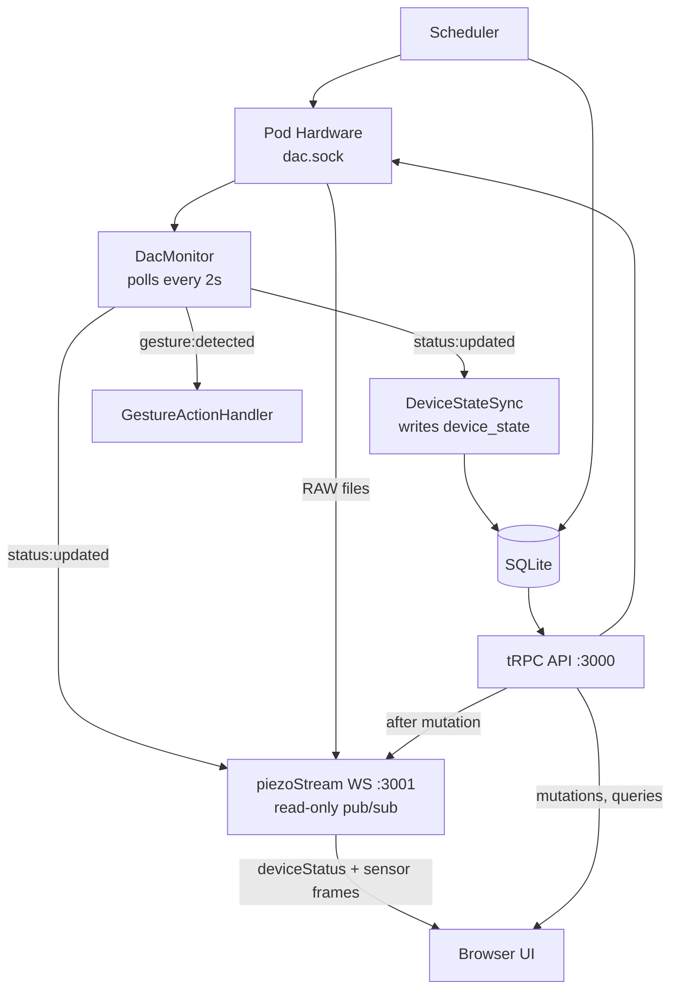

# sleepypod core

Local control system for Eight Sleep Pods (3/4/5). Type-safe rewrite of free-sleep.

## tech stack

- Frontend: Next.js 16, React 19, TailwindCSS, tRPC, Recharts
- Backend: Node.js, tRPC, Drizzle ORM
- Real-time: WebSocket (piezoStream on port 3001) for sensor data + device status
- Database: SQLite with WAL
- Hardware: Unix socket (dac.sock), DacMonitor polling at 2s
- Scheduling: node-schedule
- i18n: Lingui
- Testing: Vitest

## architecture



### data flow by type

| Data | Path | Latency |
|------|------|---------|
| Device status (temp, power) | Hardware → DacMonitor → WS push | ~2s (poll backstop) |
| Device status after mutation | tRPC mutation → broadcastFrame → WS push | ~200ms |
| Sensor data (piezo, bed temp) | RAW files → piezoStream → WS push | ~10ms |
| Mutations (setTemp, setPower) | Browser → tRPC HTTP → Hardware → WS broadcast | ~200-500ms |
| Historical data (vitals, sleep) | Browser → tRPC HTTP → SQLite | on-demand |
| Schedules, settings | Browser → tRPC HTTP → SQLite | on-demand |

## project structure

```
app/[lang]/           # Next.js pages (i18n)
src/
  ├── components/     # React UI
  ├── db/             # Drizzle schema
  ├── hardware/       # Pod hardware abstraction + DacMonitor
  ├── hooks/          # React hooks (useDeviceStatus, useSensorStream, etc.)
  ├── providers/      # React context (SideProvider, TRPCProvider)
  ├── scheduler/      # Job automation
  ├── server/routers/ # tRPC API
  └── streaming/      # WebSocket server (piezoStream)
```

## database (11 tables)

- device_settings, side_settings
- tap_gestures
- temperature_schedules, power_schedules, alarm_schedules
- device_state
- sleep_records, vitals, movement
- system_health

## commands

```bash
pnpm dev              # Dev server
pnpm lint             # ESLint
pnpm tsc              # Type check
pnpm test             # Tests
pnpm db:push          # Apply schema
pnpm db:studio        # Drizzle Studio
pnpm lingui:extract   # Extract i18n
```

## git workflow

1. Branch from `dev`
2. Conventional commits
3. PR to `dev`
4. Squash merge

## supported hardware

- ✅ Pod 3 (no SD card)
- ✅ Pod 4
- ✅ Pod 5
- ❌ Pod 1/2

## deployment

```bash
curl -fsSL https://raw.githubusercontent.com/sleepypod/core/main/scripts/install.sh | sudo bash
```

CLI: `sp-status`, `sp-restart`, `sp-logs`, `sp-update`

## documentation

- `docs/trpc-api-architecture.md` - Complete tRPC API reference
- `.claude/docs/documentation-best-practices.md` - Documentation standards
- `.claude/docs/import-patterns.md` - Import conventions
- `.claude/docs/pr-review-process.md` - PR workflow
- `.claude/docs/ci-checks.md` - CI pipeline details

## related

- ADRs: `docs/adr/`
- Original: [free-sleep](https://github.com/throwaway31265/free-sleep)
