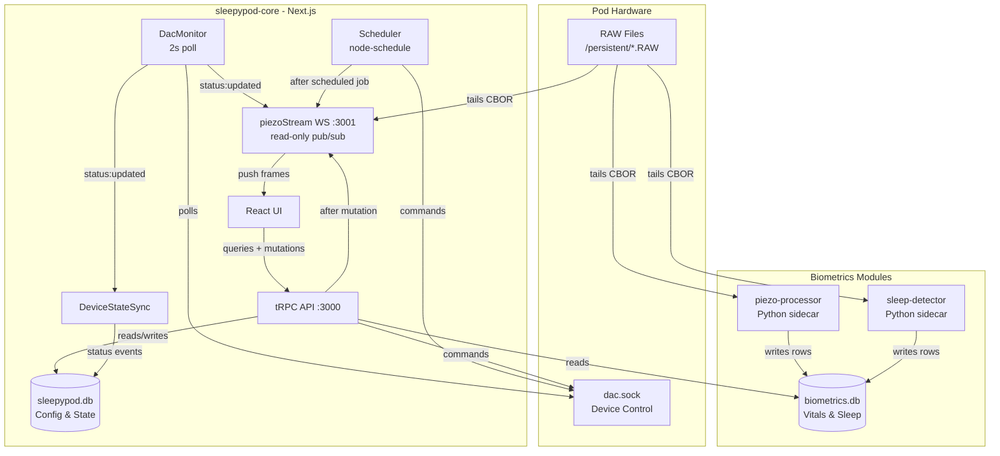
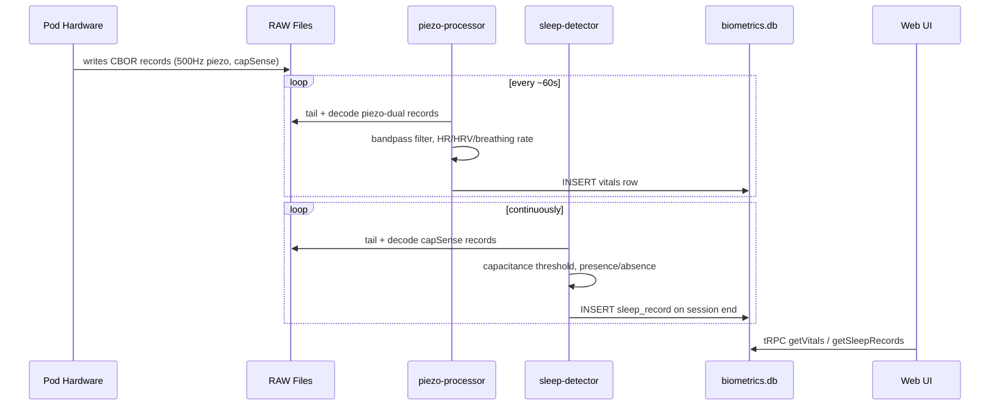
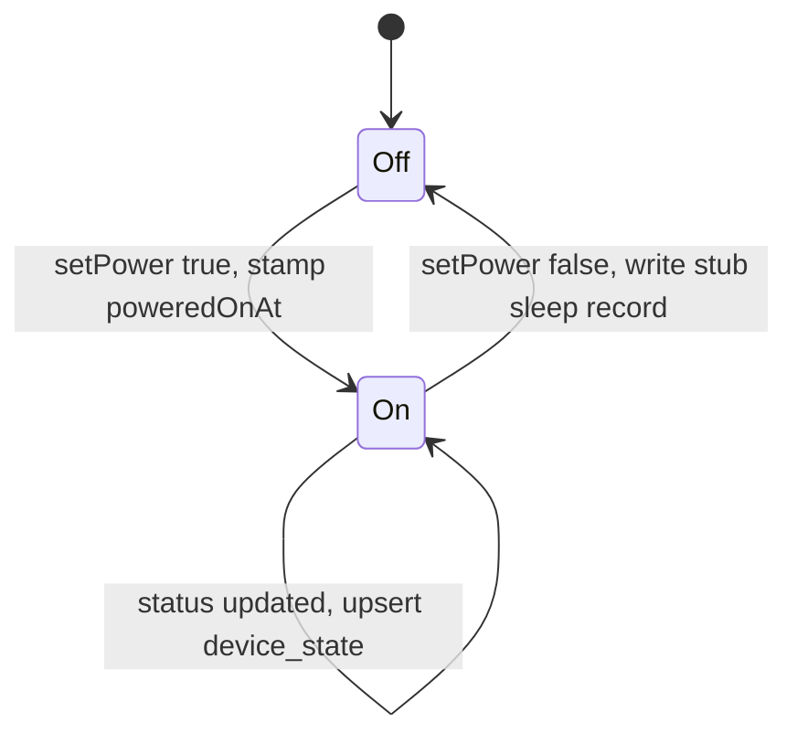
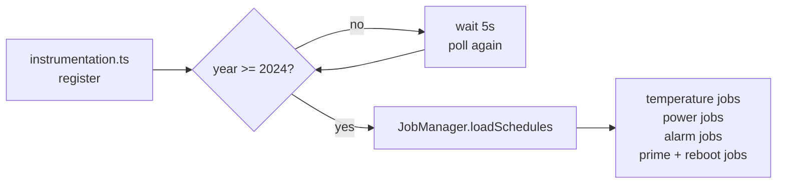
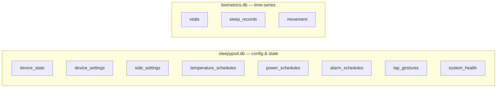
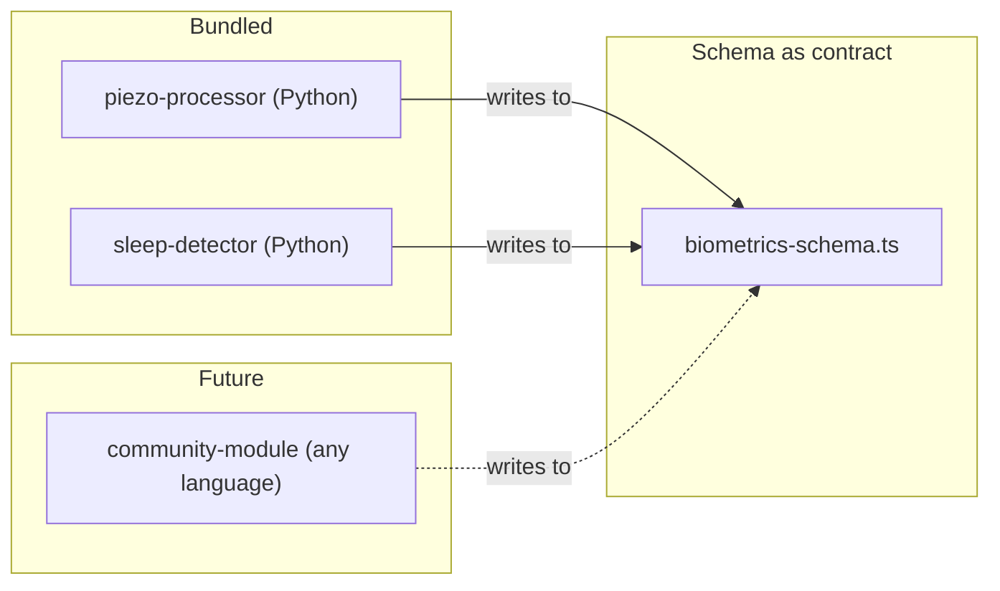

# sleepypod

A self-hosted control system for Pod mattress covers (Pod 3, 4, and 5). Runs directly on the Pod's embedded Linux hardware, replacing the cloud dependency with a local-first web interface and scheduler.

---

## What it does

- **Temperature scheduling** — set per-side temperature programs by day and time
- **Power scheduling** — automatic on/off with optional warm-up temperature
- **Alarm management** — vibration alarms with configurable intensity and pattern
- **Biometrics** — heart rate, HRV, breathing rate, sleep session tracking, and movement from the Pod's own sensors
- **Daily maintenance** — automated priming and system reboots on a schedule
- **Local web UI** — accessible on your home network, no cloud required

---

## Architecture



### Biometrics data flow

The Pod hardware daemon continuously writes raw sensor data to `/persistent/*.RAW` as CBOR-encoded binary records. Independent Python sidecar processes tail these files, extract signals, and write results to `biometrics.db`. The core app never touches raw data — it reads clean rows via tRPC.



### Power-state sleep tracking

The core app also creates stub sleep records from device power transitions — independent of the sensor modules. This ensures a record exists even when biometrics modules are not running.



### Scheduler startup

The Pod's RTC can reset to ~2010 after a power cycle. The scheduler waits for a valid system clock before starting any cron jobs.



---

## Tech stack

| Layer | Choice |
|-------|--------|
| Framework | Next.js 16 (App Router) |
| Language | TypeScript (strict) |
| UI | React 19 |
| API | tRPC v11 |
| Database | SQLite via better-sqlite3 |
| ORM | Drizzle ORM |
| Scheduler | node-schedule |
| i18n | Lingui |
| Package manager | pnpm |
| Test runner | Vitest |
| Linter | ESLint flat config + @stylistic |

---

## Databases

Two SQLite files with separate Drizzle connections and independent migration sets.



### `sleepypod.db` — config and runtime state

| Table | Purpose |
|-------|---------|
| `device_state` | Current temperature, power, water level per side |
| `device_settings` | Timezone, temperature unit, daily reboot/prime config |
| `side_settings` | Per-side name and away mode |
| `temperature_schedules` | Timed temperature change jobs |
| `power_schedules` | Timed on/off jobs with warm-up temperature |
| `alarm_schedules` | Vibration alarms with intensity, pattern, and duration |
| `tap_gestures` | Configurable double/triple-tap actions |
| `system_health` | Health status per component (core app + modules) |

### `biometrics.db` — time-series health data

| Table | Purpose |
|-------|---------|
| `vitals` | Heart rate, HRV, breathing rate — one row per ~60s interval |
| `sleep_records` | Session boundaries, duration, exit count, presence intervals |
| `movement` | Per-interval movement scores |

Biometrics uses WAL mode and a 5-second busy timeout so multiple sidecar processes can write concurrently without contention.

---

## Biometrics module system

Modules are independent OS processes — any language, managed by systemd. They share `biometrics.db` as the data contract. A crash in a module has zero impact on the core app.



Each module ships a `manifest.json`:

```json
{
  "name": "piezo-processor",
  "version": "1.0.0",
  "description": "Heart rate, HRV, and breathing rate from piezo sensors",
  "provides": ["vitals.heartRate", "vitals.hrv", "vitals.breathingRate"],
  "writes": ["vitals"],
  "service": "sleepypod-piezo-processor.service",
  "language": "python"
}
```

### Bundled modules

| Module | Input | Output | Method |
|--------|-------|--------|--------|
| `piezo-processor` | 500 Hz piezoelectric (CBOR) | HR, HRV, breathing rate → `vitals` | Bandpass filter + HeartPy peak detection + Welch PSD |
| `sleep-detector` | Capacitance presence (CBOR) | Session boundaries, exits → `sleep_records`, `movement` | Threshold detection with ABSENCE_TIMEOUT_S session gating |

---

## Directory structure

```text
sleepypod-core/
├── src/
│   ├── app/                        # Next.js App Router pages and layouts
│   ├── components/                 # React components
│   ├── db/
│   │   ├── schema.ts               # sleepypod.db schema (Drizzle)
│   │   ├── biometrics-schema.ts    # biometrics.db schema (public contract)
│   │   ├── index.ts                # main DB connection
│   │   ├── biometrics.ts           # biometrics DB connection (WAL)
│   │   ├── migrations/             # sleepypod.db migrations
│   │   └── biometrics-migrations/  # biometrics.db migrations
│   ├── hardware/
│   │   ├── client.ts               # dac.sock Unix socket client
│   │   ├── deviceStateSync.ts      # status:updated → DB + stub sleep records
│   │   └── types.ts                # DeviceStatus, SideStatus, etc.
│   ├── modules/
│   │   └── types.ts                # ModuleManifest interface
│   ├── scheduler/
│   │   ├── jobManager.ts           # Orchestrates all scheduled jobs
│   │   └── scheduler.ts            # node-schedule wrapper with events
│   └── server/
│       └── routers/                # tRPC routers
├── modules/
│   ├── piezo-processor/            # Python: HR/HRV/breathing from piezo
│   └── sleep-detector/             # Python: sleep sessions from capacitance
├── docs/
│   └── adr/                        # Architecture Decision Records
├── scripts/
│   └── install                     # Full install + update script
├── instrumentation.ts              # Scheduler init + graceful shutdown
├── drizzle.config.ts               # Drizzle config for sleepypod.db
└── drizzle.biometrics.config.ts    # Drizzle config for biometrics.db
```

---

## Installation

Requires a Pod running its stock embedded Linux. Run as root on the device:

```bash
curl -fsSL https://raw.githubusercontent.com/sleepypod/core/main/scripts/install | sudo bash
```

The script:
1. Installs Node.js 20 and pnpm (if absent)
2. Clones the repo to `/home/dac/sleepypod-core`
3. Installs dependencies and builds the app
4. Detects `dac.sock` path and writes `.env`
5. Runs database migrations for both DBs
6. Installs and starts the `sleepypod.service` systemd unit
7. Installs Python biometrics modules with isolated virtualenvs
8. Optionally configures SSH on port 8822 with key-only auth

### CLI helpers

After install, these are available system-wide:

```bash
sp-status    # systemctl status sleepypod.service
sp-restart   # restart the service
sp-logs      # journalctl -u sleepypod.service -f
sp-update    # pull latest, rebuild, migrate, restart (with automatic rollback)
```

### Switching between sleepypod and free-sleep

Already running [free-sleep](https://github.com/throwaway31265/free-sleep)? sleepypod installs alongside it — both use port 3000 but only one runs at a time. Switch freely without losing any settings or data:

```bash
sp-sleepypod    # Stop free-sleep, start sleepypod + biometrics modules
sp-freesleep    # Stop sleepypod, start free-sleep
```

This makes it easy to evaluate sleepypod: install it, try it out, and switch back any time if you prefer free-sleep. Your temperature schedules, alarm configs, and sleep data are all preserved across switches.

---

## Environment variables

| Variable | Default (dev) | Description |
|----------|---------------|-------------|
| `DATABASE_URL` | `file:./sleepypod.dev.db` | Path to sleepypod.db |
| `BIOMETRICS_DATABASE_URL` | `file:./biometrics.dev.db` | Path to biometrics.db |
| `DAC_SOCK_PATH` | `/run/dac.sock` | Unix socket path for hardware control |
| `NODE_ENV` | `development` | Set to `production` in the systemd service |

---

## Development

```bash
# Install dependencies
pnpm install

# Run dev server
pnpm dev

# Run tests
pnpm test

# Lint / type-check
pnpm lint
pnpm lint:fix
pnpm tsc

# Database — sleepypod.db
pnpm db:generate       # generate migration from schema
pnpm db:migrate        # apply migrations
pnpm db:studio         # open Drizzle Studio

# Database — biometrics.db
pnpm db:biometrics:generate
pnpm db:biometrics:migrate
pnpm db:biometrics:studio

# i18n
pnpm lingui:extract    # extract new user-facing strings for translation
```

---

## Architecture decisions

Key decisions are documented in [`docs/adr/`](docs/adr/):

| ADR | Decision |
|-----|---------|
| [0003](docs/adr/0003-core-stack.md) | TypeScript strict, React, Lingui for i18n |
| [0004](docs/adr/0004-nextjs-unified.md) | Next.js App Router as the application framework |
| [0005](docs/adr/0005-trpc.md) | tRPC for end-to-end type-safe API |
| [0006](docs/adr/0006-developer-tooling.md) | ESLint, Vitest, Conventional Commits, pnpm |
| [0010](docs/adr/0010-drizzle-orm-sqlite.md) | Drizzle ORM + SQLite for embedded constraints |
| [0012](docs/adr/0012-biometrics-module-system.md) | Plugin/sidecar architecture for biometrics |
| [0015](docs/adr/0015-event-bus-mutation-broadcast.md) | Event bus: broadcast device state after mutations |

### Key tradeoffs

**Why SQLite, not Postgres?**
The Pod is constrained ARM hardware. SQLite has no server process, fits under 1 MB of overhead, and handles the write volume (a few rows per minute) with headroom to spare.

**Why two databases?**
Config/state and time-series biometrics have fundamentally different access patterns, retention, and backup needs. Keeping them separate means biometrics data can be cleared or exported without touching device config, and each DB can be tuned independently.

**Why Python modules, not Node.js?**
Heart rate extraction from 500 Hz piezoelectric data requires FFT, bandpass filtering, and peak detection. Python's scipy/numpy ecosystem handles this naturally. A crash in a Python module has zero impact on the core app.

**How does real-time data reach clients?**
A WebSocket server on port 3001 (`piezoStream`) acts as a read-only pub/sub channel. It streams raw sensor data (piezo, bed temp, capacitance) by tailing `/persistent/*.RAW`, and also pushes `deviceStatus` frames. DacMonitor broadcasts status every 2 seconds as an authoritative backstop, and tRPC mutations (temperature, power, alarm) broadcast immediately after success so all connected clients see changes within ~200ms.

---

## License

[AGPL-3.0](LICENSE)
