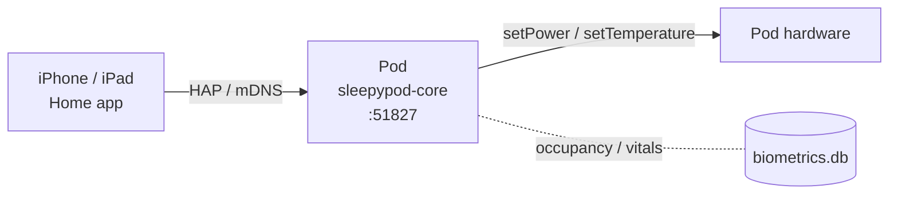
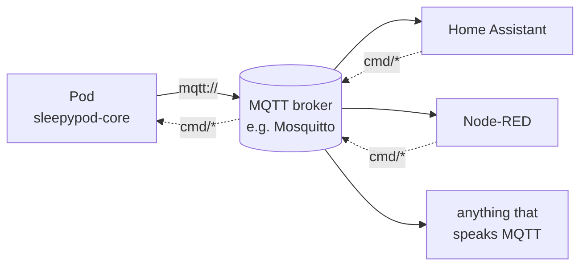
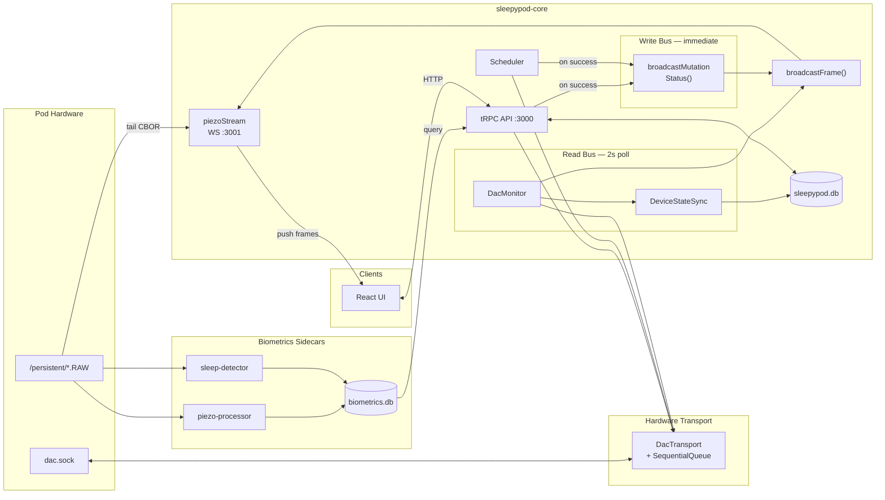
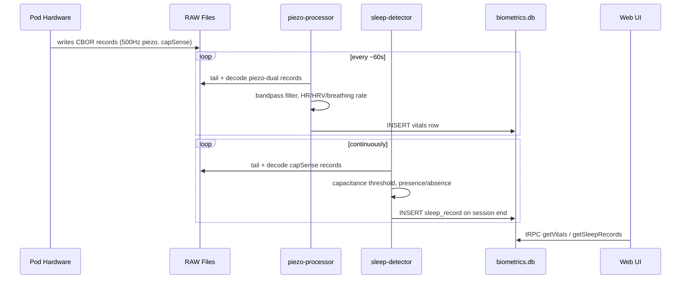
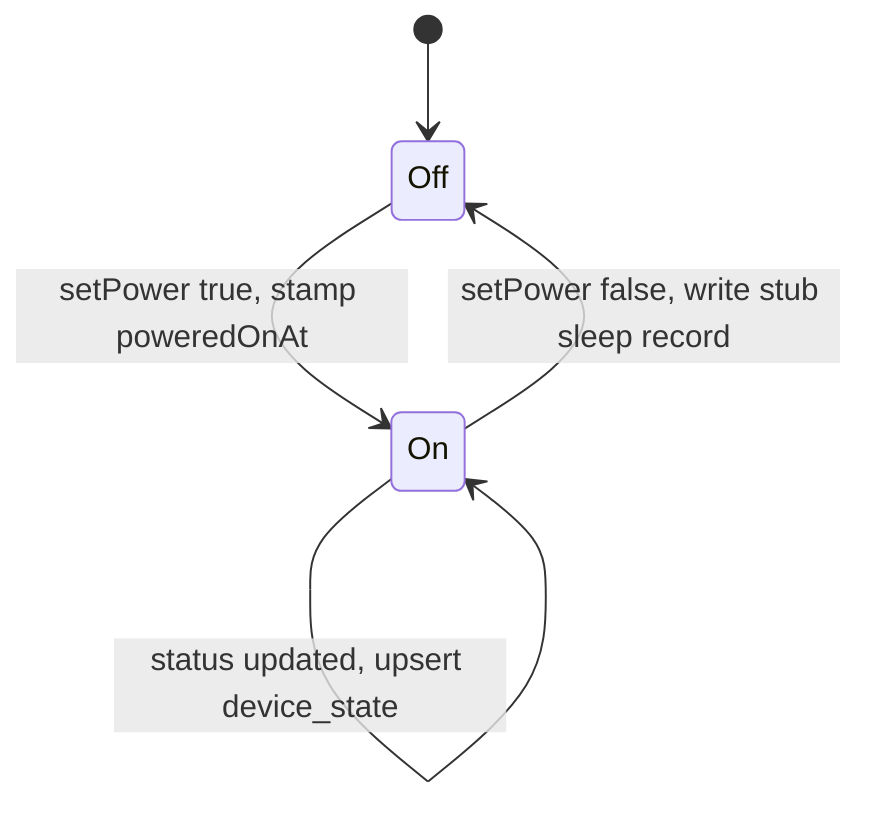
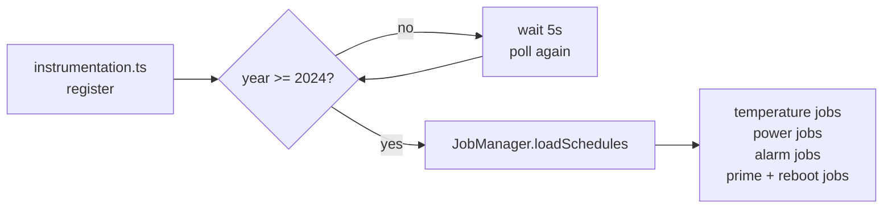
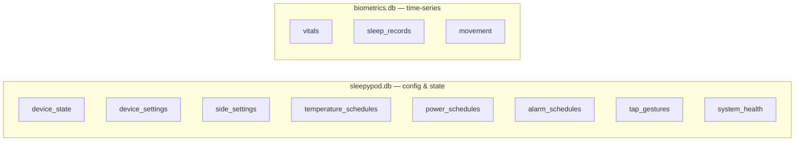
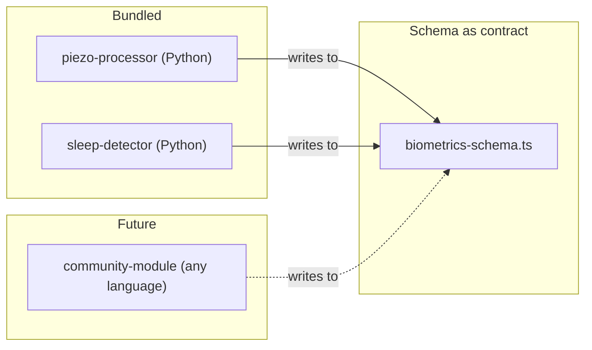

# sleepypod — local-first Pod mattress controller

[](https://github.com/sleepypod/core/actions/workflows/test.yml)
[](https://codecov.io/gh/sleepypod/core)
[](https://github.com/sleepypod/core/releases/latest)
[](LICENSE)
[](https://discord.gg/UMmv5R6MXa)

Self-hosted firmware replacement for Pod 3, 4, and 5. Runs on the Pod's embedded Linux — no cloud round-trips, no remote dependency. Local web UI, scheduler, on-device biometrics, and native integrations for Home Assistant (MQTT) and Apple Home (HomeKit).

<p align="center">
  
  
</p>

<p align="center">
  
  
  
</p>

<p align="center">
  <a href="https://github.com/sleepypod/core/issues">Issues</a> · <a href="#installation">Install guide</a>
</p>

---

## Installation

Requires a Pod running its stock embedded Linux. Run as root on the device:

```bash
curl -fsSL https://raw.githubusercontent.com/sleepypod/core/main/scripts/install | sudo bash
```

The script:
1. Installs Node.js and pnpm (if absent)
2. Downloads the latest release (pre-built) or builds from source as fallback
3. Installs dependencies and detects `dac.sock` path
4. Runs database migrations and writes `.env`
5. Installs and starts the `sleepypod.service` systemd unit
6. Installs Python biometrics modules with isolated virtualenvs
7. Optionally configures SSH on port 8822 with key-only auth

### CLI helpers

After install, these are available system-wide:

```bash
sp-status         # systemctl status sleepypod.service
sp-restart        # restart the service
sp-logs           # journalctl -u sleepypod.service -f
sp-update         # pull latest, rebuild, migrate, restart (with automatic rollback)
sp-maintenance    # one-shot manual prime / reboot / status
sp-uninstall      # stop services, remove systemd units, optionally wipe data
sp-sleepypod      # if free-sleep is also installed: stop it and start sleepypod
sp-freesleep      # mirror of the above in the other direction
```

---

## What it does

- **Temperature scheduling** — set per-side temperature programs by day and time
- **Power scheduling** — automatic on/off with optional warm-up temperature
- **Alarm management** — vibration alarms with configurable intensity and pattern
- **Biometrics** — heart rate, HRV, breathing rate, sleep session tracking, and movement from the Pod's own sensors
- **Daily maintenance** — automated priming and system reboots on a schedule
- **Local web UI** — accessible on your home network, no cloud required
- **MQTT bridge (opt-in)** — publish state and accept commands on your home MQTT broker; auto-discoverable in Home Assistant
- **HomeKit bridge (opt-in)** — control the pod from the Apple Home app; local-only, no Apple servers

---

## HomeKit bridge (opt-in)

The Pod ships an embedded [hap-nodejs](https://github.com/homebridge/HAP-NodeJS)
bridge that publishes itself as a native HomeKit accessory over Bonjour. No
Homebridge install, no Apple cloud round-trip — pairing and control happen
entirely on your LAN.



The bridge is **off by default** and lives behind the same iptables LAN-only
policy as the rest of the app — toggle it on from **Settings → HomeKit**.

### Quick start

1. Open **Settings → HomeKit** in the Pod web UI and flip **HomeKit bridge** on.
2. A QR code and 8-digit setup code render in the panel.
3. In iOS Home: **Add Accessory → More options** (or scan the QR), enter the code.
4. The Pod shows up as a bridge with one tile per side per accessory.
5. Use **Unpair all controllers** in the same panel to reset pairing without
   regenerating the bridge identity (automations stay intact).

### Accessories

Each side (`left`, `right`) gets its own set; switches that act on the whole
pod ship once.

| Accessory | Type | Reads from | Writes to |
|---|---|---|---|
| `Bed <side>` | Thermostat (single setpoint) | `deviceStatus.<side>` | `setTemperature` / `setPower` |
| `Bed <side> power` | Switch | `deviceStatus.<side>.powered` | `setPower` (preserves last setpoint) |
| `Bed <side> occupancy` | OccupancySensor | `sleep_records` (latest with `leftBedAt IS NULL`) | — |
| `Snooze <side>` | Switch | `snoozeManager` | `snoozeAlarm` / `cancelSnooze` |
| `Prime` | Switch | `primeNotification` (auto-off on completion) | `startPriming` |

Thermostat is HomeKit's single-setpoint primitive (the pod hardware exposes
one setpoint, not a heat/cool deadband). Mode `off` cuts power; `auto` powers
on at the last requested temperature. HomeKit Celsius is converted at the
boundary; the in-app unit preference is unaffected.

### Identity durability

The bridge's HomeKit identity (MAC-style username, pincode, setupId) is
**deterministically derived** from a hardware-rooted seed (eMMC CID →
machine-id → random fallback) via HKDF, and cached at
`/persistent/sleepypod-data/homekit/identity.json`. A `/persistent` wipe or
firmware reflash regenerates the **same** identity, so iOS still recognizes
the bridge — you only re-pair, your automations and rooms stay intact. See
**[ADR 0020](docs/adr/0020-homekit-identity-derivation.md)** for the full
rationale, seed chain, and what the design intentionally does *not* protect
against.

### Environment variables

Headless deployments can override the auto-detected mDNS advertiser. All
other config (enable/disable, pairing) lives in `device_settings` and is
managed from the UI.

| Variable | Default | Description |
|---|---|---|
| `HOMEKIT_ADVERTISER` | auto (`avahi` if `/run/avahi-daemon/socket` exists, else `ciao`) | mDNS advertiser; force `avahi` to coexist with the existing `_sleepypod._tcp` service file, or `ciao` for pods without avahi |

---

## MQTT bridge (opt-in)

The Pod can connect outbound to an MQTT broker you already run (typically the
[Mosquitto add-on](https://github.com/home-assistant/addons/tree/master/mosquitto)
that ships with Home Assistant). Off by default — opt in from
**Settings → MQTT** in the web UI.



The Pod is a **client**, not a broker. It does not embed a broker, does not
listen on 1883, and does not punch holes in the LAN-only iptables policy.

### Quick start

1. Open **Settings → MQTT** in the Pod web UI.
2. Set **Broker URL** (`mqtt://broker.lan:1883` or `mqtts://...` for TLS).
3. Optional: username + password. Leave blank for anonymous brokers.
4. Hit **Test Connection** to verify reachability, then toggle
   **Enable MQTT Bridge** and **Save**.
5. (Home Assistant users) flip on **Home Assistant Discovery** — climate,
   sensor, and switch entities show up automatically under the Pod's device
   page.

Headless deployments can skip the UI by setting environment variables;
the bridge resolves config in this order: `device_settings` row > env var > built-in default.

| UI field | Env var | Default |
|---|---|---|
| Enable bridge | `MQTT_ENABLED` | `false` |
| Broker URL | `MQTT_URL` | _(unset — bridge stays dormant)_ |
| Username | `MQTT_USERNAME` | _(none)_ |
| Password | `MQTT_PASSWORD` | _(none)_ |
| Topic prefix | `MQTT_TOPIC_PREFIX` | `sleepypod` |
| HA discovery | `MQTT_HA_DISCOVERY` | `false` |
| HA discovery prefix | `MQTT_HA_DISCOVERY_PREFIX` | `homeassistant` |
| TLS | `MQTT_TLS_ENABLED` | `false` |
| TLS allow self-signed | `MQTT_TLS_INSECURE` | `false` |

### Topics

`<prefix>` defaults to `sleepypod`. `<device-id>` is the slugified hostname
(override with `MQTT_DEVICE_ID`). All state topics are retained.

| Topic | Direction | Payload |
|---|---|---|
| `<prefix>/<device-id>/availability` | pod → broker | `online` / `offline` (LWT) |
| `<prefix>/<device-id>/state/device-status` | pod → broker | full deviceStatus JSON |
| `<prefix>/<device-id>/state/<side>/climate` | pod → broker | per-side temp / mode |
| `<prefix>/<device-id>/state/water-level` | pod → broker | `low` / `ok` / `unknown` |
| `<prefix>/<device-id>/state/biometrics/<side>` | pod → broker | latest HR / HRV / BR |
| `<prefix>/<device-id>/cmd/set-temperature` | broker → pod | `{"side","temperature","duration?"}` |
| `<prefix>/<device-id>/cmd/set-power` | broker → pod | `{"side","powered","temperature?"}` |
| `<prefix>/<device-id>/cmd/set-alarm` | broker → pod | `{"side","vibrationIntensity","vibrationPattern","duration"}` |
| `<prefix>/<device-id>/cmd/clear-alarm` | broker → pod | `{"side"}` |
| `<prefix>/<device-id>/cmd/start-priming` | broker → pod | `{}` |

Commands route through the same tRPC procedures the iOS app calls, so Zod
input schemas validate every payload — the bridge cannot accidentally
diverge from the app's safety envelope.

### Example: turn off the left side from any MQTT client

```bash
mosquitto_pub -h broker.lan \
  -t 'sleepypod/eight-pod/cmd/set-power' \
  -m '{"side":"left","powered":false}'
```

State mirrors back on `sleepypod/eight-pod/state/left/climate` within ~1 s.

See **[ADR 0019](docs/adr/0019-mqtt-bridge.md)** for the design rationale —
why client-not-broker, the credential storage decision, the tRPC dispatch
model, and what's deferred until `protectedProcedure` lands.

---

## Architecture



### Biometrics data flow

The Pod hardware daemon continuously writes raw sensor data to `/persistent/*.RAW` as CBOR-encoded binary records. Independent Python sidecar processes tail these files, extract signals, and write results to `biometrics.db`. The core app never touches raw data — it reads clean rows via tRPC.



### Power-state sleep tracking

The core app also creates stub sleep records from device power transitions — independent of the sensor modules. This ensures a record exists even when biometrics modules are not running.



### Scheduler startup

The Pod's RTC can reset to ~2010 after a power cycle. The scheduler waits for a valid system clock before starting any cron jobs.



---

## Tech stack

| Layer | Choice |
|-------|--------|
| Framework | Next.js 16 (App Router) |
| Language | TypeScript (strict) |
| UI | React 19 |
| API | tRPC v11 |
| Database | SQLite via better-sqlite3 |
| ORM | Drizzle ORM |
| Scheduler | node-schedule |
| i18n | Lingui |
| Package manager | pnpm |
| Test runner | Vitest |
| Linter | ESLint flat config + @stylistic |
| HomeKit bridge | hap-nodejs (embedded in next-server) |
| MQTT client | mqtt.js (outbound to user's broker) |

---

## Databases

Two SQLite files with separate Drizzle connections and independent migration sets.



### `sleepypod.db` — config and runtime state

| Table | Purpose |
|-------|---------|
| `device_state` | Current temperature, power, water level per side |
| `device_settings` | Timezone, temperature unit, daily reboot/prime config |
| `side_settings` | Per-side name and away mode |
| `temperature_schedules` | Timed temperature change jobs |
| `power_schedules` | Timed on/off jobs with warm-up temperature |
| `alarm_schedules` | Vibration alarms with intensity, pattern, and duration |
| `tap_gestures` | Configurable double/triple-tap actions |
| `system_health` | Health status per component (core app + modules) |
| `run_once_sessions` | Ephemeral one-shot temperature / power runs |

### `biometrics.db` — time-series health data

| Table | Purpose |
|-------|---------|
| `vitals` | Heart rate, HRV, breathing rate — one row per ~60s interval |
| `vitals_quality` | Per-interval signal quality flags for the `vitals` row |
| `sleep_records` | Session boundaries, duration, exit count, presence intervals |
| `movement` | Per-interval movement scores |
| `bed_temp` | Per-side bed-surface temperature samples |
| `freezer_temp` | Reservoir / freezer-side temperature samples |
| `ambient_light` | Room ambient-light samples |
| `flow_readings` | Pump flow-rate samples |
| `water_level_readings` | Continuous water-level samples |
| `water_level_alerts` | Threshold crossings (low / refill events) |
| `calibration_profiles` | Saved sensor calibration coefficients (per ADR 0014) |
| `calibration_runs` | Audit log of calibration runs |

Biometrics uses WAL mode and a 5-second busy timeout so multiple sidecar processes can write concurrently without contention.

---

## Biometrics module system

Modules are independent OS processes — any language, managed by systemd. They share `biometrics.db` as the data contract. A crash in a module has zero impact on the core app.



Each module ships a `manifest.json`:

```json
{
  "name": "piezo-processor",
  "version": "1.0.0",
  "description": "Heart rate, HRV, and breathing rate from piezo sensors",
  "provides": ["vitals.heartRate", "vitals.hrv", "vitals.breathingRate"],
  "writes": ["vitals"],
  "service": "sleepypod-piezo-processor.service",
  "language": "python"
}
```

### Bundled modules

| Module | Input | Output | Method |
|--------|-------|--------|--------|
| `piezo-processor` | 500 Hz piezoelectric (CBOR) | HR, HRV, breathing rate → `vitals` | Bandpass filter + HeartPy peak detection + Welch PSD |
| `sleep-detector` | Capacitance presence (CBOR) | Session boundaries, exits → `sleep_records`, `movement` | Threshold detection with ABSENCE_TIMEOUT_S session gating |

---

## Directory structure

```text
sleepypod-core/
├── src/
│   ├── app/                        # Next.js App Router pages and layouts
│   ├── components/                 # React components
│   ├── db/
│   │   ├── schema.ts               # sleepypod.db schema (Drizzle)
│   │   ├── biometrics-schema.ts    # biometrics.db schema (public contract)
│   │   ├── index.ts                # main DB connection
│   │   ├── biometrics.ts           # biometrics DB connection (WAL)
│   │   ├── migrations/             # sleepypod.db migrations
│   │   └── biometrics-migrations/  # biometrics.db migrations
│   ├── hardware/
│   │   ├── client.ts               # dac.sock Unix socket client
│   │   ├── deviceStateSync.ts      # status:updated → DB + stub sleep records
│   │   └── types.ts                # DeviceStatus, SideStatus, etc.
│   ├── homekit/                    # hap-nodejs bridge, accessories, identity
│   ├── streaming/                  # piezoStream WS, bonjour announce, MQTT bridge
│   ├── services/                   # autoOffWatcher, temperatureKeepalive, etc.
│   ├── modules/
│   │   └── types.ts                # ModuleManifest interface
│   ├── scheduler/
│   │   ├── jobManager.ts           # Orchestrates all scheduled jobs
│   │   └── scheduler.ts            # node-schedule wrapper with events
│   └── server/
│       └── routers/                # tRPC routers
├── modules/
│   ├── piezo-processor/            # Python: HR/HRV/breathing from piezo
│   └── sleep-detector/             # Python: sleep sessions from capacitance
├── docs/
│   └── adr/                        # Architecture Decision Records
├── scripts/
│   └── install                     # Full install + update script
├── instrumentation.ts              # Scheduler init + graceful shutdown
├── drizzle.config.ts               # Drizzle config for sleepypod.db
└── drizzle.biometrics.config.ts    # Drizzle config for biometrics.db
```

---

## Environment variables

| Variable | Default (dev) | Description |
|----------|---------------|-------------|
| `DATABASE_URL` | `file:./sleepypod.dev.db` | Path to sleepypod.db |
| `BIOMETRICS_DATABASE_URL` | `file:./biometrics.dev.db` | Path to biometrics.db |
| `DAC_SOCK_PATH` | `/persistent/deviceinfo/dac.sock` | Unix socket path for hardware control |
| `NODE_ENV` | `development` | Set to `production` in the systemd service |

---

## Development

```bash
# Install dependencies
pnpm install

# Run dev server
pnpm dev

# Run tests
pnpm test

# Lint / type-check
pnpm lint
pnpm lint:fix
pnpm tsc

# Database — sleepypod.db
pnpm db:generate       # generate migration from schema
pnpm db:migrate        # apply migrations
pnpm db:studio         # open Drizzle Studio

# Database — biometrics.db
pnpm db:biometrics:generate
pnpm db:biometrics:migrate
pnpm db:biometrics:studio

# i18n
pnpm lingui:extract    # extract new user-facing strings for translation
```

---

## Architecture decisions

Key decisions are documented in [`docs/adr/`](docs/adr/):

| ADR | Decision |
|-----|---------|
| [0003](docs/adr/0003-core-stack.md) | TypeScript strict, React, Lingui for i18n |
| [0004](docs/adr/0004-nextjs-unified.md) | Next.js App Router as the application framework |
| [0005](docs/adr/0005-trpc.md) | tRPC for end-to-end type-safe API |
| [0006](docs/adr/0006-developer-tooling.md) | ESLint, Vitest, Conventional Commits, pnpm |
| [0010](docs/adr/0010-drizzle-orm-sqlite.md) | Drizzle ORM + SQLite for embedded constraints |
| [0012](docs/adr/0012-biometrics-module-system.md) | Plugin/sidecar architecture for biometrics |
| [0014](docs/adr/0014-sensor-calibration.md) | Per-sensor calibration profiles |
| [0015](docs/adr/0015-event-bus-mutation-broadcast.md) | Event bus: broadcast device state after mutations |
| [0017](docs/adr/0017-uv-python-package-management.md) | uv for Python module package management |
| [0018](docs/adr/0018-tmpfs-raw-frames.md) | Tmpfs for `/persistent/*.RAW` to spare eMMC writes |
| [0019](docs/adr/0019-mqtt-bridge.md) | MQTT bridge for Home Assistant integration |
| [0020](docs/adr/0020-homekit-identity-derivation.md) | Deterministic HomeKit identity from hardware-rooted seed |

### Key tradeoffs

**Why SQLite, not Postgres?**
The Pod is constrained ARM hardware. SQLite has no server process, fits under 1 MB of overhead, and handles the write volume (a few rows per minute) with headroom to spare.

**Why two databases?**
Config/state and time-series biometrics have fundamentally different access patterns, retention, and backup needs. Keeping them separate means biometrics data can be cleared or exported without touching device config, and each DB can be tuned independently.

**Why Python modules, not Node.js?**
Heart rate extraction from 500 Hz piezoelectric data requires FFT, bandpass filtering, and peak detection. Python's scipy/numpy ecosystem handles this naturally. A crash in a Python module has zero impact on the core app.

**How does real-time data reach clients?**
A WebSocket server on port 3001 (`piezoStream`) acts as a read-only pub/sub channel. It streams raw sensor data (piezo, bed temp, capacitance) by tailing `/persistent/*.RAW`, and pushes `deviceStatus` frames via two buses:
- **Read bus** — DacMonitor polls hardware every 2s and broadcasts the authoritative `deviceStatus` frame. This is the consistency backstop.
- **Write bus** — After any hardware mutation succeeds (user-initiated via tRPC or automated via Scheduler), `broadcastMutationStatus()` overlays the changed fields onto the last polled status and broadcasts immediately. All connected clients see the change within ~200ms.

---

## License

[AGPL-3.0](LICENSE)
