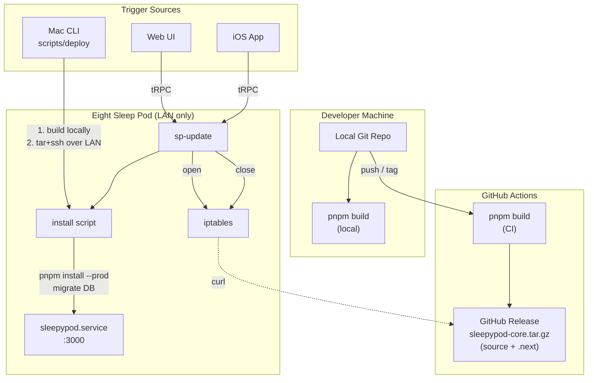

# Deployment Guide

SleepyPod Core runs on the Eight Sleep Pod, a Yocto-based embedded Linux device (aarch64). The pod has no package manager, no C compiler, no `git`, and only 2GB RAM. WAN access is blocked by iptables — only LAN and NTP traffic are allowed.

This guide covers how code gets from development to the pod.

## Architecture



## Three Deployment Paths

### Path 1: Mac Deploy (Development)

Builds locally (fast, full RAM), pushes built artifacts to the pod. No WAN needed on the pod.

```bash
./scripts/deploy                           # current branch -> 192.168.1.88
./scripts/deploy 192.168.1.50              # current branch -> different pod
./scripts/deploy 192.168.1.88 feat/alarms  # specific branch
```

**How it works:**
1. Checks out the requested branch locally (if specified)
2. Runs `pnpm build` on the Mac
3. Cleans stale files on the pod (preserves `node_modules`, `.env`)
4. Tars source + `.next` build, pipes over SSH
5. Runs `scripts/install --local --no-ssh` on the pod
6. Install script: installs prod deps (with prebuilt native modules), runs DB migrations, restarts service

**Requirements:** SSH access to pod on port 8822 with key auth.

### Path 2: CI Release (Production)

GitHub Actions builds on every push to `main` and on version tags. The build artifact is a tarball containing source + `.next` (pre-built). Tagged releases publish the tarball as a GitHub Release asset.

```yaml
# Triggered automatically:
# - Push to main: builds + uploads artifact
# - Tag v*: builds + creates GitHub Release with tarball
```

The pod downloads this pre-built tarball via `sp-update`, so it never needs to run `next build` (which requires more RAM than the pod has).

### Path 3: Remote Update (Web UI / iOS)

The pod self-updates by downloading from GitHub. Triggered via the `system.triggerUpdate` tRPC endpoint.

```bash
# From SSH on the pod:
sp-update              # latest release (pre-built)
sp-update feat/alarms  # specific branch (source only, needs build)

# From web UI or iOS app (tRPC):
# system.triggerUpdate({ branch: "main" })
# system.triggerUpdate({ branch: "feat/alarms" })
```

**How it works:**
1. Opens iptables (temporarily allows WAN)
2. Tries to download latest CI release tarball (includes `.next` — no build needed)
3. Falls back to GitHub source tarball if no release or if requesting a non-main branch
4. Installs prod dependencies (prebuild-install fetches linux-arm64 native modules)
5. Runs DB migrations
6. Closes iptables (re-blocks WAN)
7. Restarts service

**If the update fails:** iptables are restored and the service restarts with existing code. Database is restored from backup.

## Why Build Off-Device

The pod has 2GB RAM and no swap. Next.js 16 with Turbopack needs more memory than this for the build step. Instead of fighting that constraint, we build where resources are abundant (Mac or CI runner) and deploy only the runtime artifacts.

The `.next` output is platform-independent JavaScript — only `better-sqlite3` requires a platform-specific binary, which `prebuild-install` handles automatically on the pod.

## Design Decisions

### No git on the pod
The pod runs "Eight Layer" (Yocto kirkstone) — a minimal embedded Linux with no package manager. Instead of git, we use GitHub's tarball API and release assets. No commit history is needed on a deployment target.

### No rsync on the pod
The deploy script uses `tar | ssh` — creates a tar archive locally, pipes over SSH, extracts on the pod. Stale files are cleaned before extraction (mimics `rsync --delete`).

### prebuild-install for native modules
`better-sqlite3` ships with `prebuild-install`, which downloads precompiled binaries for `linux-arm64`. No C compiler needed on the pod.

### Node.js via binary tarball
Downloaded from `nodejs.org/dist/` for `linux-arm64`. No package manager required.

## Pod Environment

| Component | Status |
|---|---|
| OS | Eight Layer 4.0.2 (Yocto kirkstone) |
| Arch | aarch64 (ARM64) |
| Kernel | 5.15.42 |
| RAM | 2GB (no swap) |
| Package manager | None (dnf installed, no repos configured) |
| Node.js | Installed by sleepypod (binary tarball) |
| Python | 3.10.4 (built-in) |
| C compiler | Not available |
| git / rsync | Not available |
| curl / tar | Available |
| systemd | 250 |
| iptables | 1.8.7 |
| DAC socket | `/persistent/deviceinfo/dac.sock` |

## File Locations

| Path | Contents |
|---|---|
| `/home/dac/sleepypod-core` | App source + `node_modules` + `.next` build |
| `/persistent/sleepypod-data/sleepypod.db` | Config database |
| `/persistent/sleepypod-data/biometrics.db` | Biometrics database |
| `/home/dac/sleepypod-core/.env` | Environment config |
| `/opt/sleepypod/modules/` | Python biometrics modules |
| `/usr/local/bin/sp-*` | CLI shortcuts |

## CLI Shortcuts (on the pod)

```bash
sp-status              # systemctl status sleepypod.service
sp-restart             # restart the service
sp-logs                # tail service logs (journalctl -f)
sp-update [branch]     # self-update from GitHub (handles iptables)
```

## Coexistence with free-sleep

Both `free-sleep.service` and `sleepypod.service` bind to port 3000. Only one can run at a time:

```bash
# Switch to sleepypod
systemctl stop free-sleep.service && systemctl start sleepypod.service

# Switch back to free-sleep
systemctl stop sleepypod.service && systemctl start free-sleep.service
```
