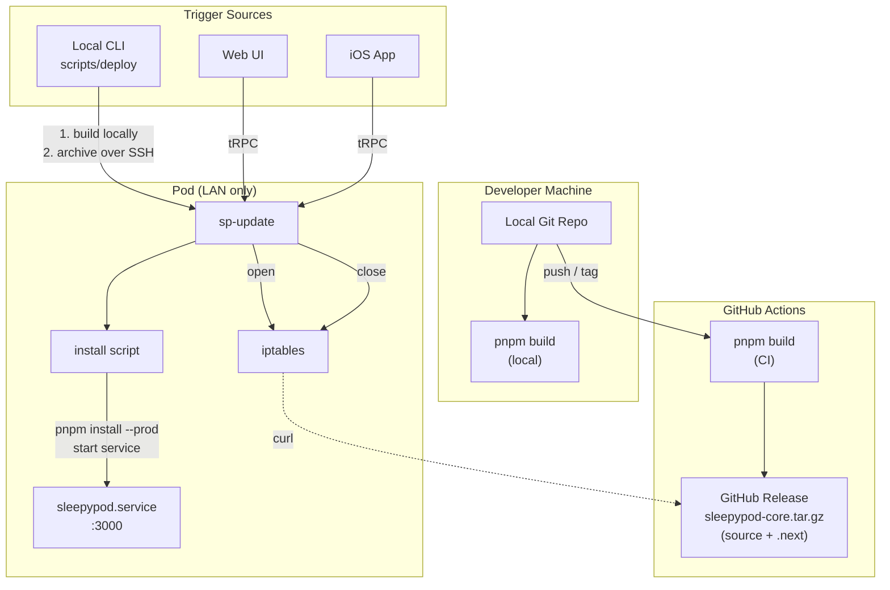

# Deployment Guide

sleepypod-core runs on the Pod, a Yocto-based embedded Linux device (aarch64). The pod has no package manager, no C compiler, no `git`, and only 2GB RAM. WAN access is blocked by iptables — only LAN and NTP traffic are allowed.

This guide covers how code gets from development to the pod.

## Architecture


```mermaid
flowchart TB
    subgraph dev["Developer Machine"]
        repo["Local Git Repo"]
        build_local["pnpm build<br/>(local)"]
    end

    subgraph ci["GitHub Actions"]
        build_ci["pnpm build<br/>(CI)"]
        release["GitHub Release<br/>sleepypod-core.tar.gz<br/>(source + .next)"]
    end

    subgraph pod["Pod (LAN only)"]
        spupdate["sp-update"]
        install["install script"]
        iptables["iptables"]
        service["sleepypod.service<br/>:3000"]
    end

    subgraph trigger["Trigger Sources"]
        mac["Local CLI<br/>scripts/deploy"]
        web["Web UI"]
        ios["iOS App"]
    end

    repo --> build_local
    repo -->|"push / tag"| build_ci
    build_ci --> release

    mac -->|"1. build locally<br/>2. archive over SSH"| spupdate
    web -->|"tRPC"| spupdate
    ios -->|"tRPC"| spupdate

    spupdate -->|"open"| iptables
    iptables -.->|"curl"| release
    spupdate -->|"close"| iptables
    spupdate --> install

    install -->|"pnpm install --prod<br/>start service"| service
```

## Three Deployment Paths

### Path 1: Local Deploy (macOS / Linux)

From a clone on your computer, build and transfer to an **already-installed** Pod:

```bash
./scripts/deploy 192.168.1.50              # current checkout, including local edits
./scripts/deploy 192.168.1.50 fix/my-fix   # branch fetched from this clone's origin
SSH_PORT=8822 ./scripts/deploy pod.local
```

Use the Node.js major in `.node-version` and the pnpm version pinned in
`package.json`. The script installs locked dependencies, builds locally, and
checks the bundle before uploading. Build workers use in-memory databases to
avoid modifying local data or contending over SQLite files. An optional branch builds in a temporary
Git worktree; your current branch and edits are preserved.

It uploads a complete archive before invoking `sp-update --archive` on the Pod.
Git metadata, `.env*`, databases, caches, and local `node_modules` are excluded.
The standalone server and its compiled configuration are retained; native
modules resolve from the production dependencies installed on the Pod.
The updater preserves the Pod's `.env`, backs up the installed code/database,
installs production dependencies for the Pod's architecture, and restarts the
service. Build-time public environment variables can still be embedded in the
Next.js output; build with the intended deployment configuration.

**Requirements:** root SSH key access (default port 8822), an existing SleepyPod
installation, and WAN access on the Pod for production/native dependencies.
The updater temporarily opens/restores a blocked WAN using the existing
firewall helpers. No GitHub release is required. For first installation, use
`scripts/install` instead.

### Validating a fork's PR

Check out the PR in your local clone and run `./scripts/deploy POD_IP`. This
works even when the fork has not published a branch release. Alternatively,
enable Actions in the fork and push the branch so its Branch Release workflow
publishes `sleepypod-core.tar.gz` under `<branch-with-slashes-replaced>-latest`.
Then run on the Pod:

```bash
sudo env SLEEPYPOD_GITHUB_REPO=OWNER/core sp-update fix/my-fix
```

A Git push alone does not upload a locally built `.next`; use the deployment
script or let CI build and publish the release.

### Path 2: CI Release (Production)

GitHub Actions builds on every push to `main` and on version tags. The build artifact is a tarball containing source + `.next` (pre-built). Tagged releases publish the tarball as a GitHub Release asset.

```yaml
# Triggered automatically:
# - Push to main: builds + uploads artifact
# - Tag v*: builds + creates GitHub Release with tarball
```

The pod downloads this pre-built tarball via `sp-update`, so it never needs to run `next build` (which requires more RAM than the pod has).

### Path 3: Remote Update (Web UI / iOS)

The pod self-updates by downloading from GitHub. Triggered via the `system.triggerUpdate` tRPC endpoint.

```bash
# From SSH on the pod:
sp-update              # latest release (pre-built)
sp-update feat/alarms  # pre-built feat-alarms-latest release
sp-update --archive /persistent/sleepypod-core.tar.gz  # uploaded pre-built archive

# From web UI or iOS app (tRPC):
# system.triggerUpdate({ branch: "main" })
# system.triggerUpdate({ branch: "feat/alarms" })
```

**How it works:**
1. Resolves `main`/`latest` to the latest stable release, `dev` to `dev-latest`, and other branches to `<slug>-latest`.
2. Downloads and validates the pre-built archive before replacing installed files.
3. Backs up the installed code and database, then installs the new code and production dependencies.
4. Restores the firewall and starts the service (database migrations run at startup).

There is no source-tarball fallback or on-Pod Next.js build. Missing releases,
API errors, failed downloads, and incomplete builds fail with actionable errors.
For a local archive, bundle validation happens before stopping the service.
When WAN is blocked, the service stops before opening the firewall to avoid
racing its firewall self-heal; preparation failures restart it with existing code.

`TMPDIR` defaults to `/persistent` for staging and rollback backups. It can be
overridden with an existing writable directory. The updater requires the
archive's pinned pnpm version and reports how to correct a mismatch.

**If the update fails:** the updater attempts to restore the firewall and,
after replacement has begun, the backed-up code and database. A failed update's
code backup remains at `$TMPDIR/sleepypod-rollback.*` for recovery. Dependency
changes in `node_modules` and module/systemd changes are not rolled back.

## Why Build Off-Device

The pod has 2GB RAM and no swap. Next.js 16 with Turbopack needs more memory than this for the build step. Instead of fighting that constraint, we build where resources are abundant (Mac or CI runner) and deploy only the runtime artifacts.

The `.next` output is platform-independent JavaScript — only `better-sqlite3` requires a platform-specific binary, which `prebuild-install` handles automatically on the pod.

## Design Decisions

### No git on the pod
The pod runs "Eight Layer" (Yocto kirkstone) — a minimal embedded Linux with no package manager. Instead of git, we use GitHub's tarball API and release assets. No commit history is needed on a deployment target.

### No rsync on the pod
The deploy script creates a tar archive locally and transfers it over SSH. The updater stages and validates it before replacing the installed application.

### prebuild-install for native modules
`better-sqlite3` ships with `prebuild-install`, which downloads precompiled binaries for `linux-arm64`. No C compiler needed on the pod.

### Node.js via binary tarball
Downloaded from `nodejs.org/dist/` for `linux-arm64`. No package manager required.

## Pod Environment

| Component | Status |
|---|---|
| OS | Eight Layer 4.0.2 (Yocto kirkstone) |
| Arch | aarch64 (ARM64) |
| Kernel | 5.15.42 |
| RAM | 2GB (no swap) |
| Package manager | None (dnf installed, no repos configured) |
| Node.js | Installed by sleepypod (binary tarball) |
| Python | 3.10.4 (built-in) |
| C compiler | Not available |
| git / rsync | Not available |
| curl / tar | Available |
| systemd | 250 |
| iptables | 1.8.7 |
| DAC socket | `/persistent/deviceinfo/dac.sock` (Pod 5) or `/deviceinfo/dac.sock` (Pod 3/4) — auto-detected from `frank.sh` |

## File Locations

| Path | Contents |
|---|---|
| `/home/dac/sleepypod-core` | App source + `node_modules` + `.next` build |
| `$DATA_DIR/sleepypod.db` | Config database — `$DATA_DIR` is chosen at install time (larger of `/` vs `/persistent` by total partition size) and persisted to `/etc/sleepypod/data-dir`. Default on Pod 4/5: `/persistent/sleepypod-data/sleepypod.db`; on Pod 3 + SD card: `/sleepypod-data/sleepypod.db`. |
| `$DATA_DIR/biometrics.db` | Biometrics database — same path resolution as above. |
| `/etc/sleepypod/data-dir` | Pointer file with the chosen `$DATA_DIR`. Read by `sp-update` / `sp-maintenance` / `sp-bundle-logs` / `sp-uninstall` / `scripts/pod/detect`. |
| `/home/dac/sleepypod-core/.env` | Environment config |
| `/opt/sleepypod/modules/` | Python biometrics modules |
| `/opt/sleepypod/python/` | `uv`-managed CPython (used when the firmware's `/usr/bin/python3` stdlib is incomplete — see `scripts/pod/capabilities`). |
| `/usr/local/bin/sp-*` | CLI shortcuts |

## CLI Shortcuts (on the pod)

```bash
sp-status              # systemctl status sleepypod.service
sp-restart             # restart the service
sp-logs                # tail service logs (journalctl -f)
sp-update [branch]     # self-update from GitHub (handles iptables)
```

## Network Security (Telemetry Blocking)

The pod runs two stock processes that continuously attempt to phone home:

| Process | Service | Target | Purpose |
|---|---|---|---|
| `frankenfirmware` | `frank.service` | `raw-api-upload.8slp.net:443` | Upload raw sensor data |
| `Eight.Capybara` | `capybara.service` | `wss://device-api-ws.8slp.net` | WebSocket device API hub |

We block these with **two independent layers**:

### Layer 1: iptables (primary)

The OUTPUT chain DROPs all non-LAN, non-NTP traffic. This is the same firewall that was on the pod before sleepypod — we preserve it.

### Layer 2: /etc/hosts null routes (defense-in-depth)

Stock firmware domains are null-routed to `0.0.0.0` in `/etc/hosts`. This prevents data exfiltration even when iptables are **temporarily opened** for `sp-update` or other maintenance. DNS resolves to `0.0.0.0` so frank/Capybara can't connect regardless of firewall state.

### Management

```bash
# Install both layers
sudo scripts/internet-control block

# Manage hosts layer independently
sudo scripts/internet-control hosts-block    # add null routes
sudo scripts/internet-control hosts-unblock  # remove null routes

# Check status of both layers
sudo scripts/internet-control status
```

### Domains blocked

- `raw-api-upload.8slp.net` — frank raw sensor data upload
- `device-api-ws.8slp.net` — Capybara WebSocket hub (configured in `/opt/eight/config/default.json`)
- `api.8slp.net`, `app-api.8slp.net`, `client-api.8slp.net` — preemptive

### Why not just stop frank/Capybara?

`frank` (frankenfirmware) also handles the sensor/frozen hardware communication — capSense, bed temperatures, pump control, piezo. Stopping it would break all biometrics. `Capybara` is only the cloud API client and could be disabled, but null-routing is safer and doesn't risk breaking undiscovered local dependencies.

## Replacing free-sleep

`free-sleep.service` and `sleepypod.service` both bind to port 3000 — only one can run. The installer stops and disables `free-sleep.service` / `free-sleep-stream.service` at install time so sleepypod can take over the port permanently. Run `sp-uninstall` if you want to revert (the script flushes iptables and removes sleepypod's units; you'll then need to re-enable free-sleep manually with `systemctl enable --now free-sleep.service`).
