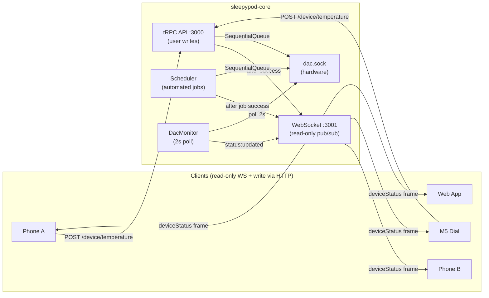
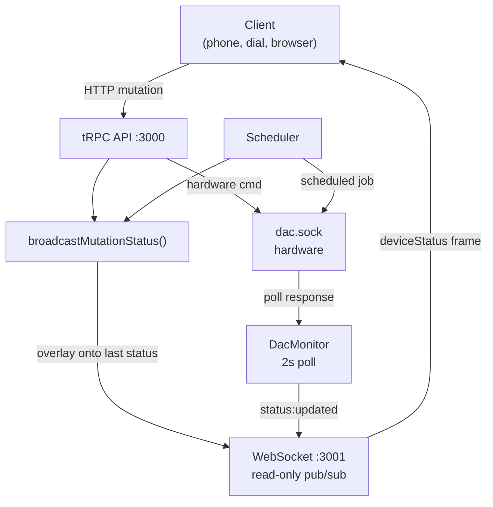

# ADR: Event Bus for Device Mutations

**Status**: Accepted
**Date**: 2026-03-22

## Context

When multiple clients (phones, M5 dials, web browsers) are connected to the pod, a temperature change from one client takes up to 30 seconds to appear on others. The delay comes from DacMonitor's 2-second poll interval plus client-side polling intervals.

The WebSocket server (`piezoStream` on port 3001) already broadcasts `deviceStatus` frames from DacMonitor's poll loop, and all clients already consume these frames. The infrastructure for instant push exists — it just isn't triggered after mutations.

Additionally, the `claim_processing` / `activeClient` / `processingState` protocol is dead code. No client sends `claim_processing` messages. It was originally designed for iOS processing ownership of the piezo stream, but the iOS app now uses HTTP for all writes and WebSocket for read-only subscriptions.

## Decision

### 1. Broadcast device status after all hardware writes

Extract `broadcastMutationStatus()` into a shared module (`src/streaming/broadcastMutationStatus.ts`). Both the **device router** (user-initiated mutations: `setTemperature`, `setPower`, `setAlarm`, `clearAlarm`, `snoozeAlarm`) and the **scheduler** (automated jobs: temperature, power on/off, alarm) call it after hardware success. This overlays the mutation onto `dacMonitor.getLastStatus()` and calls `broadcastFrame()` with a `deviceStatus` frame.

Fire-and-forget — never blocks the caller. DacMonitor's 2-second poll remains the authoritative consistency backstop (it reads actual hardware state). All hardware commands go through `dacTransport`'s `SequentialQueue`, so writes from concurrent sources (user mutation + scheduled job) are serialized at the transport level.

### 2. Remove claim_processing

Delete `processingState.ts` and strip all `activeClient`, `heartbeatTimer`, `resetHeartbeatTimer()`, `releaseClient()`, and claim/release/heartbeat message handlers from `piezoStream.ts`. Remove `getProcessingStatus` from the biometrics router. Remove client-side heartbeat sending from `useSensorStream.ts`.

The WebSocket becomes a pure read-only pub/sub channel.

## Architecture

### Data flow overview

## Consequences

**Positive:**
- Multi-client latency drops from up to 30s to ~200ms (temperature debounce)
- ~79 lines of dead code removed (net −135/+56)
- WebSocket protocol simplified — no claim/release state machine
- No new dependencies or infrastructure

**Negative:**
- Mutation broadcast uses `getLastStatus()` as the base, which may be up to 2s stale for fields not part of the mutation. DacMonitor's next poll corrects this.
- If `getLastStatus()` is null (monitor not yet started), no broadcast occurs. The 2s poll backstop handles this edge case.

**Neutral:**
- `device.getStatus` tRPC endpoint still exists for initial page load, non-WebSocket clients (iOS, CLI), and fallback when WS is unavailable.
