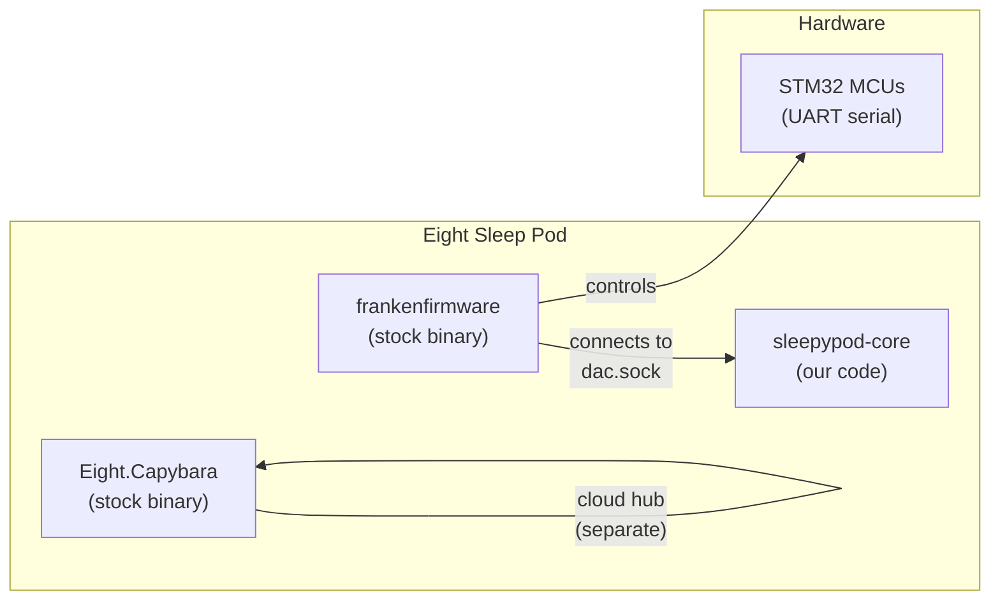
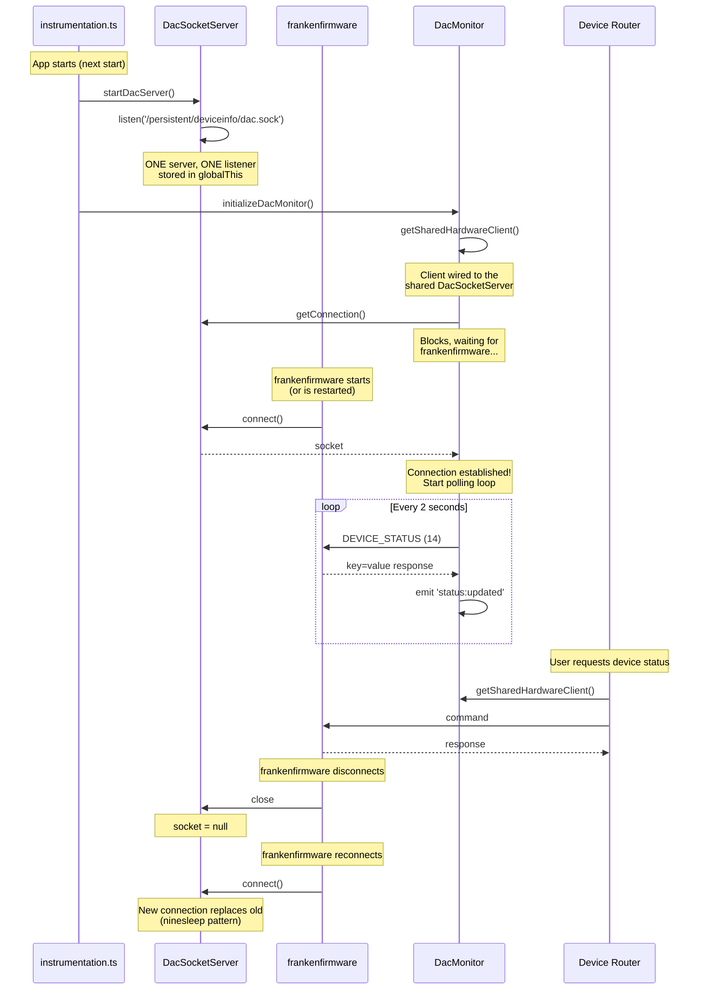

# DAC Hardware Protocol

How sleepypod-core communicates with the Eight Sleep Pod hardware.

## Architecture

The Pod runs three stock Eight Sleep processes:
- **frankenfirmware** — controls the hardware (temperature, pumps, sensors, alarms)
- **Eight.Capybara** — cloud connectivity (hub connection, OTA updates)
- **DAC** (replaced by sleepypod-core or free-sleep) — user-facing API and control

sleepypod-core **replaces the DAC** process. frankenfirmware connects TO us.



## Connection Lifecycle

This is the critical initialization sequence. Getting this wrong causes the connection to fail or compete.



## Key Design Decisions

### ONE socket server, shared by all consumers

```
DacSocketServer (globalThis singleton)
    └── HardwareClient (shared)
        ├── DacMonitor (polling every 2s)
        ├── Device Router (ad-hoc API calls)
        └── Health Router (connectivity checks)
```

All consumers share ONE `DacSocketServer` listening on `dac.sock`. There must never be multiple servers — frankenfirmware connects to whoever is listening, and competing listeners cause connection drops.

### No handshake, no verification

Based on ninesleep's implementation: frankenfirmware connects and the socket is immediately ready for commands. No HELLO, no verification step. Just accept the connection and start sending commands when needed.

### Replace-on-reconnect

When frankenfirmware reconnects (after a restart or transient disconnect), the new connection replaces the old one. This is not an error — it's normal operation. The DacSocketServer handles this automatically.

### frankenfirmware must be restarted after deploy

frankenfirmware connects to `dac.sock` on startup. If sleepypod-core creates `dac.sock` after frankenfirmware has already started, frankenfirmware won't discover it. The install script kills frankenfirmware so it respawns and finds our socket.

## Wire Protocol

Text-based, newline-delimited:

```
Request:  {command_number}\n{argument}\n\n
Response: {data}\n\n
```

The double newline (`\n\n`) terminates each message.

### Commands

| Code | Command | Argument | Description |
|------|---------|----------|-------------|
| `0` | HELLO | — | Ping/connectivity check |
| `1` | SET_TEMP | temp value | Set temperature (legacy) |
| `5` | ALARM_LEFT | hex CBOR | Configure left alarm |
| `6` | ALARM_RIGHT | hex CBOR | Configure right alarm |
| `8` | SET_SETTINGS | hex CBOR | LED brightness, etc. |
| `9` | LEFT_TEMP_DURATION | seconds | Auto-off duration (left) |
| `10` | RIGHT_TEMP_DURATION | seconds | Auto-off duration (right) |
| `11` | TEMP_LEVEL_LEFT | -100 to 100 | Set left temperature level |
| `12` | TEMP_LEVEL_RIGHT | -100 to 100 | Set right temperature level |
| `13` | PRIME | — | Start water priming |
| `14` | DEVICE_STATUS | — | Get all device status |
| `16` | ALARM_CLEAR | 0 or 1 | Clear alarm (0=left, 1=right) |

### Temperature Scale

| Level | Fahrenheit | Description |
|-------|-----------|-------------|
| -100 | 55°F | Maximum cooling |
| 0 | 82.5°F | Neutral (no heating/cooling) |
| +100 | 110°F | Maximum heating |

Formula: `°F = 82.5 + (level / 100) × 27.5`

### DEVICE_STATUS Response

Key-value pairs separated by newlines:
```
tgHeatLevelR=-20
tgHeatLevelL=30
heatTimeL=0
heatLevelL=28
heatTimeR=0
heatLevelR=-18
sensorLabel=I00-xxxx
waterLevel=true
priming=false
doubleTap={"l":0,"r":0}
tripleTap={"l":0,"r":0}
quadTap={"l":0,"r":0}
```

### Timing

- **50ms** read timeout after writing a command (per ninesleep)
- **10ms** hardware processing delay (per free-sleep)
- **2000ms** polling interval for DacMonitor

## References

- **ninesleep** (bobobo1618/ninesleep) — Rust DAC replacement, same Unix socket server pattern
- **opensleep** (liamsnow/opensleep) — Full firmware replacement, raw UART/STM32 protocol
- **free-sleep** (free-sleep) — Node.js DAC replacement, FrankenServer pattern
