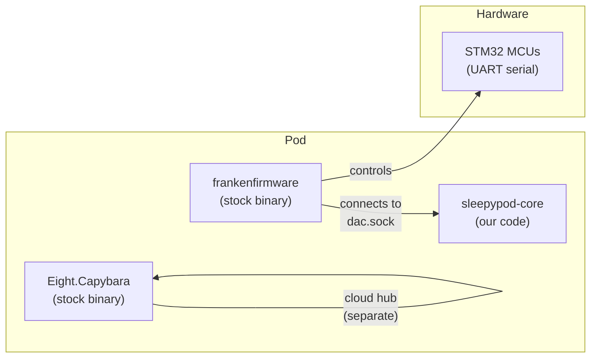
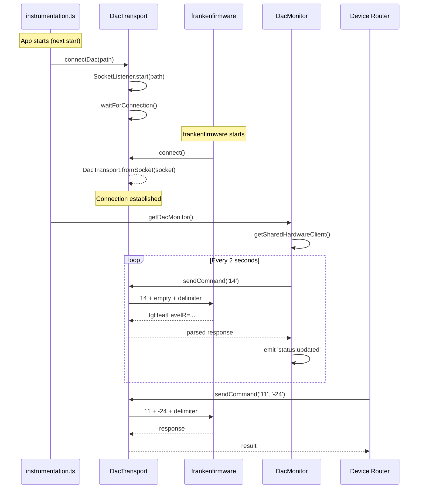

# DAC Hardware Protocol

How sleepypod-core communicates with the Pod hardware.

## Architecture

The Pod runs three stock processes:
- **frankenfirmware** — controls the hardware (temperature, pumps, sensors, alarms)
- **Eight.Capybara** — cloud connectivity (hub connection, OTA updates)
- **DAC** (replaced by sleepypod-core) — user-facing API and control

sleepypod-core **replaces the DAC** process. frankenfirmware connects TO us.



## Connection Lifecycle



## Connection Architecture

### One server, one transport, one queue

```
SocketListener (listens on dac.sock)
  └── DacTransport (wraps connected socket)
       └── SequentialQueue (one command at a time)
            └── MessageStream (binary-split on double-newline)
```

All consumers share a single `DacTransport` instance via `getSharedHardwareClient()`:

```
getSharedHardwareClient()  ← singleton
  └── DacHardwareClient    ← typed interface (setTemperature, getDeviceStatus, etc.)
       └── sendCommand()   ← raw protocol
            ├── DacMonitor (polling every 2s)
            ├── Device Router (ad-hoc API calls)
            ├── Job Manager (scheduled operations)
            ├── Health Router (connectivity checks)
            └── Gesture Handler (tap actions)
```

### How it works

1. **`SocketListener`** creates a Unix socket server at `dac.sock` and queues incoming connections
2. **`connectDac()`** pulls a connection from the queue (blocks if none available)
3. **`DacTransport.fromSocket()`** wraps the socket with a `MessageStream` and `SequentialQueue`
4. **`sendCommand()`** writes a command, waits 10ms, reads the response — all serialized through the queue
5. If the connection times out (25s), the server is destroyed and recreated
6. If frankenfirmware disconnects, a new connection is accepted on the next call

### Why this design

- **Queue, don't replace.** Incoming connections are queued. The consumer pulls when ready. Replacing on connect kills the active connection.
- **One transport for all consumers.** Multiple independent connections to `dac.sock` cause each to be treated as a new frankenfirmware, destroying the real one.
- **Pipe only when ready.** The message stream is set up after the consumer takes the connection, not eagerly on accept.
- **Sequential commands.** One command, one response. The 10ms delay between write and read lets the hardware buffer its response.
- **Restart frankenfirmware after deploy.** It only discovers `dac.sock` on startup. The install script kills it so it respawns and connects.

## Wire Protocol

Text-based, double-newline delimited:

```
Request:  {command_number}\n{argument}\n\n
Response: {data}\n\n
```

When no argument is needed, send just the command number:
```
14\n\n    (DEVICE_STATUS query)
```

### Commands

| Code | Command | Argument | Description |
|------|---------|----------|-------------|
| `0` | HELLO | — | Ping/connectivity check |
| `1` | SET_TEMP | temp value | Set temperature (legacy) |
| `5` | ALARM_LEFT | hex CBOR | Configure left alarm |
| `6` | ALARM_RIGHT | hex CBOR | Configure right alarm |
| `8` | SET_SETTINGS | hex CBOR | LED brightness, etc. |
| `9` | LEFT_TEMP_DURATION | seconds | Auto-off duration (left) |
| `10` | RIGHT_TEMP_DURATION | seconds | Auto-off duration (right) |
| `11` | TEMP_LEVEL_LEFT | -100 to 100 | Set left temperature level |
| `12` | TEMP_LEVEL_RIGHT | -100 to 100 | Set right temperature level |
| `13` | PRIME | — | Start water priming |
| `14` | DEVICE_STATUS | — | Get all device status |
| `16` | ALARM_CLEAR | 0 or 1 | Clear alarm (0=left, 1=right) |

### Temperature Scale

| Level | Fahrenheit | Description |
|-------|-----------|-------------|
| -100 | 55 F | Maximum cooling |
| 0 | 82.5 F | Neutral (no heating/cooling) |
| +100 | 110 F | Maximum heating |

Formula: `F = 82.5 + (level / 100) * 27.5`

### DEVICE_STATUS Response

Key-value pairs separated by newlines:
```
tgHeatLevelR=-20
tgHeatLevelL=30
heatTimeL=0
heatLevelL=28
heatTimeR=0
heatLevelR=-18
sensorLabel=I00-xxxx
waterLevel=true
priming=false
doubleTap={"l":0,"r":0}
tripleTap={"l":0,"r":0}
quadTap={"l":0,"r":0}
```

### Timing

- **10ms** delay between writing command and reading response
- **2000ms** polling interval for DacMonitor
- **25s** timeout waiting for frankenfirmware to connect (then retry with server recreation)

## References

- **ninesleep** (bobobo1618/ninesleep) — Rust DAC replacement, same Unix socket server pattern
- **opensleep** (liamsnow/opensleep) — Full firmware replacement, raw UART/STM32 protocol
