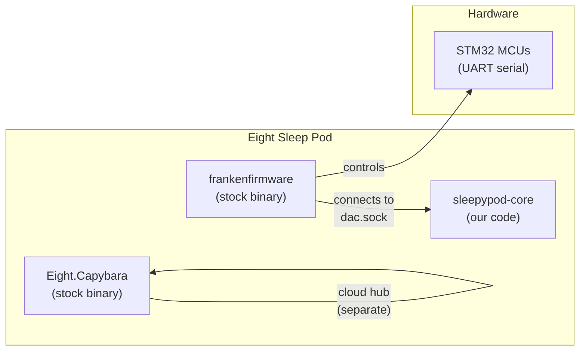
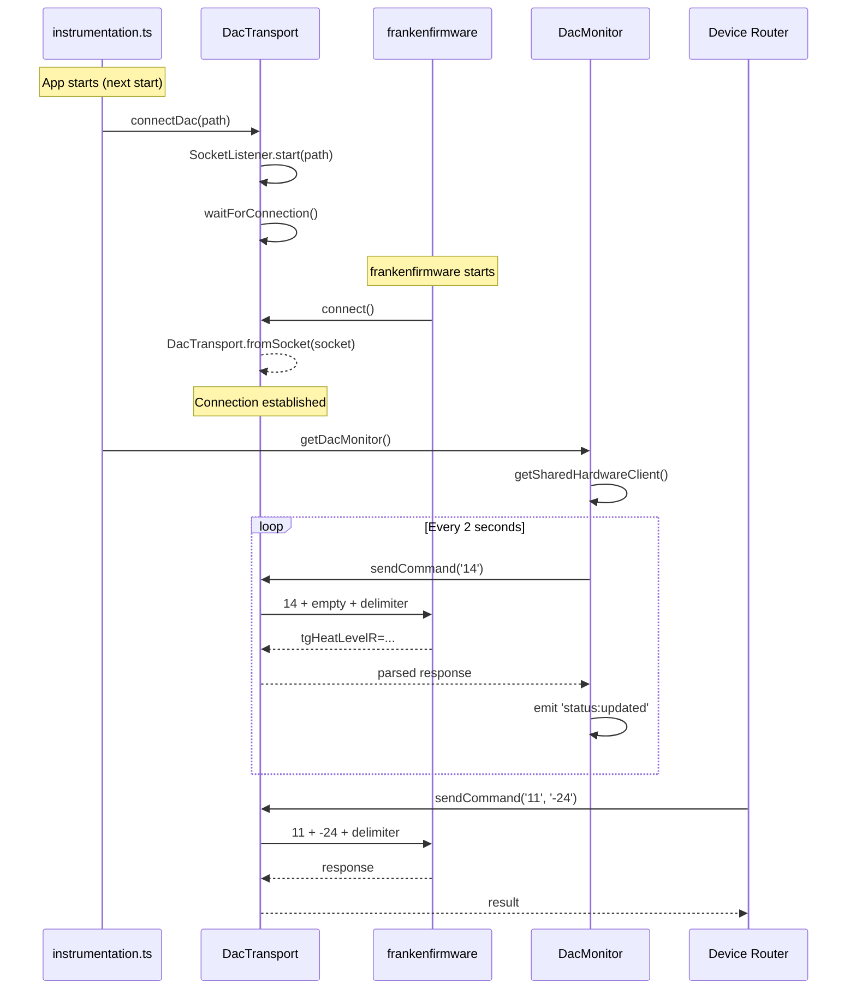

# DAC Hardware Protocol

How sleepypod-core communicates with the Eight Sleep Pod hardware.

## Architecture

The Pod runs three stock Eight Sleep processes:
- **frankenfirmware** — controls the hardware (temperature, pumps, sensors, alarms)
- **Eight.Capybara** — cloud connectivity (hub connection, OTA updates)
- **DAC** (replaced by sleepypod-core) — user-facing API and control

sleepypod-core **replaces the DAC** process. frankenfirmware connects TO us.



## Connection Lifecycle



## Critical: Why the Connection Pattern Matters

If you're building software that communicates with the Eight Sleep Pod hardware, **you must follow this pattern exactly**. This section documents what we learned through extensive debugging.

### The Problem

Our initial implementation used a custom socket server that:
1. Created a Unix socket server with `createServer(callback)`
2. Replaced the previous connection when a new one arrived
3. Eagerly wrapped sockets in a message stream pipe
4. Let multiple consumers create independent hardware client instances

**Result**: frankenfirmware connected, stayed for 1-2 seconds, then disconnected. Every time.

### What We Tried (and Failed)

| Attempt | Result |
|---------|--------|
| No handshake/HELLO on connect | Still disconnects after 1s |
| Stability check (wait 500ms before using) | Passes check, then drops |
| Retry loop with server recreation | Connects on retry, still drops |
| `globalThis` singleton to prevent duplicate servers | Same behavior |
| Socket chown to `dac:dac` | Slightly longer (5s), still drops |
| Run service as `dac` user | Service startup issues |
| Remove all data listeners | Same 1s disconnect |

### What Actually Worked

A queue-and-wait socket server with a single shared transport. Connection is stable, polls every 2 seconds indefinitely.

### The Key Differences

```mermaid
flowchart TD
    subgraph broken["Custom Socket Server (BROKEN)"]
        b1["createServer(callback)"]
        b2["Replace old socket on new connection"]
        b3["Eager pipe through binary-split"]
        b4["Multiple HardwareClient instances"]
        b5["Consumers connect as clients to dac.sock"]
        b1 --> b2 --> b3 --> b4 --> b5
    end

    subgraph working["DacTransport (WORKING)"]
        w1["createServer() + server.on('connection')"]
        w2["Queue connections, let consumer pull"]
        w3["Pipe only when transport wraps socket"]
        w4["ONE transport instance via sendCommand()"]
        w5["All commands go through single queue"]
        w1 --> w2 --> w3 --> w4 --> w5
    end
```



#### 1. Connection handling: queue vs replace

**Broken**: New connections destroy the previous socket. If anything (health check, scheduled job, gesture handler) connected as a client to `dac.sock`, it killed frankenfirmware's real connection.

**Working**: Connections are queued. The consumer explicitly calls `waitForConnection()` to pull the next one. Stale queued connections are cleaned up, but the active connection is never touched.

#### 2. Consumer model: many clients vs one channel

**Broken**: 7+ call sites created independent hardware client instances with `new HardwareClient({ socketPath })`. Without a shared transport reference, these connected as **outbound clients** to `dac.sock`. The server saw each as a new incoming connection and destroyed frankenfirmware's socket.

**Working**: ONE `DacTransport` instance wraps the socket. ALL commands go through `sendCommand()` which uses a `SequentialQueue`. No consumer ever touches the socket directly.

#### 3. Socket wrapping timing

**Broken**: Socket was immediately piped through `binary-split` on accept. This set up Node.js flow control (backpressure) on the socket before any consumer was ready to read.

**Working**: Socket is wrapped in `DacTransport.fromSocket()` which sets up the message stream, but only AFTER the connection is pulled by `waitForConnection()`. The consumer is ready to read when the pipe is created.

#### 4. Sequential command execution

Both implementations use a sequential queue, but the working version ensures **exactly one in-flight command** with a 10ms delay between write and read:

```typescript
async sendMessage(message: string) {
  return this.queue.exec(async () => {
    await this.write(Buffer.concat([Buffer.from(message), SEPARATOR]))
    await wait(10)  // hardware processing delay
    return (await this.messageStream.readMessage()).toString()
  })
}
```

### Rules for Pod Hardware Communication

1. **ONE socket server, ONE consumer.** Never create multiple hardware client instances. Use a shared singleton.
2. **Queue connections, don't replace.** Let the consumer pull connections when ready.
3. **Don't eagerly pipe.** Only set up the message stream when you're ready to send commands.
4. **Never connect as a client to your own socket.** Any outbound `socket.connect(dacSockPath)` will be seen as a new frankenfirmware connection and kill the real one.
5. **Sequential commands only.** One command, one response. Wait 10ms between write and read.
6. **Restart frankenfirmware after creating dac.sock.** It only connects on startup.

## Wire Protocol

Text-based, double-newline delimited:

```
Request:  {command_number}\n{argument}\n\n
Response: {data}\n\n
```

When no argument is needed, send just the command number:
```
14\n\n    (DEVICE_STATUS query)
```

### Commands

| Code | Command | Argument | Description |
|------|---------|----------|-------------|
| `0` | HELLO | — | Ping/connectivity check |
| `1` | SET_TEMP | temp value | Set temperature (legacy) |
| `5` | ALARM_LEFT | hex CBOR | Configure left alarm |
| `6` | ALARM_RIGHT | hex CBOR | Configure right alarm |
| `8` | SET_SETTINGS | hex CBOR | LED brightness, etc. |
| `9` | LEFT_TEMP_DURATION | seconds | Auto-off duration (left) |
| `10` | RIGHT_TEMP_DURATION | seconds | Auto-off duration (right) |
| `11` | TEMP_LEVEL_LEFT | -100 to 100 | Set left temperature level |
| `12` | TEMP_LEVEL_RIGHT | -100 to 100 | Set right temperature level |
| `13` | PRIME | — | Start water priming |
| `14` | DEVICE_STATUS | — | Get all device status |
| `16` | ALARM_CLEAR | 0 or 1 | Clear alarm (0=left, 1=right) |

### Temperature Scale

| Level | Fahrenheit | Description |
|-------|-----------|-------------|
| -100 | 55 F | Maximum cooling |
| 0 | 82.5 F | Neutral (no heating/cooling) |
| +100 | 110 F | Maximum heating |

Formula: `F = 82.5 + (level / 100) * 27.5`

### DEVICE_STATUS Response

Key-value pairs separated by newlines:
```
tgHeatLevelR=-20
tgHeatLevelL=30
heatTimeL=0
heatLevelL=28
heatTimeR=0
heatLevelR=-18
sensorLabel=I00-xxxx
waterLevel=true
priming=false
doubleTap={"l":0,"r":0}
tripleTap={"l":0,"r":0}
quadTap={"l":0,"r":0}
```

### Timing

- **10ms** delay between writing command and reading response
- **2000ms** polling interval for DacMonitor
- **25s** timeout waiting for frankenfirmware to connect (then retry with server recreation)

## References

- **ninesleep** (bobobo1618/ninesleep) — Rust DAC replacement, same Unix socket server pattern
- **opensleep** (liamsnow/opensleep) — Full firmware replacement, raw UART/STM32 protocol
