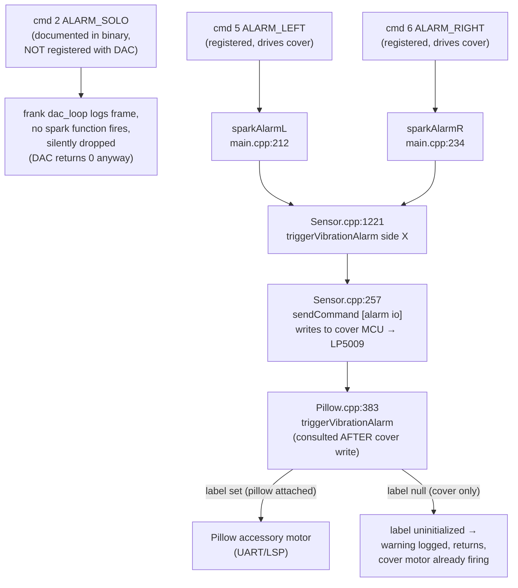

# Alarm system

How a user-configured alarm becomes a buzz on the cover. Covers the three
documented firmware alarm opcodes, which of them actually fires the
cover motor on Pod 5 J55 firmware, the CBOR wire format, and the live
diagnosis technique. The original "use solo" decision in
[ADR 0021](../adr/0021-alarm-solo-trigger.md) was wrong and is now
superseded — see that ADR's "Correction" section and the
[Reality check](#reality-check-pod-5-j55-firmware) below.

## End-to-end flow

```mermaid
flowchart LR
    UI["AlarmEditor / AlarmSection"]
    Trpc["device.setAlarm tRPC mutation"]
    Sched["jobManager (cron)"]
    Client["sharedClient.ts<br/>HardwareClient.setAlarm()"]
    Encode["alarmPayload.ts<br/>encodeAlarmPayload()"]
    Dac["dacTransport<br/>sendCommand()"]
    Sock["/persistent/deviceinfo/dac.sock"]
    Frank["frankenfirmware"]
    LP5009L["LP5009 left<br/>(cover motor driver)"]
    LP5009R["LP5009 right<br/>(cover motor driver)"]

    UI -->|"Test button"| Trpc
    Sched -->|"scheduled fire"| Client
    Trpc --> Client
    Client --> Encode
    Encode -->|"hex-CBOR string"| Dac
    Dac -->|"{cmd}\n{arg}\n\n"| Sock
    Sock --> Frank
    Frank -->|"sparkAlarmL / triggerVibrationAlarm<br/>(side: 'left')"| LP5009L
    Frank -->|"sparkAlarmR / triggerVibrationAlarm<br/>(side: 'right')"| LP5009R
```



The UI calls `device.setAlarm` for immediate tests; the scheduler calls
`setAlarm()` directly when an `alarm_schedules` row fires. Both end up at
the same hardware client, with the same per-side opcode (`ALARM_LEFT`
cmd 5 or `ALARM_RIGHT` cmd 6).

## The documented alarm opcodes

frankenfirmware's binary references three alarm-related code paths. Same
wire format on all three; the command code selects the path. Live
behavior on Pod 5 J55 firmware:



### Reality check: Pod 5 J55 firmware

- **`ALARM_SOLO` (cmd 2) silently drops.** The strings
  `sparkAlarmS`, `[alarm] vib. solo`, `setHighCurrentVibration`,
  `enabling Pod 2.0 vibration (simultaneous motors)` are present in the
  binary, but the spark function is not registered with the DAC on this
  firmware. frank's `dac_loop` logs the incoming frame and nothing else
  — no motor write. The DAC response is `0` (default for an unregistered
  opcode), which makes the call look successful to the API layer.
- **`ALARM_LEFT` / `ALARM_RIGHT` (cmd 5 / 6) fire the cover motor on
  cover-only pods.** The pillow label gate (`Pillow.cpp:383`) only
  affects the separate pillow-accessory motor; it runs AFTER the cover
  motor write (`Sensor.cpp:1221 triggerVibrationAlarm` →
  `Sensor.cpp:257 [alarm io] side N power P pattern X for D`). The
  "label uninitialized or does not support vibration" log line that
  appears in cover-only setups is cosmetic from the alarm system's
  point of view — the cover has already been told to vibrate.

**Routing:** `HardwareClient.setAlarm()` uses `ALARM_LEFT` (cmd 5) for
`side: 'left'` and `ALARM_RIGHT` (cmd 6) for `side: 'right'`, both with
the hex-CBOR payload from `encodeAlarmPayload()`. Per-side independence
is real.

## CBOR payload

Every alarm command takes a single string argument: the hex encoding of a
CBOR-serialized map. Four Particle-Spark-style short keys.

| Key  | Type   | Range / format        | Meaning                                                                              |
|------|--------|-----------------------|--------------------------------------------------------------------------------------|
| `pl` | uint   | 1–100                 | Power level (intensity %). Hardware-enforced; >100 rejected at parse. **No perceived effect on Pod 5 J55** — see [Empirical behavior](#empirical-behavior-pl-and-pi). |
| `du` | uint   | 10–180 (seconds)      | Duration. Firmware silently ignores values below 10s — the motor won't engage. We clamp client-side. **Only field with a user-meaningful effect** on Pod 5 J55. |
| `pi` | string | `"rise"` \| `"double"`| Vibration pattern. `rise` is documented as soft→strong ramp, `double` as two firm bursts — but both feel identical on Pod 5 J55. See [Empirical behavior](#empirical-behavior-pl-and-pi). |
| `tt` | uint   | unix epoch seconds    | Trigger time. Firmware uses it for retry windows and dismiss correlation.            |

### Empirical behavior: `pl` and `pi`

Live tested on Pod 5 J55 (192.168.1.88) — 2026-05-12:

- **`pl` (intensity) has no perceptible effect.** `pl=1` and `pl=100`
  produce indistinguishable buzz. frank logs echo the correct power
  value, so the truncation happens downstream in the cover MCU (the
  separate firmware blob that drives the LP5009). The MCU appears to
  run a fixed motor envelope regardless of the power argument.
- **`pi='rise'` and `pi='double'` feel the same.** Both patterns
  produce the same buzz profile. The firmware log line
  `Sensor.cpp:257 [alarm io] … pattern X` echoes the value, but the
  cover MCU does not appear to switch envelope shapes.
- **Net: `du` (duration) is the only user-meaningful field.** The UI
  exposes intensity and pattern controls, but they are cosmetic on the
  current firmware. Document this in any user-facing setting and
  consider hiding or disabling the controls until firmware behavior
  is confirmed on other pod versions.

Reverse-engineering the cover MCU envelope tables is a separate effort
— frank doesn't have visibility into it.

Encoding (`src/hardware/alarmPayload.ts`):

```typescript
const encoder = new Encoder({ useRecords: false })

export function encodeAlarmPayload(config: AlarmConfig): string {
  const payload = {
    pl: config.vibrationIntensity,
    du: Math.max(10, config.duration),
    pi: config.vibrationPattern,
    tt: Math.floor(Date.now() / 1000),
  }
  return Buffer.from(encoder.encode(payload)).toString('hex')
}
```

### Worked example

`config = { vibrationIntensity: 60, vibrationPattern: 'rise', duration: 15 }` at
unix time `1778486725` encodes to:

```text
b9000462706c183c6264750f62706964726973656274741a6a018d52
```

Decoded byte-by-byte:

| Bytes           | CBOR meaning              |
|-----------------|---------------------------|
| `b9 0004`       | map with 4 entries        |
| `62 70 6c`      | text(2) = `"pl"`          |
| `18 3c`         | uint(0x3c) = 60           |
| `62 64 75`      | text(2) = `"du"`          |
| `0f`            | uint(15)                  |
| `62 70 69`      | text(2) = `"pi"`          |
| `64 72697365`   | text(4) = `"rise"`        |
| `62 74 74`      | text(2) = `"tt"`          |
| `1a 6a018d52`   | uint(0x6a018d52) = epoch  |

### Earlier (broken) format

The original implementation sent a comma string —
`"{intensity},{patternCode},{duration}"` where `patternCode` was `'0'` or
`'1'`. The firmware's registered function (`SensorAlarm.h::
trySparkParseAlarmSettings`) rejected this with:

```text
ERR SensorAlarm.h:39 trySparkParseAlarmSettings|alarm settings args: 80,0,10
WRN device_api_client.cpp:26 receive|receive: 5 registered-function returned err:-1
```

The CBOR map is what the firmware (and the official 8 Sleep cloud) expects.

## Wire framing

The DAC socket is a Unix stream socket at
`/persistent/deviceinfo/dac.sock`. Frames are text:

```text
{command-code}\n{argument}\n\n
```

`\n\n` is the message delimiter. The argument is the hex-CBOR string for
alarm commands, a plain integer for temperature setpoints, etc. See
`docs/hardware/DAC-PROTOCOL.md` for the full command table.

## Clearing the alarm

The `ALARM_CLEAR` command (cmd `16`) takes a single character argument:
`'0'` = clear left, `'1'` = clear right. It works regardless of which
opcode started the alarm (firmware's clear path doesn't consult pillow
labels). `device.clearAlarm` uses this directly; `snoozeAlarm` clears,
schedules a setTimeout, and re-sends the same alarm config when the
timer fires (`src/hardware/snoozeManager.ts`).

**Cover-motor startup race:** the cover MCU needs a non-trivial time to
ramp the LP5009 from a clear state to motor-running. Sending
`ALARM_CLEAR` within ~100ms of `ALARM_LEFT`/`RIGHT` cancels the buzz
before the user feels it (verified live — `alarm[left] start` log line
appears, but the next line is `alarm[left] off` from the clear). Probe
scripts must let the buzz run before clearing.

## Diagnosing "API returns success but no buzz"

The DAC response code is unreliable — frank returns `0` for any opcode
without a registered spark function, masking a silent drop. The ground
truth is in `journalctl -u frank` on the pod. The full chain on a
working cover-motor write looks like:

```text
dac_loop command: 5 payload: b9...
[alarm] vib. left: time …, power …, pattern double, dur …
Sensor.cpp:1221 triggerVibrationAlarm side left
Sensor.cpp:257 sendCommand [alarm io] side 0 power … pattern … for …
Pillow.cpp:383 left label uninitialized or does not support vibration   ← cosmetic, ignore
Sensor.cpp:614 [sensor] -> FW: … alarm[left] start: power … dur … ms
```

If `sparkAlarmL` / `sparkAlarmR` (or `triggerVibrationAlarm`) does not
appear after `dac_loop command: N`, the opcode has no registered
handler. If `alarm[left] start` appears followed quickly by
`alarm[left] off`, a clear races the start.

## Why two layers of motor drivers?

The cover has two **LP5009** chips — one per side — that drive both LEDs
and the vibration motor on that side. Button-press haptic feedback is
generated locally by the cover MCU writing to the LP5009; the pod never
sees those motor commands. The alarm path is the other direction: the pod
tells the cover MCU "vibrate now", and the cover MCU writes the
intensity/pattern envelope to its local LP5009.

The Pillow accessory has its own MCU and its own motor on a separate
UART link. The firmware's `Pillow.cpp` path is what drives it. The cover
motors are accessible via `ALARM_LEFT`/`ALARM_RIGHT` (cmd 5/6) — the
pillow code path runs after the cover write and is a no-op on cover-only
pods (a warning logs but the cover motor has already started).

## Files

- `src/hardware/alarmPayload.ts` — `encodeAlarmPayload()` (single source of truth)
- `src/hardware/sharedClient.ts` — production write path (`getSharedHardwareClient`)
- `src/hardware/client.ts` — dev/test write path
- `src/hardware/types.ts` — `HardwareCommand.ALARM_LEFT/RIGHT/CLEAR` (the
  enum's `ALARM_SOLO` entry maps to cmd 2 but is a dead opcode on the
  current firmware — see [Reality check](#reality-check-pod-5-j55-firmware))
- `src/server/routers/device.ts` — `setAlarm` / `clearAlarm` / `snoozeAlarm` tRPC procedures + `execute` raw passthrough
- `src/scheduler/jobManager.ts` — fires scheduled `alarm_schedules` rows
- `src/components/Schedule/AlarmEditor.tsx` — UI Test button + persistence

## Open work

- Confirm `ALARM_LEFT` / `ALARM_RIGHT` cover-motor write works on Pod 3
  and Pod 4 firmware (verified on Pod 5 J55 only).
- Investigate why `sparkAlarmS` (cmd 2) is unregistered. Strings remain
  in the binary but no spark function attaches. Could be an 8 Sleep
  firmware change between releases; worth re-probing if firmware updates.
