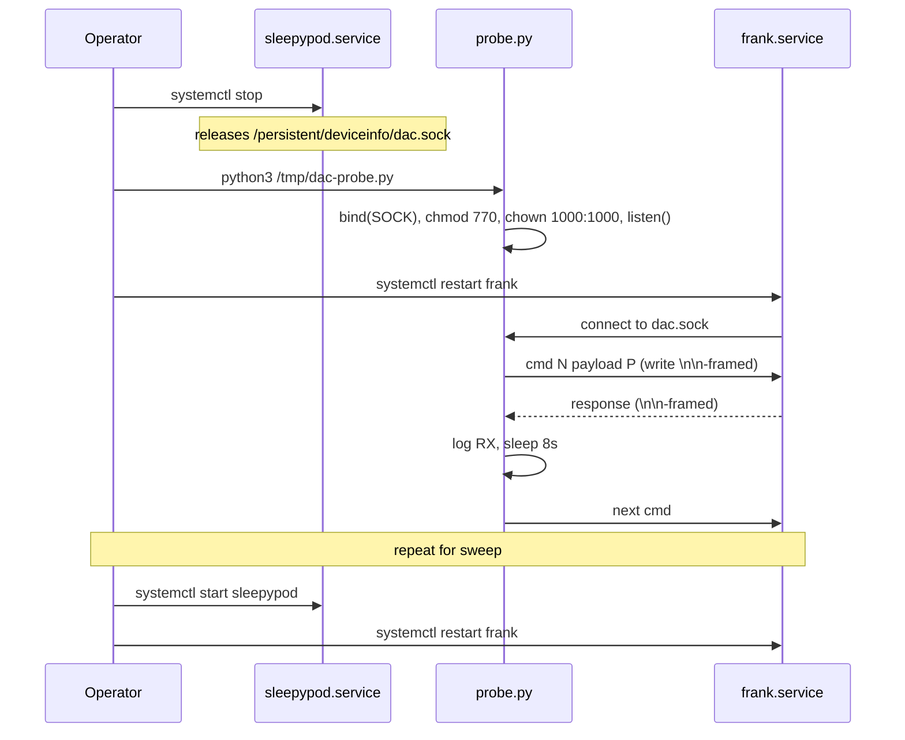

# DAC socket takeover — investigation technique and findings

Reference notes for the next agent that needs to probe frankenfirmware
behavior directly. Written 2026-05-12 during an attempt to diagnose
why `ALARM_SOLO` (cmd 2) stopped buzzing on `eight-pod` (Pod 5,
cover-only, no Pillow). The technique works; some firmware-side gotchas
made it less useful than expected.

## Why take over the socket

sleepypod-core owns `/persistent/deviceinfo/dac.sock` — it listens,
frankenfirmware connects as the client. Everything the app sends to
the firmware goes over that one socket, and `device.execute` is the
only way to send arbitrary cmd/payload pairs through it. But:

- `device.execute` is restricted to a Zod enum of command names — adding
  a side hint or probing arbitrary cmd numbers requires a code change.
- A separate Turbopack bug (see [Open issues](#open-issues)) makes
  `device.execute` fail with `[DAC] not connected — call connectDac() first`
  because the raw path doesn't share the warmed `transport` module
  state with `withHardwareClient`.
- The firmware logs `dac_loop command: N payload: …` for received
  commands but does **not** consistently log what happens next. To know
  whether the firmware accepted, rejected, or silently dropped a
  payload, we need to send a wide sweep of variants and watch firmware
  state directly.

Taking over the socket gives us cmd/payload-level control from a
~70-line Python script — no rebuild, no chunk patching.

## The technique



Operator steps (on the pod, as root):

1. `systemctl stop sleepypod.service` — releases the socket.
2. Run a Python script that recreates the socket file at the canonical
   path, listens, accepts the first incoming connection, and runs a
   labeled sequence of `(cmd, payload)` writes with ~8s gaps.
3. `systemctl restart frank.service` — forces frankenfirmware to
   reconnect immediately (without this it can take ≥60s to retry).
4. Script writes, reads, prints. Operator listens for buzzes.
5. `systemctl start sleepypod.service`; `systemctl restart frank.service`
   to ensure the firmware reconnects to sleepypod-core.

Recipe for the operator orchestration that handles steps 1, 3, and 5
in one go is in `git show` for this commit at
`scripts/probe-dac.sh` if it lands; otherwise inline it. The Python
script lives at `/tmp/dac-probe.py` on the pod during a probe session
and is deleted after — it is intentionally not committed because it
mutates a privileged socket and should never run automatically.

## Wire framing

Every frame is text:

```
{command-number}\n{argument}\n\n
```

`\n\n` is the message delimiter on both directions. The argument is a
hex string for alarm-style commands, a plain integer for temp
setpoints, etc. For commands with no argument the second `\n` is still
required: `14\n\n\n` is a valid DEVICE_STATUS request (cmd, empty arg,
separator). See [DAC-PROTOCOL.md](./DAC-PROTOCOL.md) for the full
command table.

## CBOR encoding gotcha (the only durable finding)

**The firmware requires the non-canonical `b9 NNNN`
(uint16-length) form for CBOR map headers. Sending the canonical
short form (e.g. `a4` for a 4-entry map) makes the firmware close the
socket on read.**

`cbor-x` (used by `src/hardware/alarmPayload.ts`) happens to emit the
long form by default:

```text
b9 00 04 | map(4)
62 70 6c | text(2) "pl"
18 3c    | uint(60)
…
```

A hand-rolled CBOR encoder that emits canonical headers (`a4 …` for
maps of length 4–23) will look fine on the wire and pass any standard
CBOR decoder, but frankenfirmware's parser blows up on it. Symptoms:

- `BrokenPipeError` on the next `sendall()` from the probe side.
- `dac_loop err: asio.system:22 while trying to read command`
  (`EINVAL`) or `asio.misc:2` (EOF) in the firmware journal.
- frankenfirmware exits; systemd (`Restart=always`) brings it back
  within ~1s.

If you write a new probe, hard-code the long form:

```python
def cbor_map(entries):
    n = len(entries)
    hdr = bytes([0xb9, (n >> 8) & 0xff, n & 0xff])
    body = b""
    for k, v in entries:
        body += cbor_tstr(k)
        body += cbor_uint(v) if isinstance(v, int) else cbor_tstr(v)
    return hdr + body
```

This matches what cbor-x emits and what
[`alarms.md`](./alarms.md) documents as the wire format.

## Firmware restart sensitivity

Even with correct framing and correct CBOR, the firmware is **not
robust** to the probe disconnecting between commands:

- Closing the socket after a single command sequence triggers
  `dac_loop err` on the firmware's next read.
- frankenfirmware exits; systemd restarts it.
- The new firmware instance reconnects to whatever is listening on
  `dac.sock` (probe or sleepypod-core).

Consequence for probe design: a sweep MUST run to completion in a
single connection. If the probe writes cmd A, then writes cmd B and B
is malformed, the firmware exits and we lose any in-flight effects of
cmd A. Some specific gotchas:

- The dac_loop `command: N payload: …` echo line is **buffered** and
  may be lost when the firmware exits. We could not reliably confirm
  whether the firmware processed our cmd 2 before the restart, because
  the journal entry never made it out.
- `ALARM_SOLO` (cmd 2), even with the correct CBOR payload, caused a
  graceful firmware exit on the next read. The same exact bytes sent
  by sleepypod-core's `sendCommand` do NOT cause the exit. The
  difference is unclear; likely sleepypod-core keeps the connection
  open between commands so the firmware never sees EOF.

The practical takeaway: **takeover probes are good for one-shot reads
(DEVICE_STATUS) but unreliable for sequences of write-side
experiments**. For arbitrary-command testing, prefer modifying
`src/hardware/sharedClient.ts` or adding a transient `device.execute`
variant that goes through `withHardwareClient`, rebuilding, and
deploying. The Turbopack module-duplication bug in `device.execute`
should be fixed regardless (see Open issues).

## Findings about labels and the Pillow path

Background from
[ADR 0021](../adr/0021-alarm-solo-trigger.md): three alarm commands
exist (`ALARM_SOLO`=2, `ALARM_LEFT`=5, `ALARM_RIGHT`=6). The per-side
commands route through `Pillow.cpp:383 triggerVibrationAlarm` which
gates on `leftPillowLabel` / `rightPillowLabel`. On cover-only pods
those labels stay `null` and the firmware rejects per-side alarm
triggers with `err:-1`.

The investigation surfaced a parallel gate:
**`Sensor.cpp:1218 triggerVibrationAlarm` exists in the same firmware,
guarded by a different label — `sensorLabel`.** The two gates fire at
the same timestamp during firmware init, suggesting both paths are
invoked from a shared alarm dispatcher:

```text
WRN:369664291 Sensor.cpp:1218 triggerVibrationAlarm|[sensor] sensor label uninitialized or does not support vibration
WRN:369664291 Sensor.cpp:1218 triggerVibrationAlarm|[sensor] sensor label uninitialized or does not support vibration
INF:369664291 Pillow.cpp:383 triggerVibrationAlarm|left label uninitialized or does not support vibration
INF:369664291 Pillow.cpp:383 triggerVibrationAlarm|right label uninitialized or does not support vibration
```

On a healthy pod after init, `sensorLabel` is populated (verified via
`device.getStatus` → `sensorLabel: "20600-0003-J55-B0708DE3"` on
`eight-pod`) while the pillow labels stay `null`. This means the
**Sensor.cpp path's preconditions are satisfied even on cover-only
hardware** — if we can find the command code or payload variant that
routes through `Sensor.cpp:1218` instead of (or in addition to)
`Pillow.cpp:383`, per-side vibration on the cover should be reachable
without a Pillow accessory.

What we have NOT yet found:

- Which exact command number (or CBOR payload key) selects the
  Sensor.cpp path. The three known alarm cmds (2/5/6) all appear to
  fan out through Pillow.cpp.
- Whether `setHighCurrentVibration` (the function `ALARM_SOLO` is
  documented to call on a healthy pod) is still being reached on
  `eight-pod`. The journal shows it firing exactly **once** at boot
  during `Sensor.cpp:1175 startSampling`, never from a subsequent
  alarm command. This is suspicious — either the log line was removed
  / demoted in this firmware build, or `ALARM_SOLO` is no longer
  reaching that function.

### Spark variable spoofing — already rejected

ADR 0021 rejected the approach of forcing `leftPillowLabel` to a
non-null value via the `dac setVariable` API: that API only accepts
writes from `SubsysConnectionManager` (the pillow-connect handler
inside the firmware). External `setVariable` calls are silently
ignored. The boot log
`dac setVariable var: leftPillowLabel val: null` is the firmware
**writing to itself** during init, not an externally-controllable
knob.

## Live test result (eight-pod, 2026-05-12)

Probe sweep on `eight-pod` (Pod 5, cover-only, sensorLabel set, pillow
labels null) sent the following while operator listened at the pod:

| Test | Cmd | Payload                                          | Buzz? |
|------|-----|--------------------------------------------------|-------|
| 1    | 14  | DEVICE_STATUS (no arg)                           | n/a — got status response |
| 2    | 2   | `b9 0004 pl=80 du=15 pi="rise" tt=…` (basic)     | no    |
| 3    | 2   | basic + `s:0`                                    | not reached (firmware exit on test 2) |
| 4–10 | 2   | side hints (`s`, `side`, `m`, `bedside`)         | not reached |

Test 2 caused `dac_loop err: asio.misc:2` (EOF on next read) and a
clean firmware exit. None of the cmd 2 variants reached the operator's
ears, but the firmware exit immediately after the first cmd 2 write
means we cannot conclude the payload was rejected — only that the
firmware exited before either buzzing or logging.

A parallel hardware check: cover-button haptic feedback was tested
manually (two button presses). Result pending; this datapoint
distinguishes between "LP5009 motor drivers are stuck" (no button
haptic) and "firmware alarm path is broken" (button haptic works).

## Where to look next

The remaining open hypothesis is that there is a fourth alarm
command — or a CBOR field hint on cmd 2 — that selects the
Sensor.cpp path. Useful next steps that do NOT require the fragile
takeover technique:

1. **Disassemble `/opt/eight/bin/frankenfirmware`** (ARM aarch64, 4.9MB,
   stripped) off-pod with radare2 / Ghidra. Find xrefs to
   `Sensor.cpp::triggerVibrationAlarm` to determine whether it is
   called from `sparkAlarmS` (cmd 2), one of `sparkAlarmL`/`R` (5/6),
   or a different dispatcher entirely.
2. **Grep the binary for additional Spark function names** —
   `helloFrank`, `clear_alarm_settings`, `sparkSetHeatingLeft`,
   `sparkParseBedside`, and the three `sparkAlarmS/L/R` are confirmed;
   anything else surfaced by `strings -n 4 | grep -E "^spark[A-Z]"`
   may be a registered handler we haven't tried.
3. **Modify `sharedClient.ts` for an in-place A/B**: swap `ALARM_SOLO`
   for `ALARM_LEFT` temporarily, rebuild, deploy, observe whether
   `Pillow.cpp:383` rejection re-appears in the firmware journal. If
   it does, the firmware logging path is alive but cmd 2's handler is
   silent — pointing to a regression in `sparkAlarmS`'s log emission
   or its handler itself.

## Open issues

- `device.execute` raw command endpoint fails with
  `[DAC] not connected — call connectDac() first` even when the
  shared client is warmed. Root cause: Turbopack module-duplicates
  `src/hardware/dacTransport.ts`. `device.ts` imports it as
  `@/src/hardware/dacTransport` (absolute alias) while
  `sharedClient.ts` and `dacMonitor.instance.ts` import it as
  `./dacTransport` (relative). The two resolutions land in separate
  module instances with separate `transport` module-locals; the
  shared-client path warms one, the execute path reads the other.
  Either pin a single resolution form (all-relative or all-aliased
  across the hardware folder) or move `transport` to `globalThis`
  like `dacMonitor.instance.ts` already does for its singletons.
- The dac_loop `command: …` echo is buffered; on a firmware exit the
  line never reaches the journal. If we plan to keep using this for
  debugging, ask whether the firmware has a flush-on-exit hook or run
  it under `stdbuf -oL` from the systemd unit.
- `setHighCurrentVibration` is called once at boot and never again.
  Either it's idempotent and stays enabled forever (likely — the
  string is `enabling Pod 2.0 vibration (simultaneous motors)`,
  suggesting a one-time mode switch), or there's a state regression
  on this specific pod. Worth verifying on a second cover-only Pod 5
  to distinguish.

## Files referenced

- `/persistent/deviceinfo/dac.sock` — the Unix socket
- `/opt/eight/bin/frankenfirmware` — the firmware binary
- `/etc/systemd/system/frank.service` — `Restart=always`
- `src/hardware/dacTransport.ts` — sleepypod-core's transport
- `src/hardware/alarmPayload.ts` — CBOR encoder
- `docs/hardware/alarms.md` — wire format reference
- `docs/hardware/DAC-PROTOCOL.md` — full command table
- `docs/adr/0021-alarm-solo-trigger.md` — the SOLO routing decision
