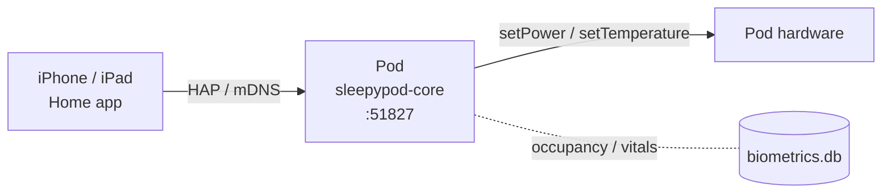
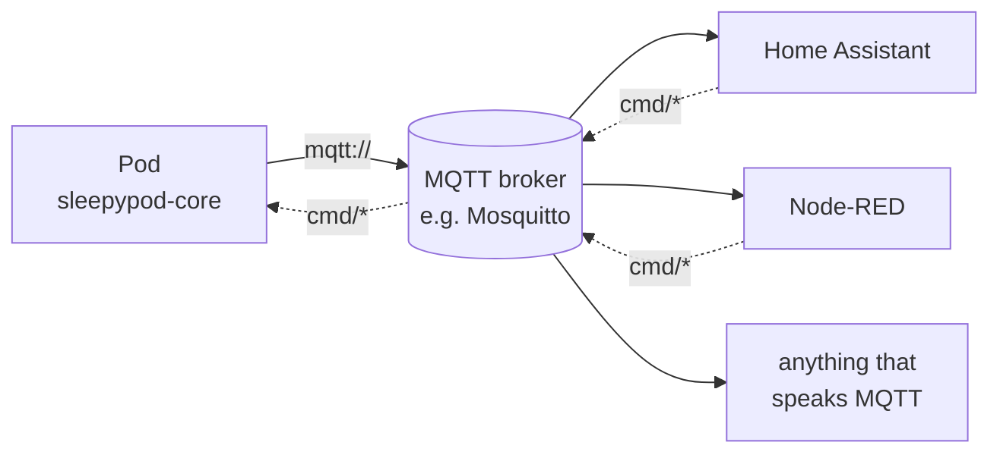

# HomeKit and MQTT reference

Setup steps live in the user guide: **[HomeKit and MQTT](https://sleepypod.github.io/core/integrations/)**. This page keeps the protocol-level reference that changes with the code: accessory mappings, identity, topics, and environment variables.

---

## HomeKit bridge

The Pod ships an embedded [hap-nodejs](https://github.com/homebridge/HAP-NodeJS)
bridge that publishes itself as a native HomeKit accessory over Bonjour. No
Homebridge install, no Apple cloud round-trip — pairing and control happen
entirely on your LAN.



The bridge is **off by default** — toggle it on from **Settings → HomeKit**.
The installer's iptables rules accept HAP (tcp/51827) only from LAN address
ranges; mDNS discovery (udp/5353) is accepted without a source restriction,
so the bridge is discoverable but not pairable or controllable from outside
the LAN.

### Accessories

Each side (`left`, `right`) gets its own set; switches that act on the whole
pod ship once.

| Accessory | Type | Reads from | Writes to |
|---|---|---|---|
| `Bed <side>` | Thermostat (single setpoint) | `deviceStatus.<side>` | `setTemperature` / `setPower` |
| `Bed <side> power` | Switch | `deviceStatus.<side>.powered` | `setPower` (preserves last setpoint) |
| `Bed <side> occupancy` | OccupancySensor | `sleep_records` (latest with `leftBedAt IS NULL`) | — |
| `Snooze <side>` | Switch | `snoozeManager` | `snoozeAlarm` / `cancelSnooze` |
| `Prime` | Switch | `primeNotification` (auto-off on completion) | `startPriming` |
| `Pod ambient` | TemperatureSensor | `bed_temp.ambient_temp` (centidegrees → °C) | — |

Thermostat is HomeKit's single-setpoint primitive (the pod hardware exposes
one setpoint, not a heat/cool deadband). Mode `off` cuts power; `auto` powers
on at the last requested temperature. HomeKit Celsius is converted at the
boundary; the in-app unit preference is unaffected.

### Identity durability

The bridge's HomeKit identity (MAC-style username, pincode, setupId) is
**deterministically derived** from a hardware-rooted seed (eMMC CID →
machine-id → random fallback) via HKDF, and cached at
`$DATA_DIR/homekit/identity.json` (where `$DATA_DIR` is the picker-chosen
data dir — see [`scripts/README.md`](../scripts/README.md#file-locations);
typically `/persistent/sleepypod-data/homekit/identity.json` on Pod 4/5).
As long as the selected seed is unchanged, a `/persistent` wipe or
firmware reflash regenerates the **same** identity, so iOS still recognizes
the bridge — you only re-pair, your automations and rooms stay intact. When
the seed comes from `machine-id` (which does not survive a factory reset) or
the `random-dev` fallback, deleting `identity.json` produces a new identity,
and the bridge must be removed and re-added in iOS. See
**[ADR 0020](adr/0020-homekit-identity-derivation.md)** for the full
rationale, seed chain, and what the design intentionally does *not* protect
against.

### Environment variables

Headless deployments can override the auto-detected mDNS advertiser. All
other config (enable/disable, pairing) lives in `device_settings` and is
managed from the UI.

| Variable | Default | Description |
|---|---|---|
| `HOMEKIT_ADVERTISER` | auto (`avahi` if `/run/avahi-daemon/socket` exists, else `ciao`) | mDNS advertiser; force `avahi` to coexist with the existing `_sleepypod._tcp` service file, or `ciao` for pods without avahi |

---

## MQTT bridge

The Pod can connect outbound to an MQTT broker you already run (typically the
[Mosquitto add-on](https://github.com/home-assistant/addons/tree/master/mosquitto)
that ships with Home Assistant). Off by default — opt in from
**Settings → MQTT** in the web UI.



The Pod is a **client**, not a broker. It does not embed a broker, does not
listen on 1883, and does not punch holes in the LAN-only iptables policy.

### Configuration

Headless deployments can skip the UI by setting environment variables;
the bridge resolves config in this order: `device_settings` row > env var > built-in default.

| UI field | Env var | Default |
|---|---|---|
| Enable bridge | `MQTT_ENABLED` | `false` |
| Broker URL | `MQTT_URL` | _(unset — bridge stays dormant)_ |
| Username | `MQTT_USERNAME` | _(none)_ |
| Password | `MQTT_PASSWORD` | _(none)_ |
| Topic prefix | `MQTT_TOPIC_PREFIX` | `sleepypod` |
| HA discovery | `MQTT_HA_DISCOVERY` | `true` |
| HA discovery prefix | `MQTT_HA_DISCOVERY_PREFIX` | `homeassistant` |
| TLS | `MQTT_TLS` | `false` |
| TLS allow self-signed | `MQTT_TLS_INSECURE` | `false` |

The URL scheme decides whether the connection is encrypted: `mqtts://` uses
TLS, `mqtt://` is plain TCP. The TLS toggle does not upgrade an `mqtt://` URL;
it only gates `MQTT_TLS_INSECURE`, which skips certificate verification when
both are on.

### Topics

`<prefix>` defaults to `sleepypod`. `<device-id>` is the slugified hostname
(override with `MQTT_DEVICE_ID`). All state topics are retained.

| Topic | Direction | Payload |
|---|---|---|
| `<prefix>/<device-id>/availability` | pod → broker | `online` / `offline` (LWT) |
| `<prefix>/<device-id>/state/device-status` | pod → broker | full deviceStatus JSON |
| `<prefix>/<device-id>/state/<side>/climate` | pod → broker | per-side temp / mode |
| `<prefix>/<device-id>/state/water-level` | pod → broker | `low` / `ok` / `unknown` |
| `<prefix>/<device-id>/state/biometrics/<side>` | pod → broker | latest HR / HRV / BR |
| `<prefix>/<device-id>/state/environment/ambient` | pod → broker | `{"ts": <epoch_ms>, "temperature": <number\|null>, "humidity": <number\|null>}` (°C, %) |
| `<prefix>/<device-id>/cmd/set-temperature` | broker → pod | `{"side","temperature","duration?"}` |
| `<prefix>/<device-id>/cmd/set-power` | broker → pod | `{"side","powered","temperature?"}` |
| `<prefix>/<device-id>/cmd/set-alarm` | broker → pod | `{"side","vibrationIntensity","vibrationPattern","duration"}` |
| `<prefix>/<device-id>/cmd/clear-alarm` | broker → pod | `{"side"}` |
| `<prefix>/<device-id>/cmd/start-priming` | broker → pod | `{}` |

Commands route through the same tRPC procedures the iOS app calls, so Zod
input schemas validate every payload — the bridge cannot accidentally
diverge from the app's safety envelope.

### Example: turn off the left side from any MQTT client

```bash
mosquitto_pub -h broker.lan \
  -t 'sleepypod/eight-pod/cmd/set-power' \
  -m '{"side":"left","powered":false}'
```

State mirrors back on `sleepypod/eight-pod/state/left/climate` within ~1 s.

See **[ADR 0019](adr/0019-mqtt-bridge.md)** for the design rationale —
why client-not-broker, the credential storage decision, the tRPC dispatch
model, and what's deferred until `protectedProcedure` lands.
