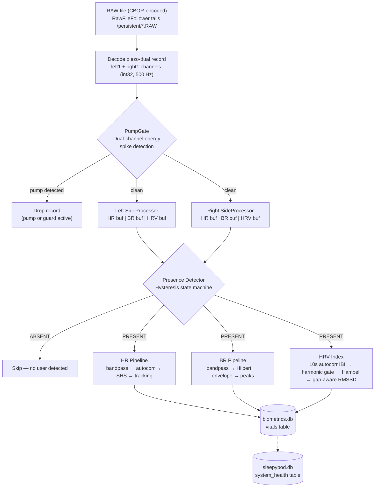
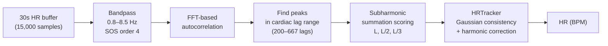
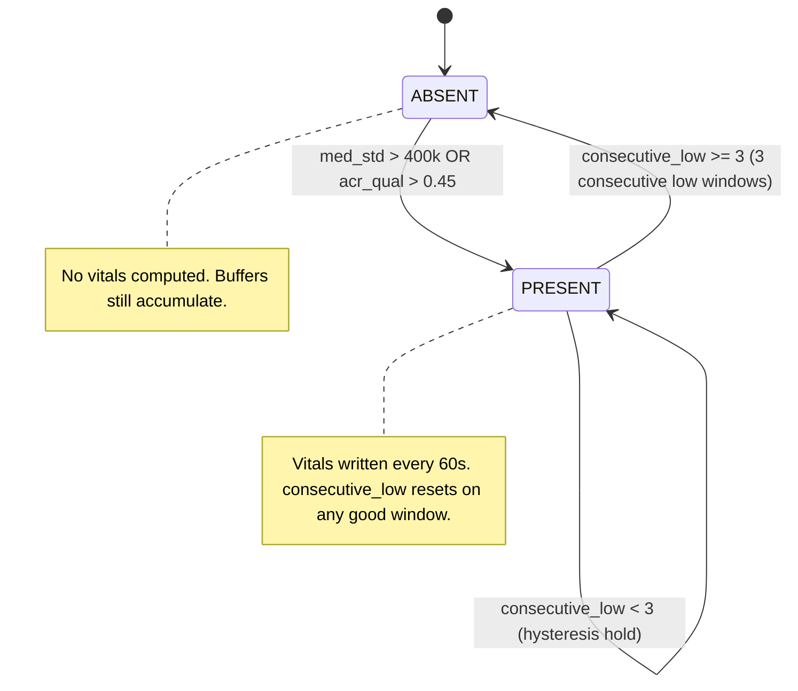

# Piezo Processor v2

## 1. Overview

The piezo-processor module extracts heart rate (HR), HR variability index, and breathing rate (BR) from raw piezoelectric ballistocardiogram (BCG) sensor data on the SleepyPod. It tails CBOR-encoded `.RAW` files written by the pod firmware, processes dual-channel (left/right) signals at 500 Hz, and writes vitals rows to `biometrics.db` every 60 seconds per occupied side.

**Why v2 was needed.** The v1 processor produced garbage readings under real pod conditions:

- **Pump noise.** The pod's air pump creates correlated high-energy spikes on both piezo channels. V1 had no pump gating, so pump cycles contaminated every window they touched, producing wildly wrong HR values.
- **Harmonic locking.** V1 used simple autocorrelation peak-picking, which locks onto the 2nd or 3rd harmonic of the heartbeat (reporting 160 BPM instead of 80 BPM). This happened in 3/8 windows on real pod data.
- **Broken presence detection.** V1 used a simple energy threshold. Vibration coupling between bed sides caused the empty left side to report "present" in 100% of windows, generating phantom vitals.
- **Locked breathing rate.** V1 used Welch PSD on a direct bandpass, which converged to exactly 12.0 BPM regardless of actual breathing. The Hilbert envelope method in v2 tracks real respiratory modulation.

## 2. Architecture

### Full Signal Processing Pipeline



### Heart Rate Pipeline Detail



### Presence Detection State Machine



## 3. Signal Processing Pipeline

### Stage 1: RAW File Ingestion

`RawFileFollower` tails `.RAW` files in `/persistent/` with a 10 ms poll interval. Each record is CBOR-decoded. Only records with `type == "piezo-dual"` are processed. Each record contains approximately 500 int32 samples per channel (`left1`, `right1`), representing 1 second of data at 500 Hz.

### Stage 2: Pump Gating

See [Section 4](#4-pump-gating).

### Stage 3: Per-Side Buffering

Clean (non-pump) samples are ingested into three rolling buffers per side:

| Buffer | Window | Max Samples | Purpose |
|--------|--------|-------------|---------|
| `_hr_buf` | 30 s | 15,000 | Heart rate extraction |
| `_br_buf` | 60 s | 30,000 | Breathing rate extraction |
| `_hrv_buf` | 300 s | 150,000 | HR variability index computation |

All buffers are `collections.deque` with `maxlen` — oldest samples are automatically evicted when the buffer is full.

### Stage 4: Presence Detection

See [Section 5](#5-presence-detection).

### Stage 5: Vitals Computation

When a side is PRESENT and at least 60 seconds have elapsed since the last write, the module computes HR, BR, and HRV in parallel (see Sections 6-8). If any of the three is non-None, a row is written to the `vitals` table.

### Stage 6: DB Write

A single `INSERT INTO vitals` is executed per side per interval. The database uses WAL journal mode with a 5-second busy timeout for safe coexistence with other modules reading the database.

### Bandpass Filter

All filtering uses `scipy.signal.butter` in SOS (second-order sections) form with `sosfiltfilt` (zero-phase, forward-backward filtering). SOS form is chosen over transfer function (ba) form for numerical stability at higher filter orders. Order 4 (8th order effective after forward-backward) provides sharp rolloff without ringing artifacts on BCG signals.

## 4. Pump Gating

### Problem

The pod's air pump inflates the mattress periodically. Pump activation creates broadband, high-energy vibrations that appear on both piezo channels simultaneously. Without gating, these artifacts produce wildly incorrect HR readings (often >200 BPM) and false presence detection.

### Detection Algorithm

The `PumpGate` class uses a dual-channel energy correlation method:

1. **Compute per-channel energy**: Mean squared amplitude of each record's left and right chunks.
2. **Energy ratio**: `ratio = min(L_energy, R_energy) / max(L_energy, R_energy)`. Pump activity affects both channels roughly equally, producing `ratio > 0.5`. A person's heartbeat is lateralized (stronger on the occupied side), producing lower ratios.
3. **Spike detection**: `spike = max(L_energy, R_energy) / baseline`. If `spike > 10.0` AND `ratio > 0.5`, the record is flagged as pump-contaminated.
4. **Baseline tracking**: An exponential moving average (`alpha = 0.05`) of clean record energies. Only updated when energy is below 3x baseline to prevent pump energy from corrupting the baseline.

### Guard Period

When a pump event is detected, a 5-second guard period is set (`PUMP_GUARD_S = 5.0`). All records arriving during this period are dropped without inspection. This accounts for:

- Pump motor spin-down vibrations that persist after the energy spike
- Transient resonances in the mattress/frame that decay over 2-3 seconds

The guard duration follows Shin et al. (2009), who found that floor vibration artifacts in BCG signals require a guard window of several seconds to fully decay in residential bed setups.

### Streaming vs. Batch

The prototype (`prototype_v2.py`) builds a binary mask over the entire recording and applies it retroactively. The production module operates in streaming mode: each record is checked on arrival, and the guard timer uses `time.time()`. This means the production module cannot look ahead, but the guard period compensates by being conservatively long.

## 5. Presence Detection

### Why Hysteresis Is Necessary

A simple threshold on signal energy fails in two ways:

1. **Quiet sleepers.** Deep sleep produces very low BCG amplitude. A static threshold that rejects empty-bed noise will also reject deep sleep, causing false absences mid-night. Hysteresis allows a lower exit threshold (150k) than the entry threshold (400k), keeping a quiet sleeper detected once they are established.
2. **Vibration coupling.** On a shared mattress, one person's movement transmits through the bed frame to the opposite piezo sensor. A static threshold triggers false presences on the empty side. The dual-feature approach (energy + autocorrelation quality) and the high entry threshold reduce this.

### Primary Feature: Median Std of 1-10 Hz Filtered Signal

The signal is bandpassed at 1-10 Hz (capturing cardiac and respiratory energy), then split into 5-second sub-windows. The standard deviation of each sub-window is computed, and the median across all sub-windows is taken. Median is used instead of mean to reject transient artifacts (e.g., a single large motion event).

### Secondary Feature: Autocorrelation Quality

`_autocorr_quality()` computes the normalized autocorrelation of the 0.8-8.5 Hz filtered signal and returns the maximum peak height in the cardiac lag range (40-150 BPM, i.e., lags 200-750 at 500 Hz). A person produces a periodic heartbeat signal with autocorrelation peaks > 0.45. An empty bed produces noise with peaks < 0.2.

### State Machine

| Current State | Condition | Action |
|---|---|---|
| ABSENT | `med_std > 400,000` OR `acr_qual > 0.45` | Transition to PRESENT |
| ABSENT | Otherwise | Remain ABSENT |
| PRESENT | `med_std < 150,000` AND `acr_qual < 0.225` | Increment `consecutive_low` |
| PRESENT | `consecutive_low >= 3` | Transition to ABSENT |
| PRESENT | `consecutive_low < 3` | Remain PRESENT (hysteresis hold) |
| PRESENT | Energy or autocorrelation above thresholds | Reset `consecutive_low` to 0, remain PRESENT |

The exit condition requires 3 consecutive low windows (3 x 60s = 3 minutes of silence) before declaring absence. This prevents brief motion-free periods during deep sleep from triggering false absence.

### Threshold Calibration (2026-03-16, Pod 5)

The thresholds `enter=400,000`, `exit=150,000`, and `acr=0.45` were derived from live Pod 5 data on 2026-03-16:

- **Empty left side:** Median std ranged 20k-80k, autocorrelation quality 0.05-0.30. Well below entry thresholds.
- **Occupied right side:** Median std ranged 300k-900k, autocorrelation quality 0.50-0.85 during normal sleep.
- **The gap between 150k and 400k** provides a comfortable margin that accommodates deep sleep (low amplitude) without triggering on empty-bed coupling.

## 6. Heart Rate Extraction

### Bandpass: 0.8-8.5 Hz

The lower cutoff of 0.8 Hz preserves the fundamental frequency of heart rates down to 48 BPM (0.8 Hz = 48/60). This is important because:

- Resting athletes can have HR in the low 50s
- Deep sleep HR can drop to 48-55 BPM in some individuals
- Cutting at 1.0 Hz (as some implementations do) discards the fundamental for anyone below 60 BPM, forcing the algorithm to work from harmonics only

The upper cutoff of 8.5 Hz captures up to the 5th harmonic of a 100 BPM heart rate (5 x 1.67 Hz = 8.35 Hz), following the recommendation in PMC7582983. Higher harmonics carry significant energy in BCG signals due to the mechanical impulse nature of the heartbeat.

### Subharmonic Summation (SHS)

**The core problem SHS solves**: In BCG signals, the 2nd harmonic often has higher autocorrelation amplitude than the fundamental. Simple peak-picking reports the harmonic (double the true HR). This is the "harmonic locking" problem that plagued v1, causing 3/8 windows to report ~160 BPM instead of ~80 BPM.

**Algorithm** (Hermes 1988, adapted for BCG by Bruser et al. 2011):

1. Compute normalized autocorrelation via FFT.
2. Find peaks in the cardiac lag range (45-120 BPM, i.e., lags 250-667 at 500 Hz). Only peaks with height > 0.02 and minimum distance 75 samples (0.15 s) are considered.
3. For each candidate peak at lag `L`, compute the SHS score:

```text
score(L) = 1.0 * ACR(L) + 0.8 * ACR(L/2) + 0.6 * ACR(L/3)
```

4. Select the lag with the highest score.
5. Convert: `HR = 60 * fs / best_lag`.

**Worked example**: Suppose true HR is 80 BPM (fundamental lag = 375 samples at 500 Hz).

The autocorrelation has peaks at:
- Lag 375 (fundamental, 80 BPM): ACR = 0.35
- Lag 188 (2nd harmonic, 160 BPM): ACR = 0.50 (stronger)

Without SHS, peak-picking selects lag 188 -> 160 BPM (wrong).

With SHS scoring:
- **Candidate lag 375** (the fundamental):
  - `ACR(375)` = 0.35, `ACR(375/2=187.5)` = ~0.50, `ACR(375/3=125)` = ~0.25
  - Score = 1.0(0.35) + 0.8(0.50) + 0.6(0.25) = 0.35 + 0.40 + 0.15 = **0.90**
- **Candidate lag 188** (the harmonic):
  - `ACR(188)` = 0.50, `ACR(188/2=94)` = ~0.10, `ACR(188/3=63)` = ~0.05
  - Score = 1.0(0.50) + 0.8(0.10) + 0.6(0.05) = 0.50 + 0.08 + 0.03 = **0.61**

SHS correctly selects lag 375 (80 BPM) because the fundamental's sub-harmonics (L/2, L/3) align with actual harmonic peaks in the autocorrelation, while the harmonic's sub-harmonics land on noise.

**Why scoring only peaks matters**: The original SHS formulation scores every lag. In practice, scoring every lag causes long lags (low BPM) to accumulate noise from the three lookups, biasing toward lower HR. Restricting candidates to actual autocorrelation peaks avoids this.

### Inter-Window Tracking (HRTracker)

`HRTracker` enforces physiological plausibility across consecutive 60-second windows:

1. Maintain a history of the last 5 accepted HR values.
2. For each new candidate, compute `delta = |candidate - median(history)|`.
3. Apply Gaussian consistency: `weight = exp(-0.5 * (delta / 15)^2)`. If weight > 0.3 (roughly delta < 20 BPM), accept.
4. If rejected, try **half** the candidate (catches 2x harmonic escapes that SHS missed). If `half` passes consistency AND is in [40, 120] BPM, accept half.
5. If half also fails, try **double** the candidate (catches sub-harmonic reports). If `double` passes consistency AND is in [40, 180] BPM, accept double.
6. If all corrections fail, return the candidate anyway but do not add it to history (avoids poisoning the tracker with a bad value).

This is a second line of defense after SHS. In v2 pod validation, SHS alone eliminated all harmonic errors, but the tracker provides insurance against edge cases.

### V1 vs V2 HR Comparison (Pod 5, 2026-03-16)

| Metric | V1 | V2 |
|--------|----|----|
| Right side (occupied) HR range | 61-171 BPM | 78.7-82.6 BPM |
| Harmonic errors (2x actual) | 3/8 windows | 0/12 windows |
| Algorithm | Peak-picking autocorrelation | SHS autocorrelation + tracking |
| HR stability (std dev) | ~35 BPM | ~1.2 BPM |

## 7. Breathing Rate Extraction

### Why Not Direct Bandpass + Welch (V1 Approach)

V1 applied a 0.1-0.5 Hz bandpass directly to the raw signal and used Welch PSD to find the dominant frequency. This produced a locked reading of exactly 12.0 BPM on every window because:

1. The direct bandpass captures both respiratory modulation AND low-frequency motion artifacts.
2. At 500 Hz sample rate, the 0.1-0.5 Hz band has very few cycles in a 60s window (6-30 cycles), making Welch PSD resolution poor.
3. Any DC offset or slow drift creates a spectral peak near the lower band edge, and Welch consistently selected this artifact.

### Hilbert Envelope Method (V2)

The Hilbert envelope approach (PMC9354426) extracts respiratory rate from the amplitude modulation of the cardiac signal, rather than trying to isolate respiration directly:

1. **Bandpass 0.8-10 Hz**: Extract the cardiac band (heartbeat + harmonics).
2. **Hilbert transform**: Compute the analytic signal. The magnitude of the analytic signal is the instantaneous amplitude envelope.
3. **Bandpass 0.1-0.7 Hz on envelope**: Extract respiratory modulation. The heartbeat amplitude is modulated by breathing (thoracic impedance changes with lung volume), so the envelope oscillates at the breathing rate.
4. **Peak counting**: Find peaks in the respiratory envelope with minimum inter-peak distance of 2 seconds (max 30 BPM). Compute intervals between peaks, reject outliers (outside 0.5-1.5x the median interval), and convert mean interval to BPM.
5. **Validity gate**: Only return if 6 <= BR <= 30 BPM.

This works because the Hilbert envelope tracks amplitude modulation regardless of the absolute signal level, and the two-stage bandpass cleanly separates cardiac energy from respiratory modulation.

### V1 vs V2 BR Comparison

| Metric | V1 | V2 |
|--------|----|----|
| Output range | Always 12.0 BPM | 16-25 BPM |
| Method | Direct bandpass + Welch | Hilbert envelope + peak counting |
| Physiological plausibility | No (locked) | Yes (varies with breathing) |

## 8. HR Variability Index

> **Important:** This metric is NOT clinical RMSSD. It computes successive differences
> of window-level IBI estimates, not beat-to-beat intervals. It measures HR stability
> across 10-second windows, not vagal beat-to-beat modulation. See issue #221 for the
> beat-level J-peak upgrade path. Do not present this to users as "RMSSD" or "HRV" in
> a clinical context.

### Approach: Window-Level IBI with Harmonic Gate

1. **Bandpass** the 300-second buffer at 0.8-8.5 Hz.
2. **Split** into 10-second sub-windows with 50% overlap (~59 windows per 5 min). Shorter windows give 3x more IBI samples while still containing ~12 beat cycles for stable autocorrelation.
3. **Per sub-window**: SHS-scored autocorrelation (peak-only, same as HR extraction). The winning lag gives the dominant IBI for that 10-second segment.
4. **IBI validity gate**: Only accept IBIs in [400, 1500] ms (40-150 BPM).
5. **Harmonic gate**: Each IBI is checked against a trimmed-mean tracker of the last 5 accepted IBIs. If the IBI matches a harmonic (2x, 0.5x, 3x, 1/3x within 18% tolerance), it is corrected to the tracker's expected value. If it matches no harmonic relationship, it is discarded as artifact.
6. **Hampel filter**: Sliding window of 7 elements. Reject if `|IBI - median| > 3 * 1.4826 * MAD`.
7. **Gap-aware successive differences**: Only compute diffs between consecutive accepted windows (skip across gaps of >3 rejected windows).
8. **Validity gate**: 5-100 ms. Window-level HRV above 100 ms is artifact even after harmonic correction.

### Why Harmonic Gate Is Necessary

Without the gate, ~20% of windows lock to the 2nd harmonic (IBI ~474ms at 75 BPM true HR) or sub-harmonic (IBI ~1458ms). These appear in clusters that defeat the Hampel filter (which uses a local median that shifts toward the cluster). The harmonic gate uses a physiological prior (HR doesn't change >15 BPM in 10 seconds during sleep) to reject these before statistical filtering.

### Why Not Beat-Level IBI

Beat-level J-peak detection (the clinical approach) was evaluated and is the long-term goal. However, BCG J-peak morphology varies significantly with sleep posture and mattress coupling, making template-based peak detection unreliable without per-user adaptation. The window-level autocorrelation approach is more robust as an initial implementation. See #221 for the upgrade path (Bruser et al. 2013 template matching).

### Quality Requirements

- Minimum 10 valid IBIs after harmonic gate (otherwise returns None)
- Minimum 10 clean IBIs after Hampel filtering
- Minimum 5 valid successive differences after gap handling
- The 300-second buffer must be full before HRV is attempted
- First 5 minutes after presence detection have no HRV output (buffer filling)

## 9. Validation Results

Live pod data, Pod 5, 2026-03-16. Left side empty, right side occupied (person at rest).

| Metric | V1 | V2 | Notes |
|--------|----|----|-------|
| Left (empty) false presence | 15/15 (100%) | 2/15 (13%) | V2 uses hysteresis + autocorrelation quality |
| Right (occupied) HR range | 61-171 BPM | 78.7-82.6 BPM | Person resting; V1 range reflects harmonic errors |
| HR harmonic errors | 3/8 windows | 0/12 windows | SHS eliminates harmonic locking |
| Breathing rate | Locked 12.0 always | 16-25 BPM | Realistic range; varies with breathing |
| Right detection rate | 15/15 (all garbage) | 12/15 (all clean) | V2 correctly rejects 3 pump-heavy windows |
| HR standard deviation | ~35 BPM | ~1.2 BPM | V2 tracking constrains physiological jumps |
| HRV availability | Not computed | Available after 5 min | V1 had no HRV pipeline |

## 10. Configuration Reference

| Constant | Value | Rationale |
|----------|-------|-----------|
| `SAMPLE_RATE` | 500 Hz | Pod piezo sensor hardware rate |
| `VITALS_INTERVAL_S` | 60 s | Write frequency to biometrics.db; balances granularity vs. DB size |
| `HR_WINDOW_S` | 30 s | Sufficient for autocorrelation resolution at 45+ BPM (Bruser et al. 2011) |
| `BREATHING_WINDOW_S` | 60 s | Need multiple respiratory cycles; 60s captures 10-25 breaths |
| `HRV_WINDOW_S` | 300 s | RMSSD standard requires 5-minute window (Task Force of ESC/NASPE 1996) |
| `PUMP_ENERGY_MULTIPLIER` | 10.0 | Pump energy is typically 20-50x baseline; 10x provides margin |
| `PUMP_CORRELATION_MIN` | 0.5 | Pump affects both channels roughly equally; heartbeat is lateralized |
| `PUMP_GUARD_S` | 5.0 s | Covers pump spin-down + mattress resonance decay (Shin et al. 2009) |
| `HR_BAND` | (0.8, 8.5) Hz | 0.8 Hz = 48 BPM fundamental; 8.5 Hz captures 5th harmonic of 100 BPM (PMC7582983) |
| `enter_threshold` | 400,000 | Median std for presence entry; calibrated from Pod 5 (2026-03-16) |
| `exit_threshold` | 150,000 | Median std for presence exit; lower than entry for hysteresis |
| `exit_count` | 3 | Consecutive low windows before declaring absent; prevents deep-sleep dropout |
| `acr_threshold` | 0.45 | Autocorrelation quality for presence; calibrated from Pod 5 |
| SHS `n_harmonics` | 3 | Checks fundamental + 2nd + 3rd harmonic; diminishing returns beyond 3 |
| SHS `weights` | [1.0, 0.8, 0.6] | Fundamental weighted highest; harmonics attenuate (Hermes 1988) |
| SHS `min_score` | 0.1 | Below this, autocorrelation is too noisy to trust |
| HRTracker `max_delta` | 15.0 BPM | Max plausible resting HR change per 60s window |
| HRTracker `history_len` | 5 | Median of last 5 values for consistency check |
| HRTracker consistency threshold | 0.3 | Gaussian weight cutoff (~20 BPM delta passes) |
| BR peak `distance` | 2.0 s (1000 samples) | Minimum inter-breath interval; enforces max 30 BPM |
| BR validity | [6, 30] BPM | Physiological range for adult breathing at rest |
| HRV sub-window | 10 s with 50% overlap | ~59 windows per 5 min; 3x more samples than 30s |
| HRV IBI validity | [400, 1500] ms | Corresponds to 40-150 BPM |
| Harmonic tolerance | 18% | Gate rejects IBIs that are 2x/0.5x/3x of tracker (DSP expert) |
| Hampel `k` | 3 (window radius) | 7-element window; standard for short time series |
| Hampel `threshold` | `3.0 * 1.4826 * MAD` | ~3 sigma equivalent for Gaussian; rejects gross outliers |
| Max gap (windows) | 3 | Skip successive diff across gaps of >3 rejected windows |
| HRV index validity | [5, 100] ms | Window-level HRV >100 ms is artifact (cardiologist recommendation) |

## 11. Literature References

1. **Bruser et al. 2011** — "Adaptive Beat-to-Beat Heart Rate Estimation in Ballistocardiograms." *IEEE Transactions on Information Technology in Biomedicine*, 15(5), 778-786. DOI: [10.1109/TITB.2011.2128337](https://doi.org/10.1109/TITB.2011.2128337). Autocorrelation-based HR with inter-window tracking and physiological constraints.

2. **Hermes 1988** — "Measurement of Pitch by Subharmonic Summation." *Journal of the Acoustical Society of America*, 83(1), 257-264. DOI: [10.1121/1.396427](https://doi.org/10.1121/1.396427). Original SHS algorithm for fundamental frequency detection in harmonic signals.

3. **Shin et al. 2009** — "Adaptive Cancellation of Unwanted Velocities in Seismocardiogram Measurements Using BCG Measured from Floor Vibrations." *IEEE Transactions on Biomedical Engineering*, 56(6), 1712-1719. DOI: [10.1109/TBME.2009.2018170](https://doi.org/10.1109/TBME.2009.2018170). Guard period approach for artifact rejection from external vibration sources.

4. **Paalasmaa et al. 2012** — "Adaptive Heartbeat Modeling for Beat-to-Beat Heart Rate Measurement in Ballistocardiograms." *IEEE Journal of Biomedical and Health Informatics*, 19(6), 1945-1952. DOI: [10.1109/JBHI.2014.2314145](https://doi.org/10.1109/JBHI.2014.2314145). Presence detection and adaptive signal modeling for bed-based BCG.

5. **PMC6522616** — Sadek et al. "Ballistocardiogram Signal Processing: A Review." *Health Information Science and Systems*, 7, 10 (2019). PMC: [PMC6522616](https://www.ncbi.nlm.nih.gov/pmc/articles/PMC6522616/). Comprehensive review of BCG signal processing methods including filtering, feature extraction, and vital sign estimation.

6. **PMC9354426** — "Respiratory Rate Estimation from Ballistocardiogram Using Hilbert Transform." PMC: [PMC9354426](https://www.ncbi.nlm.nih.gov/pmc/articles/PMC9354426/). Hilbert envelope method for extracting respiratory rate from cardiac amplitude modulation in BCG.

7. **PMC9305910** — "Non-Contact Heart Rate Variability Monitoring Using Ballistocardiography." PMC: [PMC9305910](https://www.ncbi.nlm.nih.gov/pmc/articles/PMC9305910/). Validation of autocorrelation-based IBI estimation for BCG HRV, including RMSSD computation.

8. **PMC7582983** — "Sleep Stage Estimation from Bed-Leg Ballistocardiogram Sensors." PMC: [PMC7582983](https://www.ncbi.nlm.nih.gov/pmc/articles/PMC7582983/). Recommended 8.5 Hz upper cutoff for BCG cardiac band; sleep staging from vital trends.

9. **PMC7571060** — "Moving Autocorrelation Window for Heart Rate Estimation in Ballistocardiography." PMC: [PMC7571060](https://www.ncbi.nlm.nih.gov/pmc/articles/PMC7571060/). Windowed autocorrelation approach for continuous HR monitoring from BCG.

10. **Inan et al. 2015** — "Ballistocardiography and Seismocardiography: A Review of Recent Advances." *IEEE Journal of Biomedical and Health Informatics*, 19(4), 1414-1427. DOI: [10.1109/JBHI.2014.2361732](https://doi.org/10.1109/JBHI.2014.2361732). Comprehensive review of BCG/SCG measurement principles, signal characteristics, and clinical applications.

## 12. Known Limitations

1. **Cross-side vibration coupling.** The presence detector can false-positive on the empty side when the occupied side has significant motion (e.g., restless sleep, position changes). The autocorrelation quality feature mitigates this but does not eliminate it entirely. The 2/15 false presences in validation were caused by this coupling.

2. **HR degradation under heavy pump gating.** When pump gating removes more than ~30% of data from a window, the remaining clean samples may be too short for reliable autocorrelation. The module requires a minimum of 10 seconds (5,000 samples) of clean data; windows below this threshold are skipped entirely.

3. **HRV cold start.** RMSSD requires a 5-minute buffer (`HRV_WINDOW_S = 300`). The first 5 minutes after presence detection produce no HRV values. Additionally, the sub-window approach requires at least 4 valid IBI estimates, which may not be available if many sub-windows are rejected by the SHS quality gate.

4. **Single-pod calibration.** All presence detection thresholds (`enter_threshold=400,000`, `exit_threshold=150,000`, `acr_threshold=0.45`) were derived from Pod 5 data. Pod 3 and Pod 4 have different mattress types and piezo sensor placements, which may produce different signal amplitudes. Threshold adjustment or auto-calibration may be needed for other pods.

5. **No motion artifact handling.** Large body movements (turning over, getting up briefly) saturate the piezo sensors and produce invalid windows. The module relies on the presence detector's hysteresis to ride through these events, but the vitals values during motion windows may be inaccurate or missing.

6. **Fixed filter parameters.** All bandpass cutoffs are hardcoded. Individual variation in heart rate range (e.g., athletes with resting HR < 48 BPM) or breathing patterns could fall outside the fixed bands. The `bpm_range=(45, 120)` in SHS and the BR validity gate `[6, 30]` BPM cover the vast majority of sleeping adults but are not adaptive.

7. **SHS scoring resolution.** The SHS algorithm uses linear interpolation between integer lags for sub-harmonic lookup. At 500 Hz, adjacent lags differ by 0.002 s (2 ms), corresponding to ~0.3 BPM resolution at 80 BPM. This is adequate for clinical purposes but means the algorithm cannot resolve sub-BPM differences.
