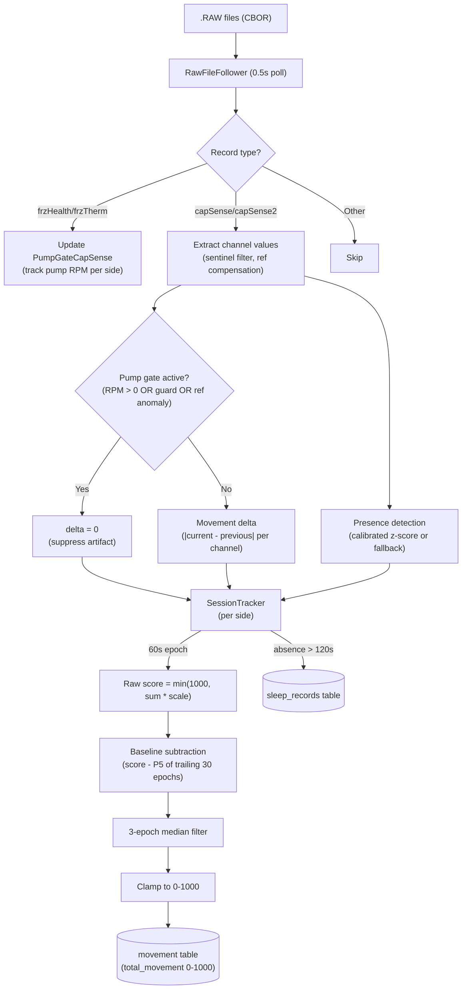
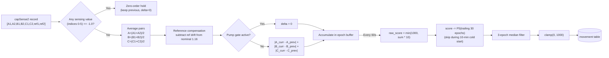

# Sleep Detector

## Overview

The sleep-detector module tracks bed occupancy, sleep session boundaries, and body movement from capacitance sensor data. It tails CBOR-encoded `.RAW` files, processes `capSense` (Pod 3) and `capSense2` (Pod 5) records at ~2 Hz, and writes to `sleep_records` and `movement` tables in `biometrics.db`.

## Architecture



## Movement Scoring

### Algorithm: Proportional Integration Mode (PIM)

Movement is measured as the sum of absolute sample-to-sample deltas across the 3 sensing channel pairs, accumulated over 60-second epochs. This is the bed-sensor analog of wrist actigraphy's PIM mode.



### Why sample-to-sample deltas (not z-scores from baseline)

The previous approach computed `|value - empty_bed_mean| / std` per channel. This measured **how present** someone was, not **how much they moved**:

| Approach | Person lying still | Person rolling over | Empty bed |
|----------|-------------------|--------------------:|----------:|
| Z-score from baseline (old) | 28,000-75,000 | ~75,000 | 22,000-32,000 |
| Sample-to-sample delta (new) | 35-77 | 200-1000 | 35-39 |

The delta approach removes the DC presence offset entirely. A person's body shifts capacitance channels by 5-20 units when they get in bed — that's a static offset, not movement. Actual movement produces brief, sharp changes of 2-40 units between consecutive samples.

### Score interpretation

| Score | State | Expected frequency during sleep |
|-------|-------|---------------------------------|
| 0-50 | Still (deep sleep, stable N2) — capSense2 | 70-80% of epochs |
| 50-200 | Minor fidgeting, twitches | 10-15% |
| 200-500 | Limb repositioning, partial turn | 5-10% |
| 500+ | Major position change, rolling over | 1-3% (~1-2/hour) |

Score is capped at 1000. The scale factor is sensor-type-dependent: capSense2 (Pod 5) uses `×10`, capSense (Pod 3) uses `×0.5` to normalize the different ADC ranges to the same 0-1000 scale. Boundaries are empirical and may need per-pod tuning.

Normal healthy sleep averages ~10 major position changes per night (De Koninck et al. 1992).

### Sentinel filtering

capSense2 firmware occasionally emits `-1.0` as a sentinel value on read errors in the sensing channels (indices 0-5). These are filtered via zero-order hold (carry forward the last valid reading, emit delta=0 for that sample). The next valid sample computes its delta against the last valid reading, which may span the sentinel gap — this produces a slightly larger delta but avoids the massive spike that a raw sentinel-to-valid transition would cause. Reference channel sentinels (indices 6-7) disable reference compensation for that sample but do not affect the sensing channels.

### Reference channel compensation

The capSense2 record includes a reference channel pair (indices 6,7) that reads ~1.16 and barely responds to body presence. Any deviation from nominal is subtracted from the sensing channels as common-mode rejection, guarding against electromagnetic interference or firmware glitches.

### Pump artifact gating (#230)

**Problem.** The pod's air pump runs periodically to maintain mattress pressure. Pump vibrations couple mechanically through the mattress into the capacitive sensor electrodes, producing small but consistent delta spikes (~0.05-0.2 per channel per sample). Over a 60-second epoch with ~120 samples, these accumulate to raw scores of 60-200 per pump-active epoch. Over a full night with frequent pump cycles, movement scores escalate from a true ~50 to 960-990 by the early morning hours.

**Three-signal detection.** The `PumpGateCapSense` class uses three independent signals:

1. **Primary: frzHealth pump RPM.** The `frzHealth` record (Pod 5 only, ~0.06 Hz) reports pump RPM per side. Any RPM > 0 means the pump is running. This is the most reliable signal but has low temporal resolution (~16s between updates).

2. **Secondary: Reference channel anomaly.** The capSense2 reference channel pair (indices 6,7) is mechanically coupled to the sensor PCB but does not respond to body presence. When `|ref_delta| > 0.02` AND at least 2 of 3 active channel deltas correlate (both spike together with magnitude > 0.5x the ref delta), the sample is flagged as mechanical coupling rather than body movement.

3. **Guard period: 3 seconds.** After pump-off is detected (RPM transitions from >0 to 0), a 3-second guard period (~6 samples at ~2 Hz) suppresses deltas while residual vibrations decay. This is shorter than the piezo processor's 5-second guard because capacitive sensors have lower sensitivity to mechanical vibration than piezoelectric sensors.

When any signal is active, the movement delta for that sample is forced to 0.

**Pipeline position.** Pump gating is applied after reference compensation and before delta computation:

```text
1. Sentinel filter (-1.0 values)
2. Pair averaging
3. Reference compensation
4. PUMP GATE — if pumpActive OR inGuardPeriod OR refAnomaly: delta = 0
5. Per-channel delta
6. 60s epoch accumulation
```

### Baseline subtraction

After computing the raw epoch score (`min(1000, sum * scale)`), the 5th percentile of the trailing 30 epochs is subtracted. This removes slow-building noise floors (residual pump artifacts that leak through the gate, thermal drift in the capacitive sensor).

- **Trailing window:** 30 epochs (30 minutes at 60s epochs)
- **Percentile:** 5th (robust to outliers; represents the quietest ~1.5 epochs in the window)
- **Cold start:** Baseline subtraction is disabled for the first 10 epochs (~10 minutes) after session start, since there is insufficient history to compute a meaningful baseline.

The subtracted score is clamped to a minimum of 0.

### 3-epoch median filter

A 3-epoch running median is applied as the final smoothing step after baseline subtraction. This suppresses isolated spike artifacts (single-epoch transients from sensor glitches, brief vibration events) without attenuating sustained movement events.

The median filter output is clamped to [0, 1000] before writing to the database.

## Presence Detection

Presence uses calibrated z-score thresholds from `calibration_profiles` when available, falling back to a fixed sum threshold (`PRESENCE_THRESHOLD = 1500` for capSense, `60.0` for capSense2). Calibration profiles are reloaded every 60 seconds.

## Sleep Sessions

A session starts on the first present sample and ends after `ABSENCE_TIMEOUT_S` (120s) of consecutive absence. Sessions shorter than `MIN_SESSION_S` (300s = 5 min) are discarded as false positives.

Session records include:
- Entry/exit timestamps
- Duration
- Number of bed exits (mid-session absences)
- Present/absent interval arrays

## Configuration

| Constant | Value | Rationale |
|----------|-------|-----------|
| `ABSENCE_TIMEOUT_S` | 120 s | Bathroom trips < 2 min don't split sessions |
| `MIN_SESSION_S` | 300 s | Shorter periods are likely false positives |
| `MOVEMENT_INTERVAL_S` | 60 s | One movement score per minute; matches AASM epoch length |
| `PRESENCE_THRESHOLD` | 1500 | Fallback for uncalibrated capSense (Pod 3) |
| `CALIBRATION_RELOAD_S` | 60 s | Poll calibration_profiles for updates |
| Movement scale (capSense2) | 10x | Pod 5 float channels, deltas ~0.05-5.0 |
| Movement scale (capSense) | 0.5x | Pod 3 int ADC channels, deltas ~1-50 |
| Movement cap | 1000 | Prevents outlier scores from sensor glitches |
| Sentinel value | -1.0 | capSense2 firmware error indicator |
| Reference nominal | 1.16 | Expected reference channel value |
| `PUMP_GUARD_S` | 3.0 s | Guard period after pump-off; 6 samples at ~2 Hz (#230) |
| `REF_ANOMALY_THRESHOLD` | 0.02 | Reference channel deviation for secondary pump detection |
| `BASELINE_TRAILING_EPOCHS` | 30 | 30-minute trailing window for baseline subtraction |
| `BASELINE_COLD_START_EPOCHS` | 10 | 10-minute minimum before baseline subtraction activates |
| `BASELINE_PERCENTILE` | 5 | 5th percentile; represents quietest epoch in trailing window |
| `MEDIAN_FILTER_WINDOW` | 3 | 3-epoch median filter; suppresses isolated spikes |

## Literature References

- **Kortelainen et al. (2010)** "Sleep Staging Based on Signals Acquired Through Bed Sensor" IEEE Trans. Inf. Technol. Biomed. — signal variance for wake detection from bed sensors
- **Cole & Kripke (1992)** "Automatic Sleep/Wake Identification from Wrist Activity" Sleep — activity counts per epoch, PIM scoring
- **Sadeh et al. (1994)** "Activity-Based Sleep-Wake Identification" Sleep — multi-feature actigraphy scoring
- **Paalasmaa et al. (2012)** "Unobtrusive Online Monitoring of Sleep at Home" IEEE J. Biomed. Health Inform. — activity from signal variance
- **Looney et al. (2021)** PMC8291858 — Emfit bed sensor vs wrist actigraphy validation
- **De Koninck, Lorrain & Gagnon (1992)** "Sleep Positions and Position Shifts" Sleep — ~10 major postural shifts per night

## Known Limitations

1. **Cross-side vibration coupling.** When the person on the right makes a large movement, the empty left side sees a brief spike (200-500) from mattress vibration. This is not gated because the sleep-detector doesn't have a dual-channel gating mechanism like the piezo processor's pump gate.

2. **Presence detection chattering.** The calibrated presence threshold can produce rapid present/absent oscillations on an empty bed if the baseline has drifted (temperature changes, bedding shifts). This causes inflated `times_exited_bed` counts. The `ABSENCE_TIMEOUT_S` mitigates this for session boundaries but not for epoch-level presence.

3. **No sleep stage classification.** The module detects presence and movement but does not classify sleep stages (W/N1/N2/N3/REM). Movement density alone can distinguish wake vs sleep but cannot reliably separate NREM stages or detect REM.

4. **Scale calibration.** The `* 10` scale factor and 1000 cap were empirically tuned on one Pod 5. Different pod generations or mattress configurations may need adjustment.

5. **Pump gate frzHealth dependency.** The primary pump signal comes from `frzHealth` records which are Pod 5 only and arrive at ~0.06 Hz (~16s between updates). There is a detection latency window where pump vibrations may leak through before the first frzHealth record confirms pump-on. The reference channel anomaly detector (signal 2) partially covers this gap but is less reliable than direct RPM monitoring.

6. **Pump gate field name uncertainty.** The exact field names in frzHealth records for pump RPM (`pumpRpm`, `pump_rpm`, etc.) have not been confirmed on live hardware. The implementation checks multiple candidate names for robustness, but if the firmware uses an unexpected name, the primary signal will be inactive and only the reference anomaly detector will provide gating.

7. **Baseline subtraction cold start.** Movement scores during the first 10 minutes of a session are not baseline-subtracted, which may produce slightly elevated readings compared to later in the night. This is acceptable because the baseline requires sufficient history to be meaningful.

8. **Median filter smoothing behavior.** The 3-epoch median filter is causal (trailing window), so it does not depend on future epochs. It may still soften abrupt transitions, which is acceptable since movement data is not used for real-time alerting.
