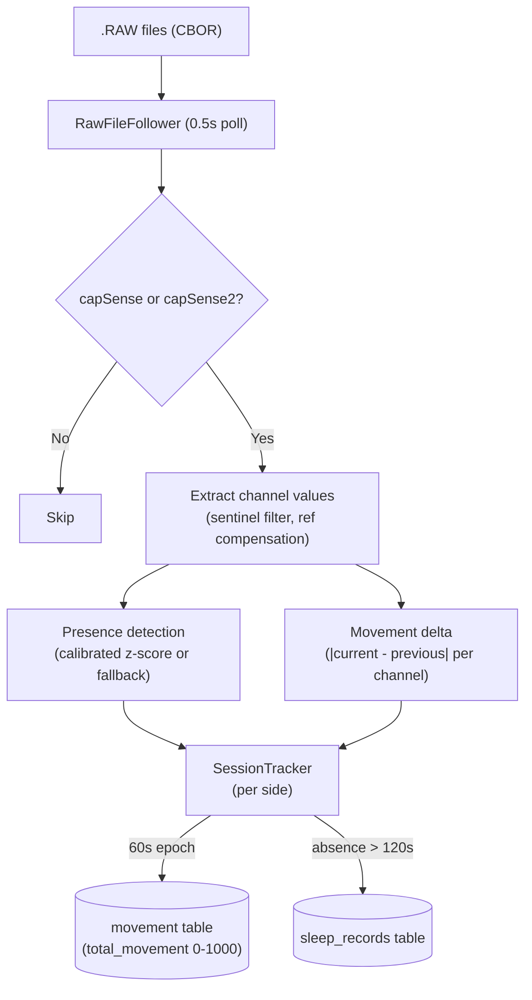
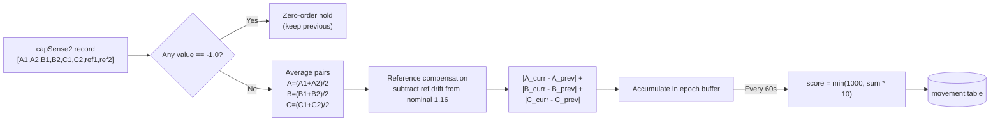

# Sleep Detector

## Overview

The sleep-detector module tracks bed occupancy, sleep session boundaries, and body movement from capacitance sensor data. It tails CBOR-encoded `.RAW` files, processes `capSense` (Pod 3) and `capSense2` (Pod 5) records at ~2 Hz, and writes to `sleep_records` and `movement` tables in `biometrics.db`.

## Architecture

## Movement Scoring

### Algorithm: Proportional Integration Mode (PIM)

Movement is measured as the sum of absolute sample-to-sample deltas across the 3 sensing channel pairs, accumulated over 60-second epochs. This is the bed-sensor analog of wrist actigraphy's PIM mode.

### Why sample-to-sample deltas (not z-scores from baseline)

The previous approach computed `|value - empty_bed_mean| / std` per channel. This measured **how present** someone was, not **how much they moved**:

| Approach | Person lying still | Person rolling over | Empty bed |
|----------|-------------------|--------------------:|----------:|
| Z-score from baseline (old) | 28,000-75,000 | ~75,000 | 22,000-32,000 |
| Sample-to-sample delta (new) | 35-77 | 200-1000 | 35-39 |

The delta approach removes the DC presence offset entirely. A person's body shifts capacitance channels by 5-20 units when they get in bed — that's a static offset, not movement. Actual movement produces brief, sharp changes of 2-40 units between consecutive samples.

### Score interpretation

| Score | State | Expected frequency during sleep |
|-------|-------|---------------------------------|
| 0-50 | Still (deep sleep, stable N2) | 70-80% of epochs |
| 50-200 | Minor fidgeting, twitches | 10-15% |
| 200-500 | Limb repositioning, partial turn | 5-10% |
| 500-1000 | Major position change, rolling over | 1-3% (~1-2/hour) |

Normal healthy sleep averages ~10 major position changes per night (De Koninck et al. 1992).

### Sentinel filtering

capSense2 firmware occasionally emits `-1.0` as a sentinel value on read errors. These are filtered via zero-order hold (carry forward the last valid reading). Deltas are not computed across sentinel boundaries to avoid false movement spikes.

### Reference channel compensation

The capSense2 record includes a reference channel pair (indices 6,7) that reads ~1.16 and barely responds to body presence. Any deviation from nominal is subtracted from the sensing channels as common-mode rejection, guarding against electromagnetic interference or firmware glitches.

## Presence Detection

Presence uses calibrated z-score thresholds from `calibration_profiles` when available, falling back to a fixed sum threshold (`PRESENCE_THRESHOLD = 1500` for capSense, `60.0` for capSense2). Calibration profiles are reloaded every 60 seconds.

## Sleep Sessions

A session starts on the first present sample and ends after `ABSENCE_TIMEOUT_S` (120s) of consecutive absence. Sessions shorter than `MIN_SESSION_S` (300s = 5 min) are discarded as false positives.

Session records include:
- Entry/exit timestamps
- Duration
- Number of bed exits (mid-session absences)
- Present/absent interval arrays

## Configuration

| Constant | Value | Rationale |
|----------|-------|-----------|
| `ABSENCE_TIMEOUT_S` | 120 s | Bathroom trips < 2 min don't split sessions |
| `MIN_SESSION_S` | 300 s | Shorter periods are likely false positives |
| `MOVEMENT_INTERVAL_S` | 60 s | One movement score per minute; matches AASM epoch length |
| `PRESENCE_THRESHOLD` | 1500 | Fallback for uncalibrated capSense (Pod 3) |
| `CALIBRATION_RELOAD_S` | 60 s | Poll calibration_profiles for updates |
| Movement scale factor | 10x | `score = min(1000, sum(deltas) * 10)` |
| Movement cap | 1000 | Prevents outlier scores from sensor glitches |
| Sentinel value | -1.0 | capSense2 firmware error indicator |
| Reference nominal | 1.16 | Expected reference channel value |

## Literature References

- **Kortelainen et al. (2010)** "Sleep Staging Based on Signals Acquired Through Bed Sensor" IEEE Trans. Inf. Technol. Biomed. — signal variance for wake detection from bed sensors
- **Cole & Kripke (1992)** "Automatic Sleep/Wake Identification from Wrist Activity" Sleep — activity counts per epoch, PIM scoring
- **Sadeh et al. (1994)** "Activity-Based Sleep-Wake Identification" Sleep — multi-feature actigraphy scoring
- **Paalasmaa et al. (2012)** "Unobtrusive Online Monitoring of Sleep at Home" IEEE J. Biomed. Health Inform. — activity from signal variance
- **Looney et al. (2021)** PMC8291858 — Emfit bed sensor vs wrist actigraphy validation
- **De Koninck, Lorrain & Gagnon (1992)** "Sleep Positions and Position Shifts" Sleep — ~10 major postural shifts per night

## Known Limitations

1. **Cross-side vibration coupling.** When the person on the right makes a large movement, the empty left side sees a brief spike (200-500) from mattress vibration. This is not gated because the sleep-detector doesn't have a dual-channel gating mechanism like the piezo processor's pump gate.

2. **Presence detection chattering.** The calibrated presence threshold can produce rapid present/absent oscillations on an empty bed if the baseline has drifted (temperature changes, bedding shifts). This causes inflated `times_exited_bed` counts. The `ABSENCE_TIMEOUT_S` mitigates this for session boundaries but not for epoch-level presence.

3. **No sleep stage classification.** The module detects presence and movement but does not classify sleep stages (W/N1/N2/N3/REM). Movement density alone can distinguish wake vs sleep but cannot reliably separate NREM stages or detect REM.

4. **Scale calibration.** The `* 10` scale factor and 1000 cap were empirically tuned on one Pod 5. Different pod generations or mattress configurations may need adjustment.
