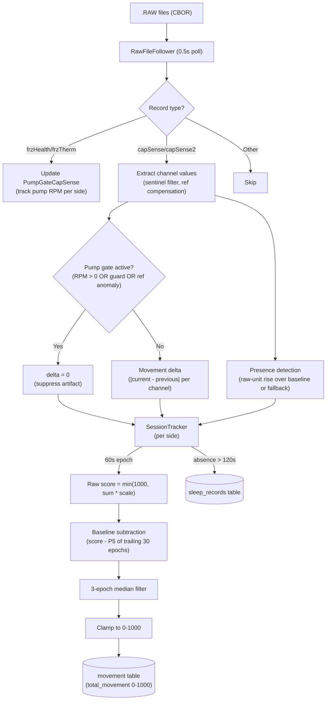
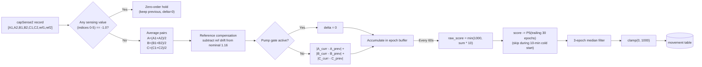

# Sleep Detector

## Overview

The sleep-detector module tracks bed occupancy, sleep session boundaries, and body movement from capacitance sensor data. It tails CBOR-encoded `.RAW` files, processes `capSense` (Pod 3) and `capSense2` (Pod 5) records at ~2 Hz, and writes to `sleep_records` and `movement` tables in `biometrics.db`.

## Architecture


```mermaid
flowchart TD
    RAW[".RAW files (CBOR)"] --> Follow["RawFileFollower (0.5s poll)"]
    Follow --> TypeFilter{"Record type?"}
    TypeFilter -->|"frzHealth/frzTherm"| PumpState["Update PumpGateCapSense\n(track pump RPM per side)"]
    TypeFilter -->|"capSense/capSense2"| Extract["Extract channel values\n(sentinel filter, ref compensation)"]
    TypeFilter -->|Other| Skip[Skip]
    Extract --> Presence["Presence detection\n(raw-unit rise over baseline or fallback)"]
    Extract --> PumpGate{"Pump gate active?\n(RPM > 0 OR guard OR ref anomaly)"}
    PumpGate -->|Yes| ZeroDelta["delta = 0\n(suppress artifact)"]
    PumpGate -->|No| Delta["Movement delta\n(|current - previous| per channel)"]
    ZeroDelta --> Session["SessionTracker\n(per side)"]
    Delta --> Session
    Presence --> Session
    Session -->|"60s epoch"| RawScore["Raw score = min(1000, sum * scale)"]
    RawScore --> Baseline["Baseline subtraction\n(score - P5 of trailing 30 epochs)"]
    Baseline --> MedianFilt["3-epoch median filter"]
    MedianFilt --> Clamp["Clamp to 0-1000"]
    Clamp --> MovDB[("movement table\n(total_movement 0-1000)")]
    Session -->|"absence > 120s"| SleepDB[("sleep_records table")]
```

## Movement Scoring

### Algorithm: Proportional Integration Mode (PIM)

Movement is measured as the sum of absolute sample-to-sample deltas across the 3 sensing channel pairs, accumulated over 60-second epochs. This is the bed-sensor analog of wrist actigraphy's PIM mode.


```mermaid
flowchart LR
    Raw["capSense2 record\n[A1,A2,B1,B2,C1,C2,ref1,ref2]"] --> Sentinel{"Any sensing value\n(indices 0-5) == -1.0?"}
    Sentinel -->|Yes| Hold["Zero-order hold\n(keep previous, delta=0)"]
    Sentinel -->|No| Avg["Average pairs\nA=(A1+A2)/2\nB=(B1+B2)/2\nC=(C1+C2)/2"]
    Avg --> Ref["Reference compensation\nsubtract ref drift from nominal 1.16"]
    Ref --> PumpCheck{"Pump gate active?"}
    PumpCheck -->|Yes| ZeroDelta["delta = 0"]
    PumpCheck -->|No| Delta["|A_curr - A_prev| +\n|B_curr - B_prev| +\n|C_curr - C_prev|"]
    ZeroDelta --> Buf["Accumulate in epoch buffer"]
    Delta --> Buf
    Buf -->|"Every 60s"| Score["raw_score = min(1000, sum * 10)"]
    Score --> Baseline["score -= P5(trailing 30 epochs)\n(skip during 10-min cold start)"]
    Baseline --> Median["3-epoch median filter"]
    Median --> Clamp["clamp(0, 1000)"]
    Clamp --> DB[("movement table")]
```

### Why sample-to-sample deltas (not z-scores from baseline)

The previous approach computed `|value - empty_bed_mean| / std` per channel. This measured **how present** someone was, not **how much they moved**:

| Approach | Person lying still | Person rolling over | Empty bed |
|----------|-------------------|--------------------:|----------:|
| Z-score from baseline (old) | 28,000-75,000 | ~75,000 | 22,000-32,000 |
| Sample-to-sample delta (new) | 35-77 | 200-1000 | 35-39 |

The delta approach removes the DC presence offset entirely. A person's body shifts capacitance channels by 5-20 units when they get in bed — that's a static offset, not movement. Actual movement produces brief, sharp changes of 2-40 units between consecutive samples.

### Score interpretation

| Score | State | Expected frequency during sleep |
|-------|-------|---------------------------------|
| 0-50 | Still (deep sleep, stable N2) — capSense2 | 70-80% of epochs |
| 50-200 | Minor fidgeting, twitches | 10-15% |
| 200-500 | Limb repositioning, partial turn | 5-10% |
| 500+ | Major position change, rolling over | 1-3% (~1-2/hour) |

Score is capped at 1000. The scale factor is sensor-type-dependent: capSense2 (Pod 5) uses `×10`, capSense (Pod 3) uses `×0.5` to normalize the different ADC ranges to the same 0-1000 scale. Boundaries are empirical and may need per-pod tuning.

Normal healthy sleep averages ~10 major position changes per night (De Koninck et al. 1992).

### Sentinel filtering

capSense2 firmware occasionally emits `-1.0` as a sentinel value on read errors in the sensing channels (indices 0-5). These are filtered via zero-order hold (carry forward the last valid reading, emit delta=0 for that sample). The next valid sample computes its delta against the last valid reading, which may span the sentinel gap — this produces a slightly larger delta but avoids the massive spike that a raw sentinel-to-valid transition would cause. Reference channel sentinels (indices 6-7) disable reference compensation for that sample but do not affect the sensing channels.

### Reference channel compensation

The capSense2 record includes a reference channel pair (indices 6,7) that reads ~1.16 and barely responds to body presence. Any deviation from nominal is subtracted from the sensing channels as common-mode rejection, guarding against electromagnetic interference or firmware glitches.

### Pump artifact gating (#230)

**Problem.** The pod's air pump runs periodically to maintain mattress pressure. Pump vibrations couple mechanically through the mattress into the capacitive sensor electrodes, producing small but consistent delta spikes (~0.05-0.2 per channel per sample). Over a 60-second epoch with ~120 samples, these accumulate to raw scores of 60-200 per pump-active epoch. Over a full night with frequent pump cycles, movement scores escalate from a true ~50 to 960-990 by the early morning hours.

**Three-signal detection.** The `PumpGateCapSense` class uses three independent signals:

1. **Primary: frzHealth pump RPM.** The `frzHealth` record (Pod 5 only, ~0.06 Hz) reports pump RPM per side. Any RPM > 0 means the pump is running. This is the most reliable signal but has low temporal resolution (~16s between updates).

2. **Secondary: Reference channel anomaly.** The capSense2 reference channel pair (indices 6,7) is mechanically coupled to the sensor PCB but does not respond to body presence. When `|ref_delta| > 0.02` AND at least 2 of 3 active channel deltas correlate (both spike together with magnitude > 0.5x the ref delta), the sample is flagged as mechanical coupling rather than body movement.

3. **Guard period: 3 seconds.** After pump-off is detected (RPM transitions from >0 to 0), a 3-second guard period (~6 samples at ~2 Hz) suppresses deltas while residual vibrations decay. This is shorter than the piezo processor's 5-second guard because capacitive sensors have lower sensitivity to mechanical vibration than piezoelectric sensors.

When any signal is active, the movement delta for that sample is forced to 0.

**Pipeline position.** Pump gating is applied after reference compensation and before delta computation:

```text
1. Sentinel filter (-1.0 values)
2. Pair averaging
3. Reference compensation
4. PUMP GATE — if pumpActive OR inGuardPeriod OR refAnomaly: delta = 0
5. Per-channel delta
6. 60s epoch accumulation
```

### Baseline subtraction

After computing the raw epoch score (`min(1000, sum * scale)`), the 5th percentile of the trailing 30 epochs is subtracted. This removes slow-building noise floors (residual pump artifacts that leak through the gate, thermal drift in the capacitive sensor).

- **Trailing window:** 30 epochs (30 minutes at 60s epochs)
- **Percentile:** 5th (robust to outliers; represents the quietest ~1.5 epochs in the window)
- **Cold start:** Baseline subtraction is disabled for the first 10 epochs (~10 minutes) after session start, since there is insufficient history to compute a meaningful baseline.

The subtracted score is clamped to a minimum of 0.

### 3-epoch median filter

A 3-epoch running median is applied as the final smoothing step after baseline subtraction. This suppresses isolated spike artifacts (single-epoch transients from sensor glitches, brief vibration events) without attenuating sustained movement events.

The median filter output is clamped to [0, 1000] before writing to the database.

## Presence Detection

Presence is the summed **signed** raw-unit rise of the sensing channels over a per-side empty-bed baseline. A body only adds capacitance, so only a rise counts. Occupancy enters above the threshold (`CAPSENSE_PRESENCE_THRESHOLD = 300` summed over out/cen/in for capSense, the profile threshold, default `6.0`, for capSense2) and exits below `PRESENCE_EXIT_FRACTION` (half) of it, so a reading hovering at the threshold can't flap. capSense2 values are reference-compensated before comparison.

The former z-score check (sum of `|val - mean| / std`, std floored at 5) flagged ~30 raw units of thermal drift in either direction as occupied, holding sessions open until the 16 h cap or the next recalibration.

### Self-adjusting baseline

The baseline is maintained by the detector itself (`AdaptiveBaseline`), not by scheduled calibration — a scheduled snapshot could not tell a motionless sleeper from an empty bed (ADR-0014 amendment).

- **Drift:** while the bed is empty and the reading is within the exit threshold, the baseline follows it with time constant `BASELINE_UP_TAU_S` (30 min). A load between the exit and enter thresholds is never learned as empty.
- **Contamination:** any reading below baseline pulls it down with `BASELINE_DOWN_TAU_S` (2 min), so a baseline captured with someone in bed recovers minutes after they get up.
- **Stuck load:** after a session force-closed at `MAX_SESSION_S`, the current level becomes the new empty level.
- **Seeding:** the saved state file, else the active calibration profile — including this detector's own published baseline when the state file is lost (legacy capSense profiles with a z-score threshold get the raw-unit default) — else the first frame. A calibration profile newer than any seen — a manual recalibration — is adopted as a reseed.
- **Publishing:** every `BASELINE_PUBLISH_S` (15 min) the baseline is upserted to `calibration_profiles` with `source: "adaptive"`, in the calibrators' shape, so Node's occupancy check and the UI see the same level. Profiles marked adaptive never replace a live baseline; they only seed one when there is none.
- Per-sample tracking time is capped at `BASELINE_MAX_STEP_S`, so a gap or restart can't move the baseline in one step. Frames with a missing side or capSense2 sentinels are ignored.

Replaying recorded capSense data starting from a baseline captured with the sleeper in bed, the baseline recovers within minutes of them getting up, sessions end at the real wake time rather than at the next recalibration, and a bedding shift of a few tens of units per channel produces no session.

## Single-Sleeper Mode

Exactly one side in **away mode** (`side_settings.away_mode`) means one person sleeps in the bed, on the other ("home") side. A solo sleeper who rolls over or puts a leg on the empty side loads that side's sensors too — its capSense level rises and its piezo reports the same heartbeat — which used to open phantom sessions there. `common/side_mode.py` reads the flag read-only every 60 s; both sides away, or neither, is ordinary per-side operation.

In this mode (`process_single_sleeper`):

- The sleeper is in bed while **either** side reads occupied, so migrating across the bed stays one home-side session with no extra bed-exits; a session can also start on the away side.
- Movement deltas from both sides are summed into the home side's epochs. The away side writes no sessions or movement.
- The away side still tracks its own baseline. A session capped at `MAX_SESSION_S` resets both sides' baselines, since either side's load could be holding it open.
- If away mode is switched on while the away side has an open session, that session is closed at its last presence.

The piezo-processor applies the same mode to vitals (`SingleSleeperVitals`): each cycle's candidates from the two sides are paired, only the higher-quality one is written, under the home side, and an away-side reading with no partner (fully rolled over) is written as the home side.

A night where the sleeper rolls onto the away side yields one home-side session with a single morning exit, instead of several short sessions on the away side.

## Sleep Sessions

A session starts on the first present sample and ends after `ABSENCE_TIMEOUT_S` (120s) of consecutive absence. Sessions shorter than `MIN_SESSION_S` (300s = 5 min) are discarded as false positives.

### Surviving restarts

An open session lives in memory, so it is checkpointed to `sleep-detector-state.json` next to `biometrics.db` (override with `SLEEP_DETECTOR_STATE_PATH`) every `STATE_SAVE_INTERVAL_S` and immediately on session start, bed-exit, and close. The write is tmp + fsync + rename. On startup the detector:

- **resumes** the session when the last saved sample is recent. If the occupant is still in bed the downtime counts as sleep; if absence is committed before any presence is seen, the exit is dated at the last pre-restart presence (they left while the detector was down).
- **closes** it at the last presence when the gap exceeds `STATE_MAX_GAP_S` (30 min), since the downtime can't be attributed to sleep.
- **skips replayed samples**: the RAW follower re-reads the current file from offset 0, so samples at or before the saved `last_ts` are ignored — for every side, with or without an open session. The presence hysteresis latch is restored too, so a reading between the exit and enter thresholds keeps its state.

Session records include:
- Entry/exit timestamps
- Duration
- Number of bed exits (mid-session absences)
- Present/absent interval arrays

## Chart Aggregation

The Movement chart in the app (`src/components/MovementChart/MovementChart.tsx`) does **not** read individual 60-s epochs directly. It calls `biometrics.getMovementBuckets` (`src/server/routers/biometrics.ts`) which groups epochs into fixed-width buckets in SQL:

| View | `bucketSeconds` (`src/lib/movement.ts`) | Bars per bucket |
|------|-----------------------------------------|-----------------|
| Day  | `MOVEMENT_BUCKET_DAY_SECONDS = 300` (5 min) | up to 5 epochs |
| Week | `MOVEMENT_BUCKET_WEEK_SECONDS = 1800` (30 min) | up to 30 epochs |

Per bucket the SQL returns:
- `totalMovement` — `SUM(total_movement)` (raw PIM intensity).
- `eventCount` — `COUNT(... >= POSITION_CHANGE_SCORE_MIN)`, rendered as **events/hour** on the y-axis.
- `sampleCount` — total epochs in the bucket.

### In-bed gate

`inBedExists(side)` filters epochs to those whose timestamp falls inside a recorded `sleep_records` row for the same side. This drops empty-bed sensor noise that doesn't belong to a persisted session.

### Density gate

`inBedExists` is necessary but not sufficient — a noisy session of record (high `times_exited_bed`) can span hours yet contain many empty-bed sub-windows. A second filter, `pickMinBucketNonStillEpochs(bucketSeconds)`, requires each rendered bucket to contain at least that many epochs above `RESTLESS_SCORE_MIN`:

```text
minNonStillEpochs = max(MIN_BUCKET_NONSTILL_FLOOR, floor(bucketSeconds / 600))
                  = max(2, floor(bucketSeconds / 600))
```

For the standard bucket widths:

| Bucket | Epoch budget | Required non-still | Sleep-time expectation (per doc score table) |
|--------|--------------|--------------------|----------------------------------------------|
| 5 min  | 5  | 2 | ~1-2 non-still epochs even mid-sleep |
| 30 min | 30 | 3 | ~6-10 non-still epochs in real sleep |

This filters phantom-session flicker (1-3 scattered non-still epochs per bucket) without affecting real sessions. Tune `MIN_BUCKET_NONSTILL_FLOOR` if a quieter sleeper drops out of the chart.

## Configuration

| Constant | Value | Rationale |
|----------|-------|-----------|
| `ABSENCE_TIMEOUT_S` | 120 s | Bathroom trips < 2 min don't split sessions |
| `MIN_SESSION_S` | 300 s | Shorter periods are likely false positives |
| `MOVEMENT_INTERVAL_S` | 60 s | One movement score per minute; matches AASM epoch length |
| `CAPSENSE_PRESENCE_THRESHOLD` | 300 | Raw-unit rise (summed) that means occupied, capSense |
| `PRESENCE_EXIT_FRACTION` | 0.5 | Exit threshold as a fraction of the enter threshold |
| `BASELINE_UP_TAU_S` | 30 min | Empty-bed drift tracking time constant |
| `BASELINE_DOWN_TAU_S` | 2 min | Recovery when the reading falls below baseline |
| `BASELINE_PUBLISH_S` | 15 min | Baseline written back to calibration_profiles |
| `CALIBRATION_RELOAD_S` | 60 s | Poll calibration_profiles for updates |
| `STATE_SAVE_INTERVAL_S` | 60 s | Checkpoint an open session to the state file |
| `STATE_MAX_GAP_S` | 30 min | Longer downtime closes a restored session instead of resuming it |
| Movement scale (capSense2) | 10x | Pod 5 float channels, deltas ~0.05-5.0 |
| Movement scale (capSense) | 0.5x | Pod 3 int ADC channels, deltas ~1-50 |
| Movement cap | 1000 | Prevents outlier scores from sensor glitches |
| Sentinel value | -1.0 | capSense2 firmware error indicator |
| Reference nominal | 1.16 | Expected reference channel value |
| `PUMP_GUARD_S` | 3.0 s | Guard period after pump-off; 6 samples at ~2 Hz (#230) |
| `REF_ANOMALY_THRESHOLD` | 0.02 | Reference channel deviation for secondary pump detection |
| `BASELINE_TRAILING_EPOCHS` | 30 | 30-minute trailing window for baseline subtraction |
| `BASELINE_COLD_START_EPOCHS` | 10 | 10-minute minimum before baseline subtraction activates |
| `BASELINE_PERCENTILE` | 5 | 5th percentile; represents quietest epoch in trailing window |
| `MEDIAN_FILTER_WINDOW` | 3 | 3-epoch median filter; suppresses isolated spikes |
| `MIN_BUCKET_NONSTILL_FLOOR` | 2 | Chart density gate; minimum non-still epochs per rendered bucket |

## Literature References

- **Kortelainen et al. (2010)** "Sleep Staging Based on Signals Acquired Through Bed Sensor" IEEE Trans. Inf. Technol. Biomed. — signal variance for wake detection from bed sensors
- **Cole & Kripke (1992)** "Automatic Sleep/Wake Identification from Wrist Activity" Sleep — activity counts per epoch, PIM scoring
- **Sadeh et al. (1994)** "Activity-Based Sleep-Wake Identification" Sleep — multi-feature actigraphy scoring
- **Paalasmaa et al. (2012)** "Unobtrusive Online Monitoring of Sleep at Home" IEEE J. Biomed. Health Inform. — activity from signal variance
- **Looney et al. (2021)** PMC8291858 — Emfit bed sensor vs wrist actigraphy validation
- **De Koninck, Lorrain & Gagnon (1992)** "Sleep Positions and Position Shifts" Sleep — ~10 major postural shifts per night

## Known Limitations

1. **Cross-side vibration coupling.** When the person on the right makes a large movement, the empty left side sees a brief spike (200-500) from mattress vibration. This is not gated because the sleep-detector doesn't have a dual-channel gating mechanism like the piezo processor's pump gate.

2. **Presence detection chattering.** The calibrated presence threshold can produce rapid present/absent oscillations on an empty bed if the baseline has drifted (temperature changes, bedding shifts). This causes inflated `times_exited_bed` counts. The `ABSENCE_TIMEOUT_S` mitigates this for session boundaries but not for epoch-level presence.

3. **No sleep stage classification.** The module detects presence and movement but does not classify sleep stages (W/N1/N2/N3/REM). Movement density alone can distinguish wake vs sleep but cannot reliably separate NREM stages or detect REM.

4. **Scale calibration.** The `* 10` scale factor and 1000 cap were empirically tuned on one Pod 5. Different pod generations or mattress configurations may need adjustment.

5. **Pump gate frzHealth dependency.** The primary pump signal comes from `frzHealth` records which are Pod 5 only and arrive at ~0.06 Hz (~16s between updates). There is a detection latency window where pump vibrations may leak through before the first frzHealth record confirms pump-on. The reference channel anomaly detector (signal 2) partially covers this gap but is less reliable than direct RPM monitoring.

6. **Pump gate field name uncertainty.** The exact field names in frzHealth records for pump RPM (`pumpRpm`, `pump_rpm`, etc.) have not been confirmed on live hardware. The implementation checks multiple candidate names for robustness, but if the firmware uses an unexpected name, the primary signal will be inactive and only the reference anomaly detector will provide gating.

7. **Baseline subtraction cold start.** Movement scores during the first 10 minutes of a session are not baseline-subtracted, which may produce slightly elevated readings compared to later in the night. This is acceptable because the baseline requires sufficient history to be meaningful.

8. **Median filter smoothing behavior.** The 3-epoch median filter is causal (trailing window), so it does not depend on future epochs. It may still soften abrupt transitions, which is acceptable since movement data is not used for real-time alerting.

9. **Calibrator RAW path coupling (Pod 5).** The calibrator reads RAW files from `RAW_DATA_DIR`, which must match the tmpfs path created by `sleepypod-tmpfs-prep` (`/persistent/biometrics`, per ADR-0018). A mismatch makes every reader see an empty directory, so the detector (and piezo/temperature calibration) receives no frames at all. The calibrator unit file declares `RequiresMountsFor=/persistent/biometrics` to surface this as a startup failure rather than a silent runtime degradation.
